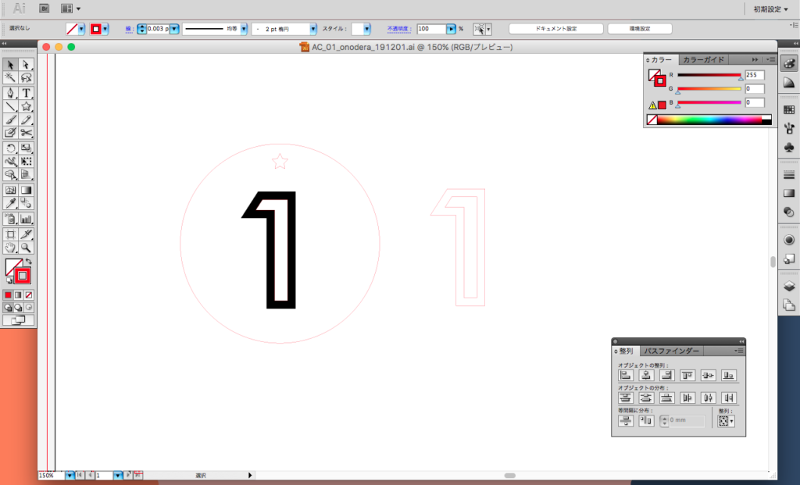
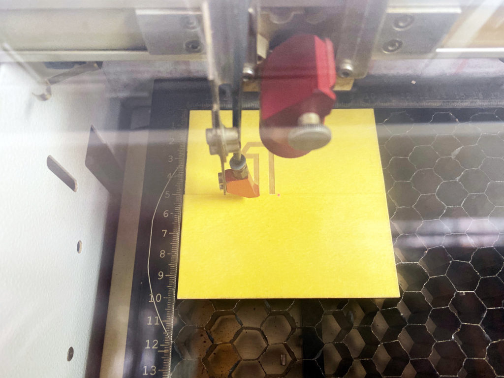
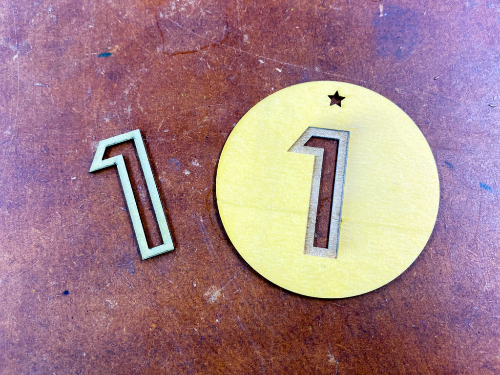

 

## **#01/25 [ 2019/12/01 ]** 
### by Shino ONODERA (FabLab SENDAI - FLAT)
  

 

### **材料**

* シナベニヤ（1mm厚）
* [Trolase Metallic Plus ゴールド（ヘアライン）／ブラック](https://www.trotec-materials.com/laser-materials/plastic/trolase-metallic-plus.html)
* ボールチェーン

 

### **技術**

* データ作成：Adobe Illustrator
* 切断&彫刻：レーザーカッター（trotec speedy100）

 

### **作り方**
 

**1.** 
Adobe Illustratorでデータを作成！黒い部分は彫刻加工で凹ませて、そこにメタリックのパーツを埋め込みます。 

  

**2.** 
レーザーカッターで素材をそれぞれ彫刻&カット！ 

  

**3.** 
素材の加工が完了したら組み立て！ 

  

**4.** 
完成！ 

    

Trolase Metallic Plusはパッと見金属っぽいですが、レーザーで簡単に加工できるのでとても楽しいです！オススメですよ！

  

（Last Updated: 2023.04.11）

