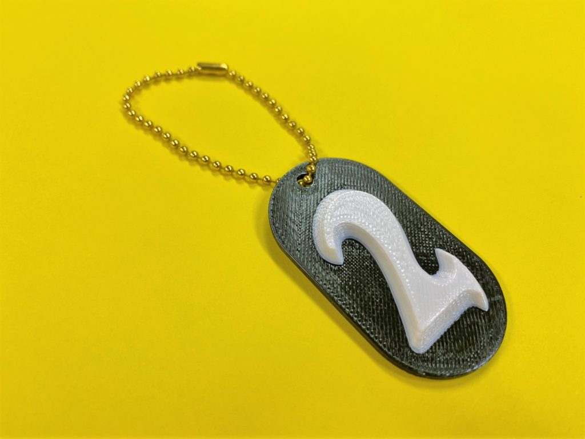
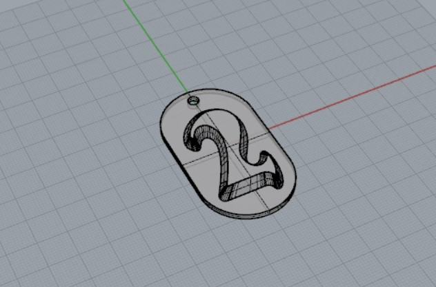
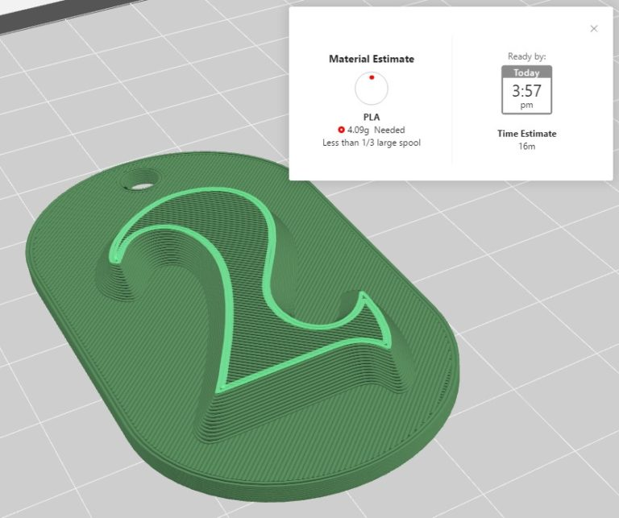
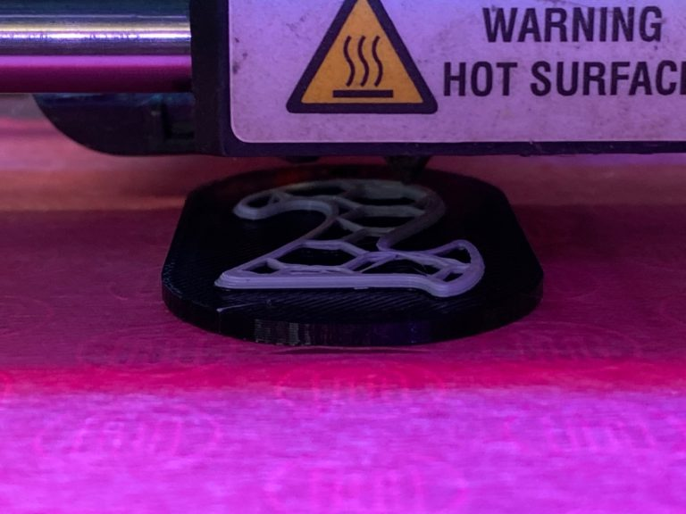

 

## **#02/25 [ 2019/12/02 ]** 
### by Takuma OAMI (FabLab SENDAI - FLAT)
  

 

### **材料**

* PLAフィラメント 1.75mm (ブラック / ホワイト)
* ボールチェーン

 

### **技術**

* データ作成：Rhinoceros
* 切断&彫刻：3Dプリンター(MakerBot Replicator 2)

 

### **作り方**
 

### **1.** 
Rhinocerosで3Dモデル製作。文字のところがボコッと浮き上がっている感じに。 

  

### **2.** 
データを3Dプリンタに送るために、MakerBot Printでノズルの動きを計算。(予測出力時間：16分くらい) 

  

### **3.** 
最初は黒のフィラメント(3Dプリンタの素材のこと)でプリント開始。途中でマシンを一時停止して、フィラメントを白色のものにチェンジ。プリント再開。 

  

### **4.** 
チェーン通して完成。 

    

基本的には、一色でのプリントだと思われがちな3Dプリンタですが、実は途中でフィラメントを付け替えることができます！　積層方向とモデルの形を気にしてあげることで、こんなこともできるので興味のある方はスタッフまでー
  

（Last Updated: 2023.04.11）

