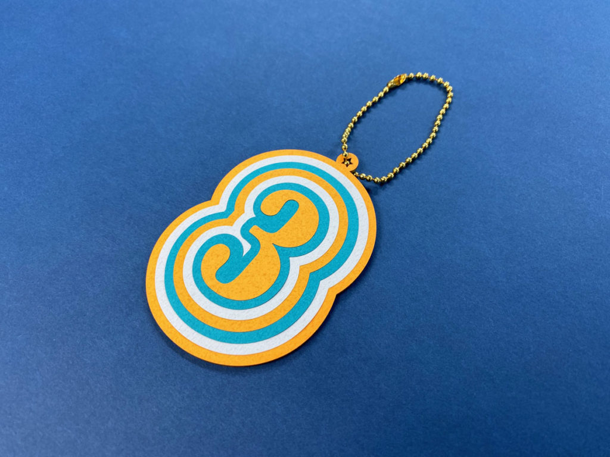
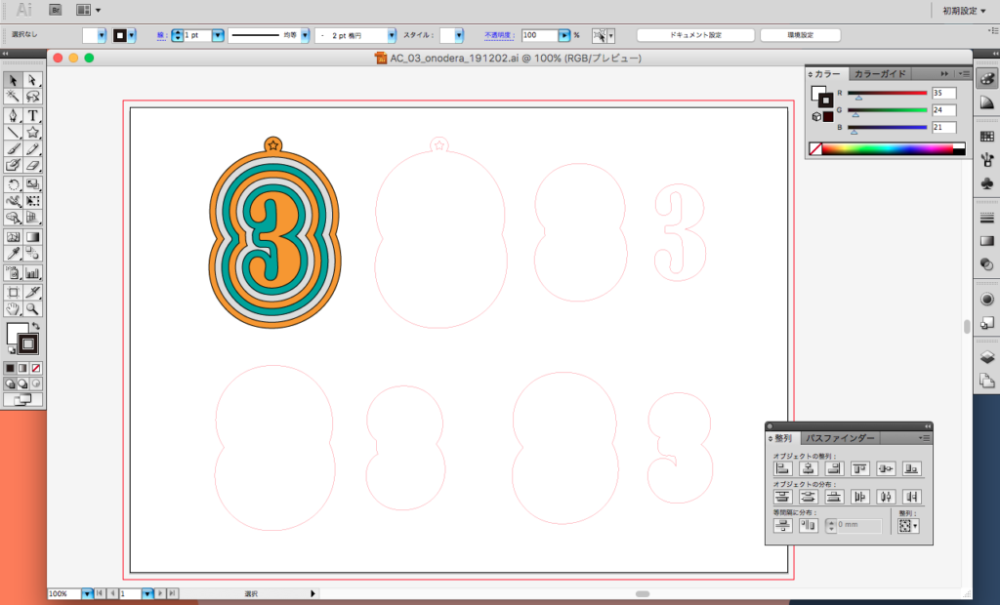
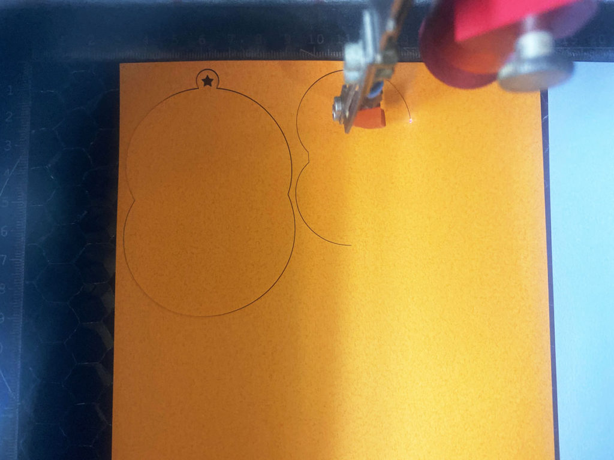

 

## **#03/25 [ 2019/12/03 ]** 
### by Shino ONODERA (FabLab SENDAI - FLAT)
  

 

### **材料**

* イラストボード（1mm厚）
* [タントペーパー](http://www.kidstoyo.co.jp/item1834/)
* ボールチェーン

 

### **技術**

* データ作成：Adobe Illustrator
* 切断：レーザーカッター（trotec speedy100）

 

### **作り方**
 

### **1.** 
Adobe Illustratorでデータを作成！ 
元となる「3」のデータに対して、2mmずつオフセットを作成していきます。 

  

### **2.** 
レーザーカッターで素材をカット！薄い紙は飛びやすいので、air assistはOffに設定しました。 

  

### **3.** 
カットが完了したら貼り付け！タントペーパーだけだと弱いので、土台にはイラストボードを使用することに。 

  

### **4.** 
完成！ 

    

今回は薄い紙で製作しましたが、厚みのある素材だと立体感が出てより面白い仕上がりになります。
また、レーザーカッターでは加工が難しいと思われがちな紙も、パワーをきちんと設定すればヤニが発生しません。 
ぜひチャレンジしてみてくださいね！
  

（Last Updated: 2023.04.11）

