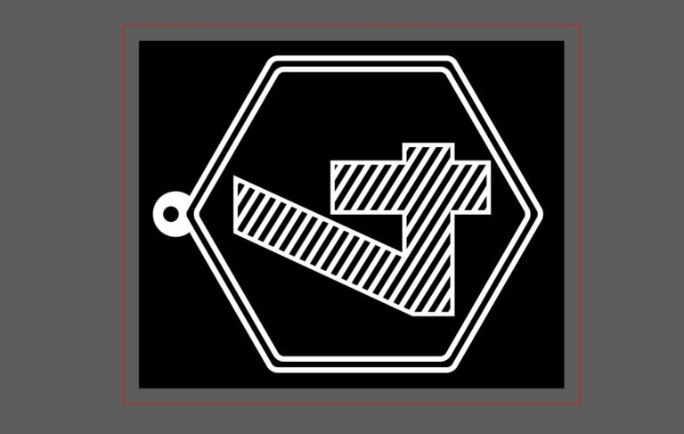
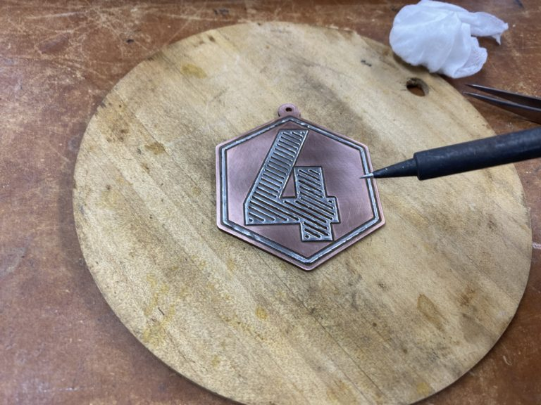

 

## **#04/25 [ 2019/12/04 ]** 
### by Takuma OAMI (FabLab SENDAI - FLAT)
  

 

### **材料**

* 紙フェノール基板
* はんだ
* ボールチェーン

 

### **技術**

* データ作成：Adobe Illustrator
* 切断：小型CNCルーター（Modela MDX-20）

 

### **作り方**
 

### **1.** 
Adobe Illustratorでデータを作成！ 
銅の部分が残ってほしい所を白にします。 

  

### **2.** 
CNCルーターで銅基板を削って模様を彫刻していきます。 

  

### **3.** 
削り終わった基板。好きな銅の部分にはんだをのせてシルバーにしていきますー 

  

### **4.** 
完成！ 

    

電子回路を作る時に良く使われる紙フェノール基板ですが、クラフトっぽい用途に使ってみました。赤い銅のベースにところどころシルバーのハイライトが乗り、スチームパンク感あふれる作品に仕上がりました。道具やテクニックを別の目的に使ってみるとアッと驚くような発見があったりしますね。なんでも試してみるものです。
  

（Last Updated: 2023.04.11）

