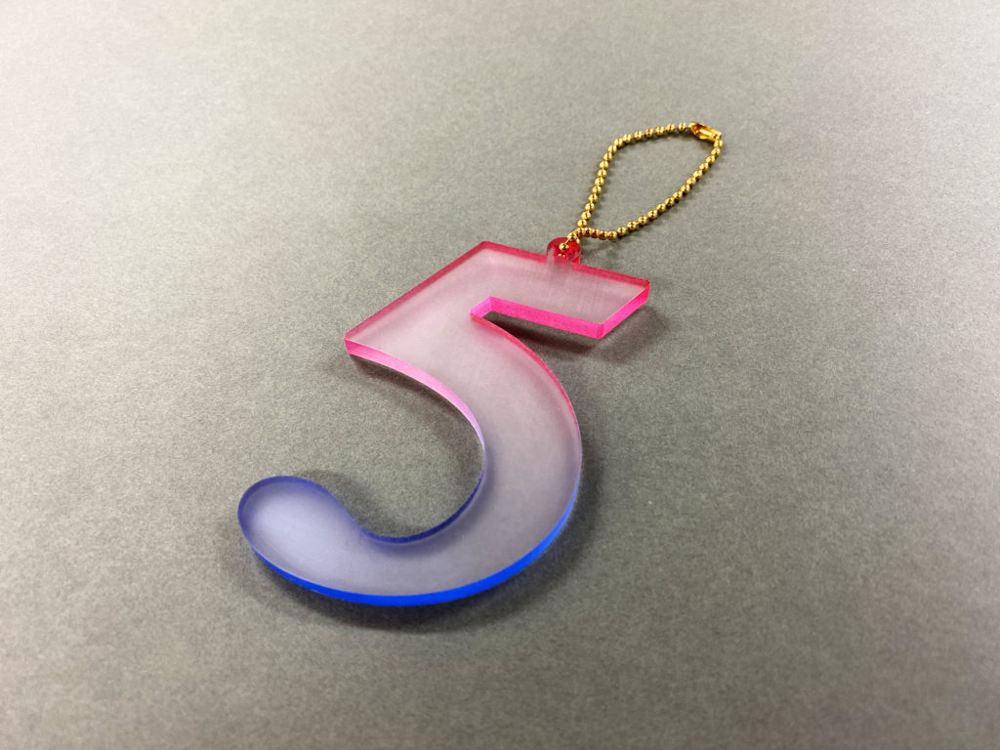
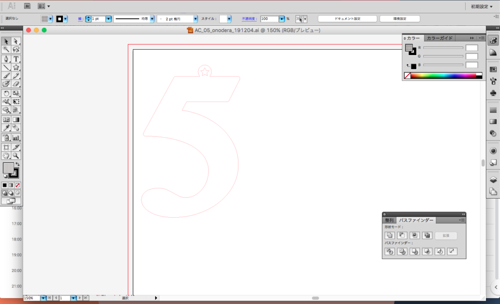
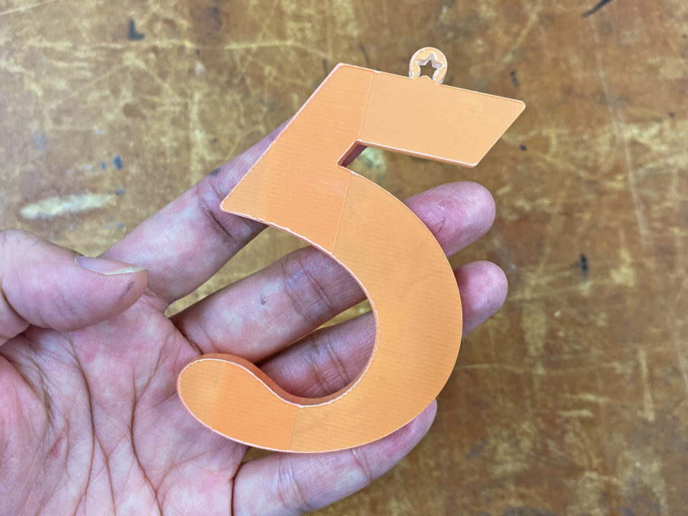
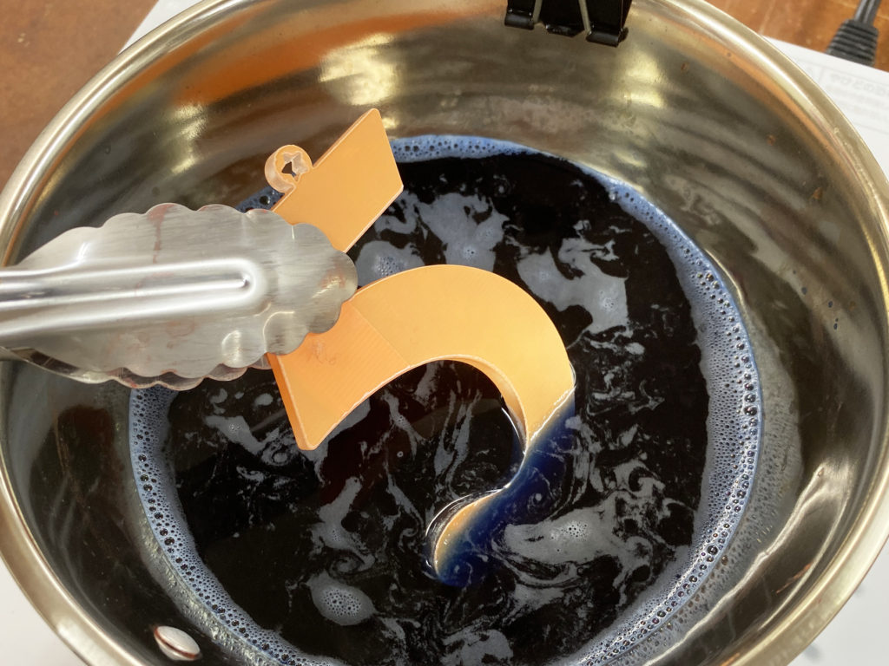

 

## **#05/25 [ 2019/12/05 ]** 
### by Shino ONODERA (FabLab SENDAI - FLAT)
  

 

### **材料**

* [アクリル板（両面マット）](https://www.hazaiya.co.jp/category/akuriru_matto.html)
* [樹脂用染料 SDN](https://osaka-kaseihin.co.jp/?page_id=274)
* [養生テープ](https://www.sekisui-pack.com/search/category/yojyo/tape/1301583_12979.html)
* ボールチェーン

 

### **技術**

* データ作成：Adobe Illustrator
* 切断：レーザーカッター（trotec speedy100）

 

### **作り方**
 

### **1.** 
Adobe Illustratorでデータを作成！ 

  

### **2.** 
レーザーカッターでカット！アクリル板の保護紙は剥がし、代わりに養生テープを貼ったままカットしました。 

  

### **3.** 
養生テープは貼ったまま、アクリルパーツを染料で染めます。 
下半分は青、上半分はピンクの染料を使用し、 
パーツをトングで持って揺すりながら染色することでグラデーションに仕上げました。 

  

### **4.** 
完成！ 

    

透明ではなく、表面がマットなアクリル板を使用したことで、側面の色が拡散して不思議な見た目の作品ができました。
透明なアクリル板を使用した場合でも、染色後に表面をやすりがけすることで、マットな仕上がりにすることが可能です。
[樹脂の染色方法についてはこちらに詳しくまとめています](https://fabble.cc/fablabsendai/dyeingacrylic)ので、ご興味のある方はぜひチェックしてみてください！
  

（Last Updated: 2023.04.11）

