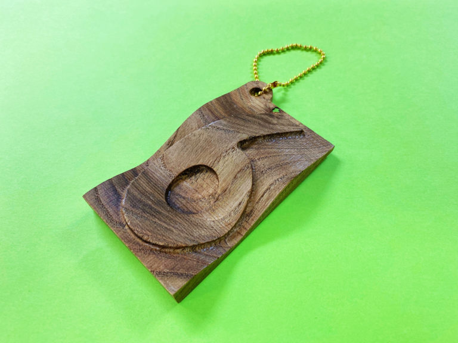
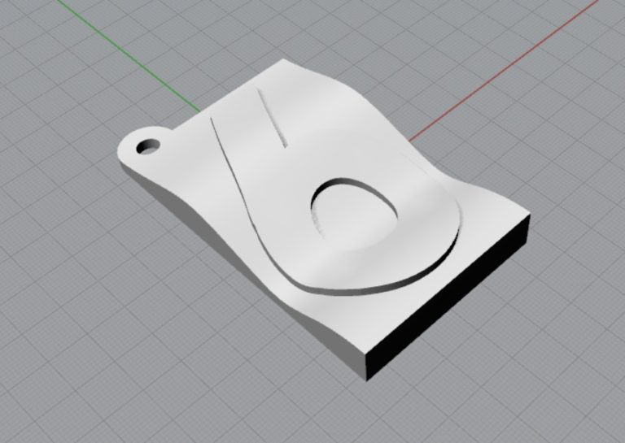
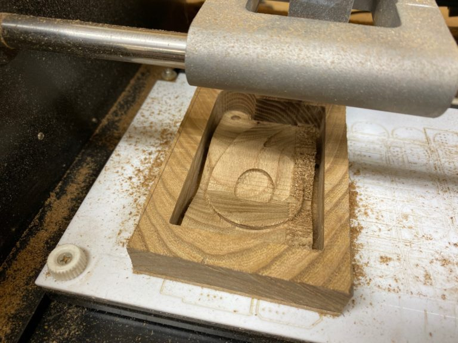
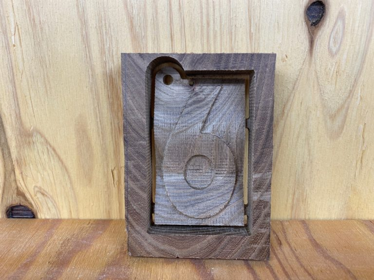

 

## **#06/25 [ 2019/12/06 ]** 
### by Takuma OAMI (FabLab SENDAI - FLAT)
  

 

### **材料**

* 無垢材(エンジュ)
* ボールチェーン

 

### **技術**

* データ作成：Rhinoceros
* 切断：卓上CNCルーター（MODELA MDX-20）

 

### **作り方**
 

### **1.** 
Rhinocerosでデータを作成！真っ平ではなく、全体的に波打ったように表面を曲げました。 

  

### **2.** 
制作したデータをCNCで切削していきます。立体的な”6″がだんだん素材から削り出されていきます。 

  

### **3.** 
切削加工が完了した直後の様子。光の関係で素材の色がころころ変わってすいません…　ここからやすりがけとワックスで仕上げていきます。 

  

### **4.** 
ジャーン！完成！　質のいい木工おもちゃみたいな風合いになりました。 

    

幾何学的な形なんだけど、暖かみのある素材感なのが木工CNCの面白いところ。削った後のやすりがけや塗装など仕上げ方次第で、さらに化けます。時間をかければかけただけ、結果として帰ってくるので嬉しいです。
  

（Last Updated: 2023.04.11）

