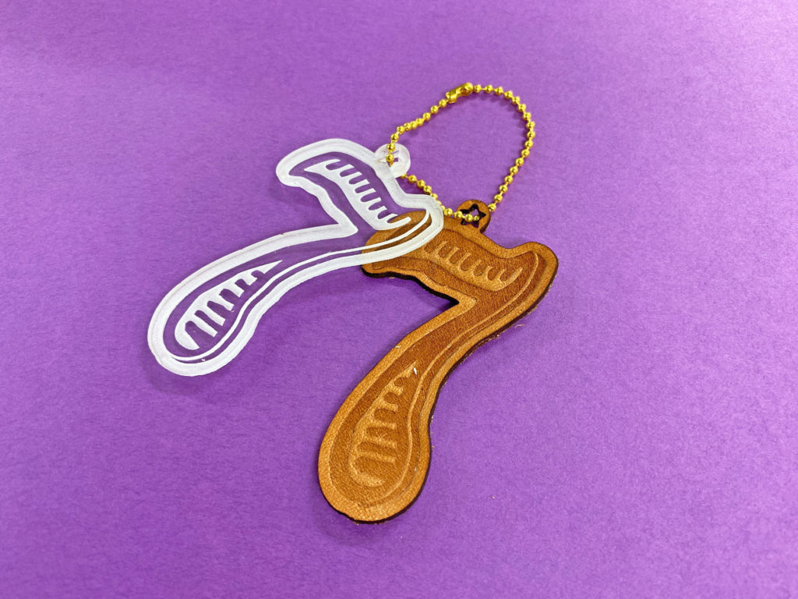
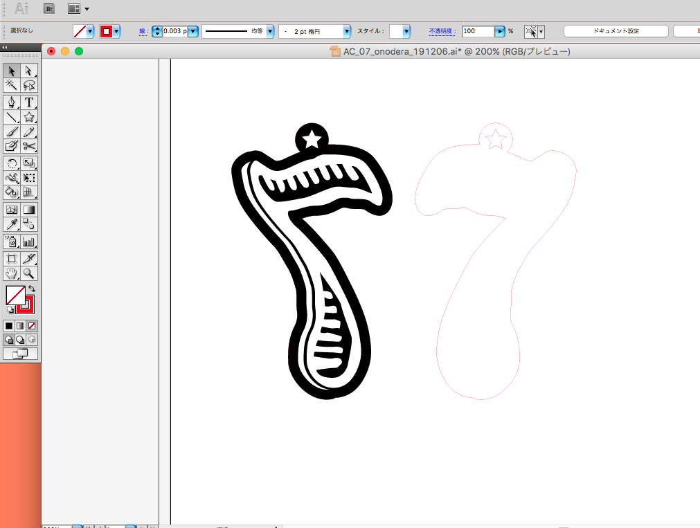
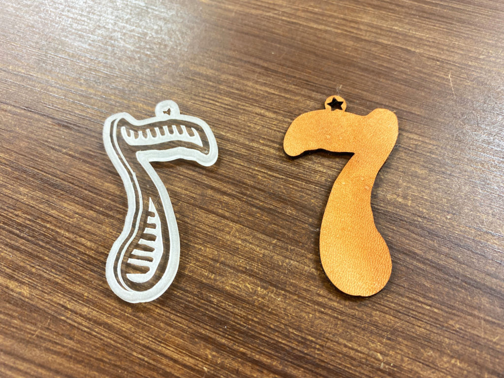
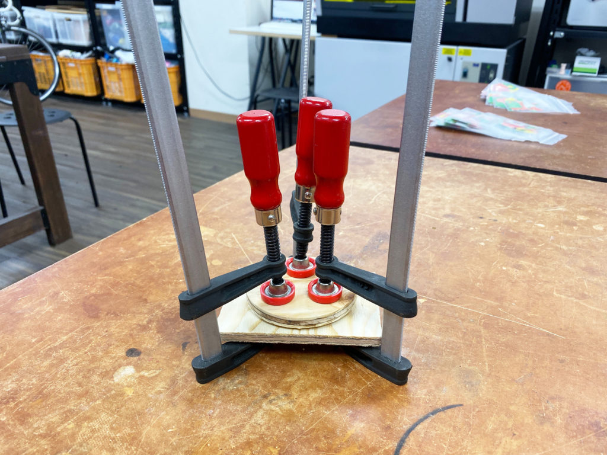

 

## **#07/25 [ 2019/12/07 ]** 
### by Shino ONODERA (FabLab SENDAI - FLAT)
  

 

### **材料**

* レザー
* アクリル板（3mm厚）
* ボールチェーン

 

### **技術**

* データ作成：Adobe Illustrator
* レザーのカット：レーザーカッター（trotec speedy100）
* アクリル板のカット&彫刻：レーザーカッター（trotec speedy 100）

 

### **作り方**
 

### **1.** 
Illustratorでデータを作成！左はアクリル板加工用のもので、黒い部分は彫り込む加工（彫刻）をします。 
スタンプのようにしたいので、デザインを反転しました。 

  

### **2.** 
どちらも表面にマスキングテープを貼ってレーザー加工しました。（焦げ付き防止のため。） 
写真では分かりにくいですが、左のアクリル板の白っぽくなっているところは1mmほど削られています。 

  

### **3.** 
アクリル板とレザーのパーツを重ねて板で挟み、クランプで強く締めます。（レザーは表面を軽く湿らせました。） 

  

### **4.** 
30分ほどおいたら、クランプと板をはずして完成！ 

    

へこんだ部分は、色が濃くツヤのある仕上がりになりました。 
今回はレザーを使用しましたが、今度は厚みのある紙にこのエンボス加工をしてみようかなぁと思っています！
  

（Last Updated: 2023.04.11）

