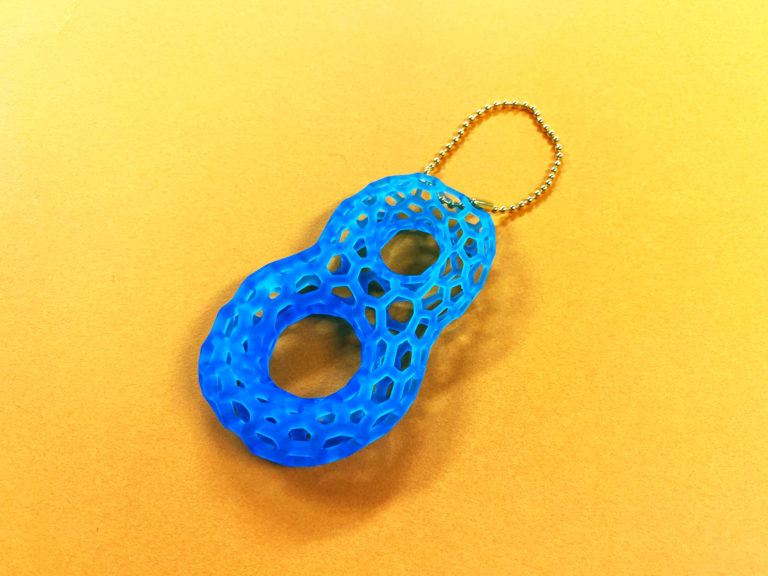
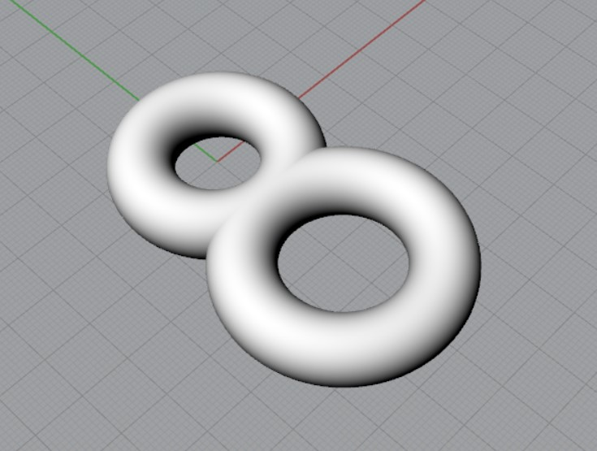
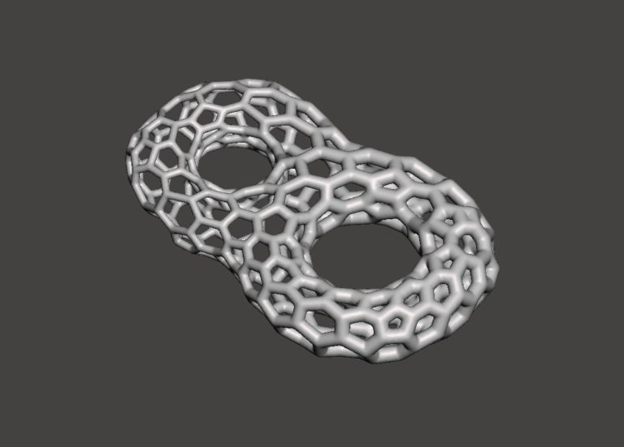
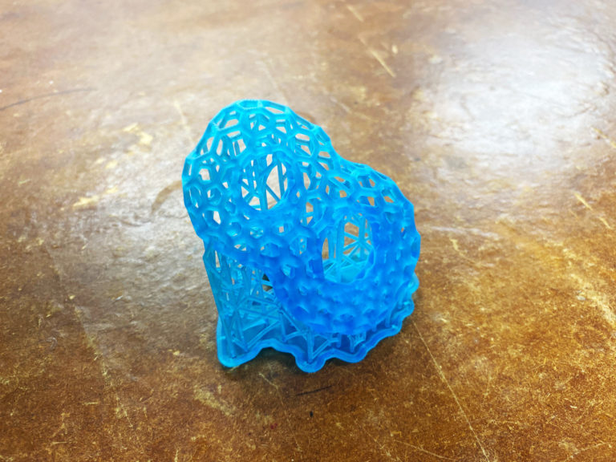

 

## **#08/25 [ 2019/12/08 ]** 
### by Takuma OAMI (FabLab SENDAI - FLAT)
  

 

### **材料**

* Formlabs toughレジン
* ボールチェーン

 

### **技術**

* データ作成：Rhinoceros & Meshmixer
* 3Dプリント：光造形3Dプリンタ（Formlabs Form 2）

 

### **作り方**
 

### **1.** 
Rhinocerosでもとになる3Dデータを作成！ドーナツのような大小のリング２つを合体させたシンプルなもの 

  

### **2.** 
シンプルな8の字を[Meshmixer](http://www.meshmixer.com/)に読み込んで、植物(粘菌？)のようなフレームに変換します。 

  

### **3.** 
今回のモデルは複雑かつ繊細だったので、UVライトで硬化する樹脂で3DプリントするForm 2という3Dプリンタで出力をおこないましたー。安定したプリントで一発で成功！(サポートも見た目ほど取るの難しくなかったです。) 

  

### **4.** 
サポートを取って、ボールチェーン通したら完成ー！ 

    

高性能なプリンタのデモなんかであるあるなこんな形。Meshmixerを使うと意外と簡単にできちゃいました(しかも無償ソフトという太っ腹さ)。英語ですがチュートリアルビデオの[リンク](https://www.youtube.com/watch?v=kh5jKgsEQak)もこちらに貼っておきますね！3Dプリントの前のデータ修正に持って来いのソフトなので是非お試しあれ～
  

（Last Updated: 2023.04.11）

