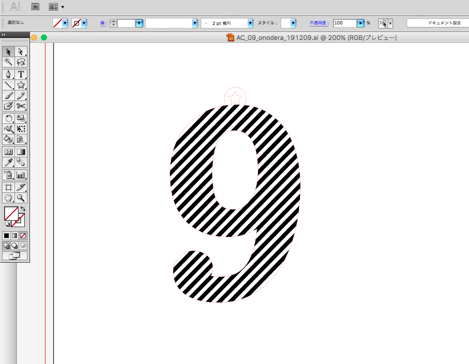
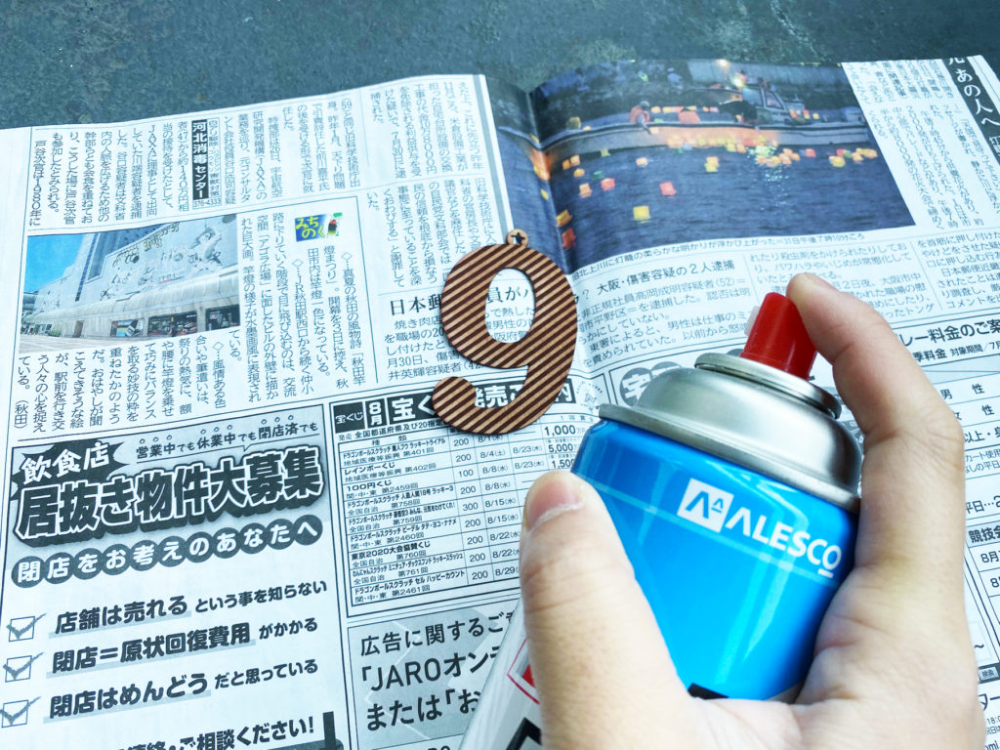
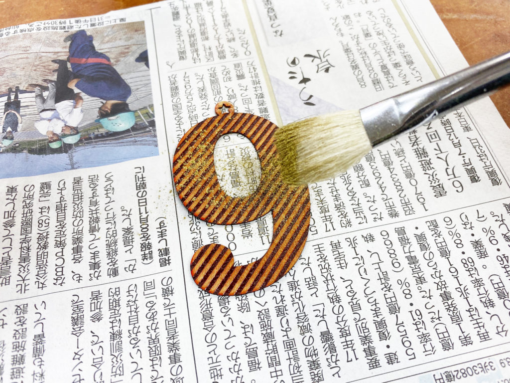

 

## **#09/25 [ 2019/12/09 ]** 
### by Shino ONODERA (FabLab SENDAI - FLAT)
  

 

### **材料**

* 乾漆シート（赤） 
（寒冷紗（かんれいしゃ）という布を漆（うるし）で塗り固めるという伝統技法によって作られた板状素材）
* 真鍮粉
* ボールチェーン

 

### **技術**

* データ作成：Adobe Illustrator
* レーザー彫刻&カット：レーザーカッター（trotec speedy100）

 

### **作り方**
 

### **1.** 
レーザーカット用のデータを作成！黒い部分は彫り込む加工（彫刻）、赤い線の部分はカット加工をします。 

  

### **2.** 
乾漆シートの表面にマスキングテープを貼ってレーザー加工！ 
加工が完了したら、マスキングテープは剥がさずに、透明スプレーを吹き付けます。 

  

### **3.** 
透明スプレーが半乾きになったら、筆を使って真鍮粉を振りかけます。 

  

### **4.** 
乾漆シート表面のマスキングテープを剥がしたら完成！ 

    

漆芸の技法のひとつである「沈金」からヒントを得て、糊ではなくアクリルスプレーを使って真鍮粉を定着させてみました。彫刻部分に凹凸があるためムラのある仕上がりになってしまいましたが、解像度を上げたら改善されるかもしれません。これはまだまだ実験が必要そうです。
  

（Last Updated: 2023.04.11）

