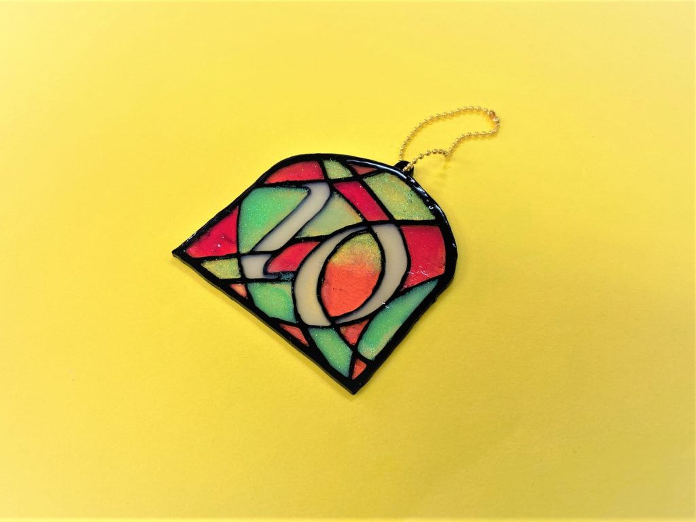
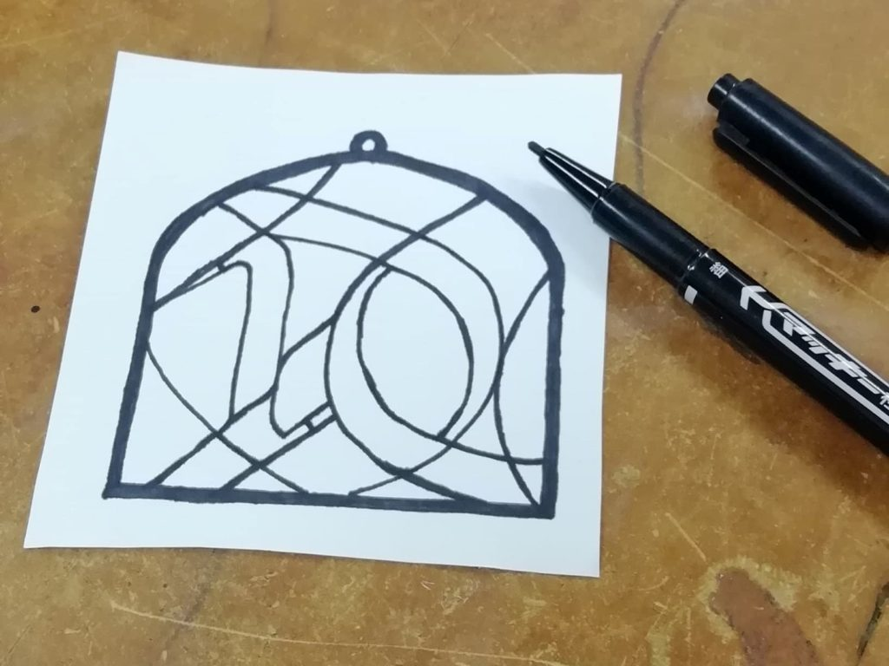
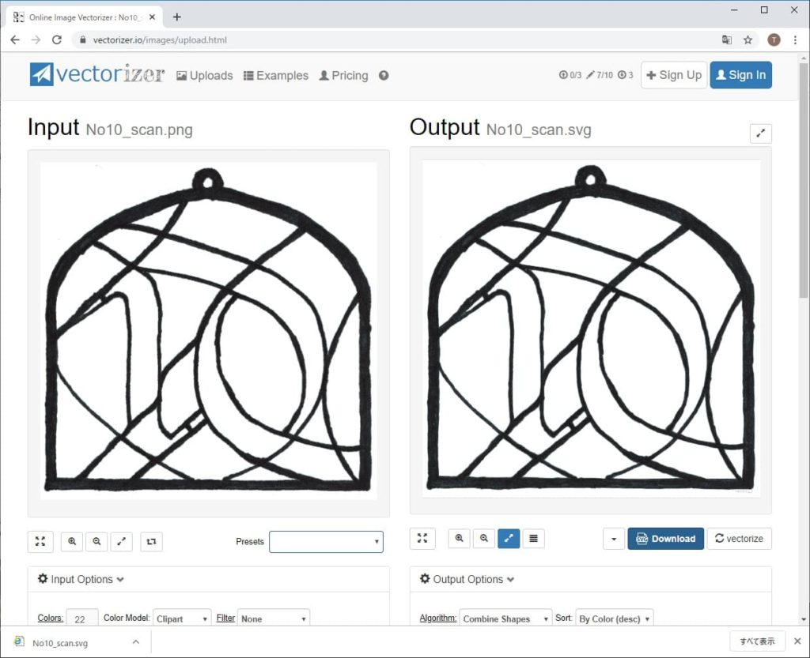
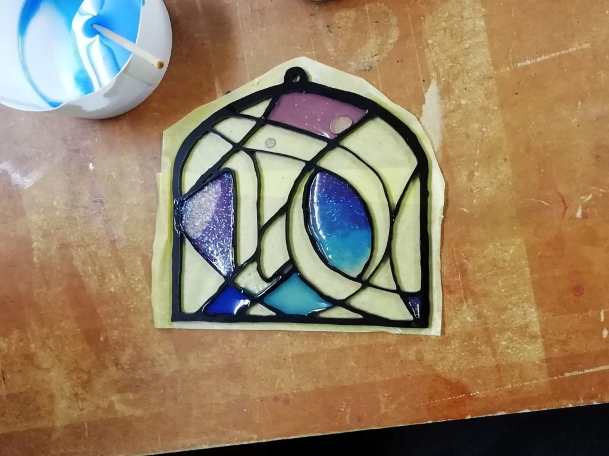

 

## **#10/25 [ 2019/12/10 ]** 
### by ツチタさん（FabLab SENDAI - FLATユーザー）
  

 

### **材料**

* アクリル板（2mm黒）
* UVレジン
* UVレジン用染料
* ネイル用グリッター
* 養生テープ
* ボールチェーン

 

### **技術**

* データ作成：手書き＆ベクター変換
* 切断：レーザーカッター（trotec speedy100）

 

### **作り方**
 

### **1.** 
サインペンを使用して手書きで枠のデザインを作成 

  

### **2.** 
スキャナで取り込み、ベクター画像に変換 
変換には[「https://www.vectorizer.io/」](https://www.vectorizer.io/)というサイトを使用 

  

### **3.** 
レーザーカッターでアクリルを切り取り、枠を作成。 
レジンを流し込む。 

  

### **4.** 
紫外線により硬化させて完成。 

    

デジタル工作機を使用する場合の最初のハードル「データ作成」を手書きのデータを取り込み～ベクタデータに変換とすることで、CADやIllustratorを使用せずに加工データを作成することができました。
  

（Last Updated: 2023.04.11）

