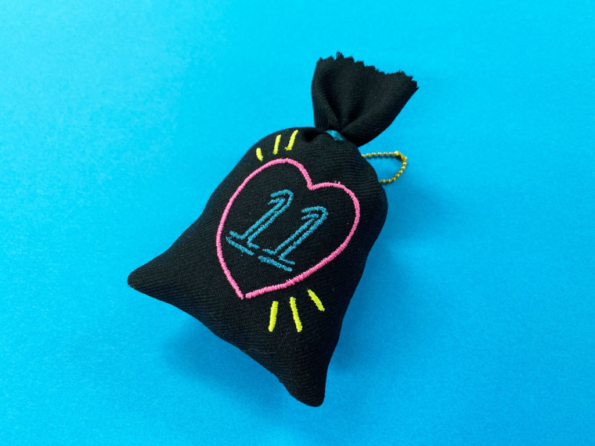
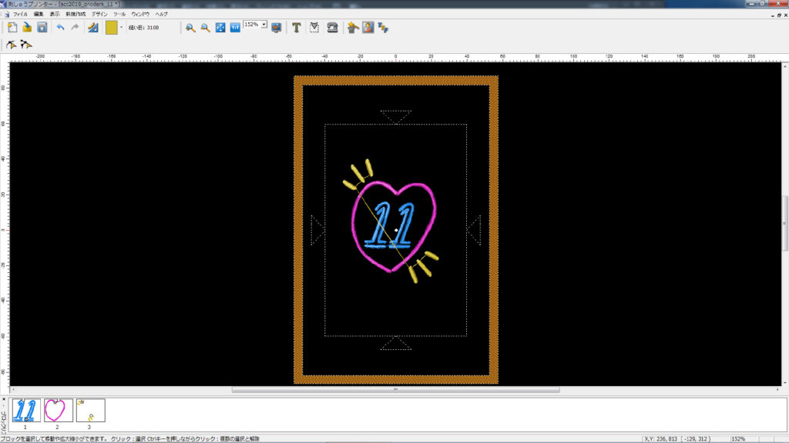
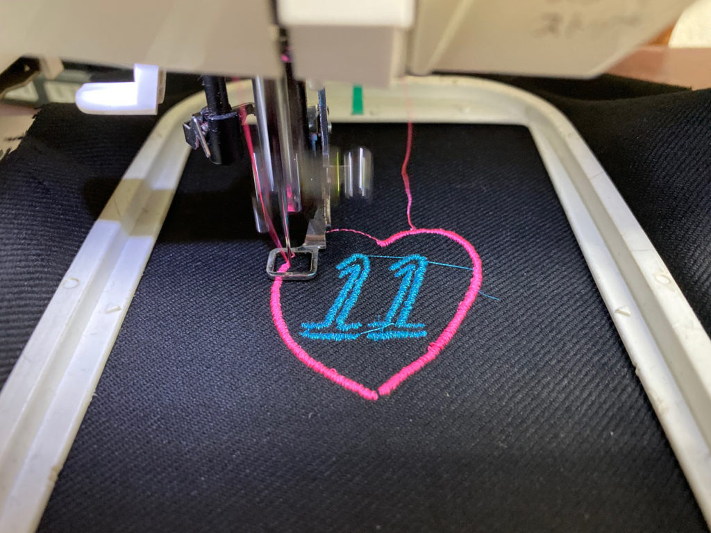

 

## **#11/25 [ 2019/12/11 ]** 
### by Shino ONODERA （FabLab SENDAI - FLAT）
  

 

### **材料**

* 布
* 刺繍糸
* 綿
* ボールチェーン

 

### **技術**

* データ作成：手書きのイラスト & 刺繍ミシン用データ作成ソフト
* 刺繍：刺繍ミシン（JAGUAR SP-4000）

 

### **作り方**
 

### **1.** 
サインペンを使用して、手書きでイラストを作成。 

  

### **2.** 
イラストをスマホで撮影し、刺繍ミシン用データ作成ソフトに読み込み。 
どんな縫い方にするかを決め、最終的なデザインも少し修正しました。 

  

### **3.** 
データが完成したら刺繍開始！だいたい15分くらいで全ての刺繍が完了しました。 

  

### **4.** 
刺繍完成！刺繍された布は、袋状にして綿を詰めてみました。 

    

刺繍ミシンの場合、IllustratorやInkscapeなどで作成したデジタルデータは特に必要なく、刺繍ミシン用ソフトも様々なデータを作成することが可能です。
布や糸をセッティングしなければならないので作業手順は多めですが、
他のデジタル加工マシンに比べてとっつきやすいマシンではないかなと思います。 
「なんでもいいからデジタルファブリケーションにチャレンジしてみたい！」という方におすすめですよ！
  

（Last Updated: 2023.04.11）

