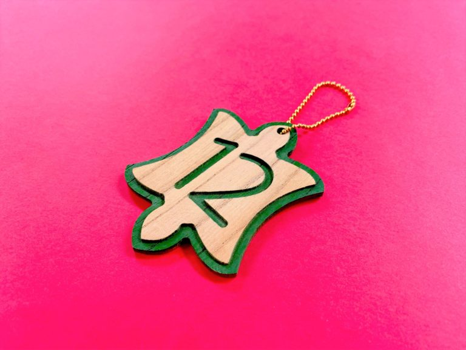
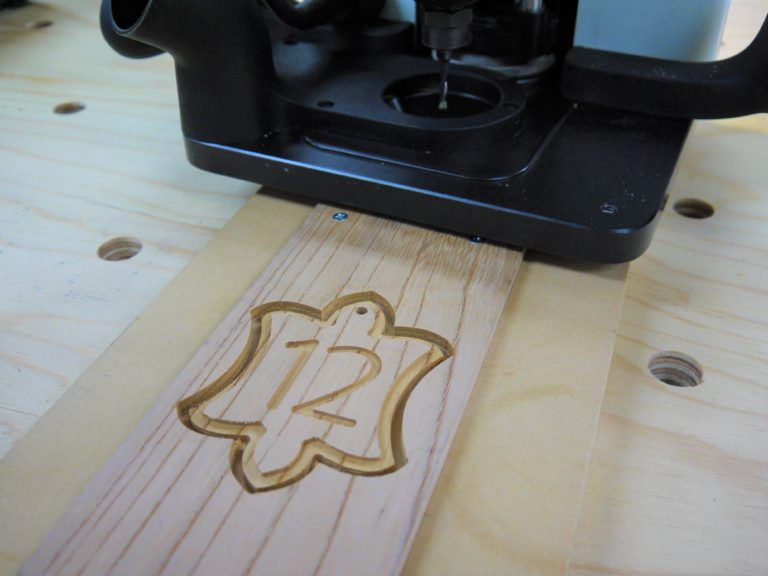
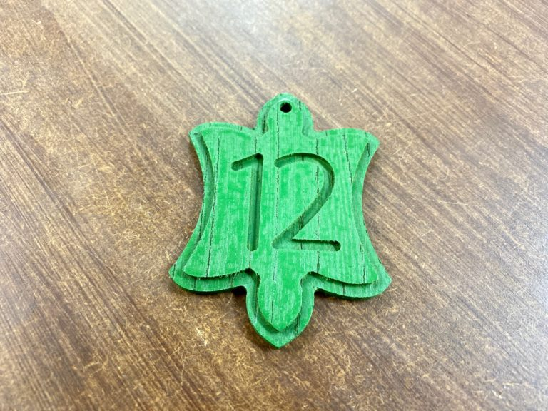
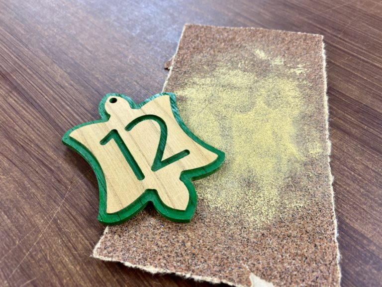

 

## **#12/25 [ 2019/12/12 ]** 
### by Takuma OAMI （FabLab SENDAI - FLAT）
  

 

### **材料**

* 無垢板(アッシュ, 5mm厚)
* 多用途水性スプレー(グリーン)
* ボールチェーン

 

### **技術**

* データ作成：Adobe Illustrator
* CNC切削：Shaper Origin

 

### **作り方**
 

### **1.** 
イラレで作ったデータをShaper Originで削ります。 

  

<iframe width="680" height="382.5" src="https://www.youtube.com/embed/LR1SmL5JmHg" title="YouTube video player" frameborder="0" allow="accelerometer; autoplay; clipboard-write; encrypted-media; gyroscope; picture-in-picture; web-share" allowfullscreen></iframe>

  

### **2.** 
削ったパーツをスプレーで塗装します。( 裏側に色がつかないようにマステで保護してました ) 

  

### **3.** 
十分に乾いたら、紙やすりを平らな所におき、前面の出っ張ったとこだけやすっていきます。こうすることで、模様の出っ張ったところだけ色が落ちて木目があらわれ、削ってへこんだところだけにスプレーの色が残ります。 

  

### **4.** 
ボールチェーンを通して完成！ 

    

木目とパキッとしたスプレーカラーが対照的な仕上がりになりました。 
マスキングテープを駆使すれば多色でのカラーリングもできます。
  

（Last Updated: 2023.04.11）

