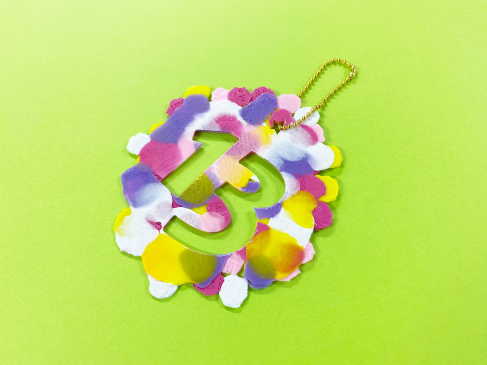
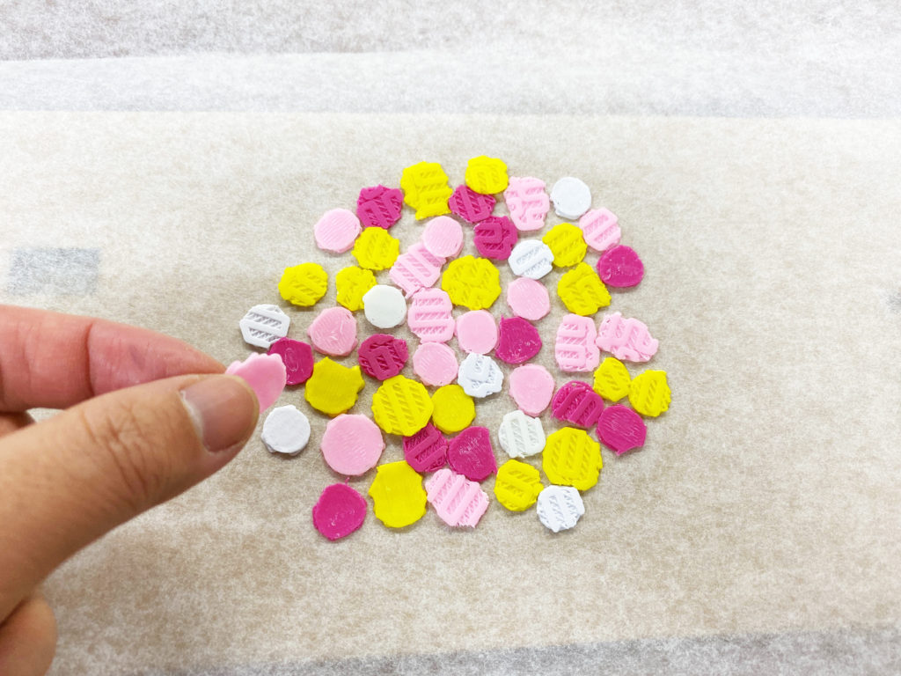
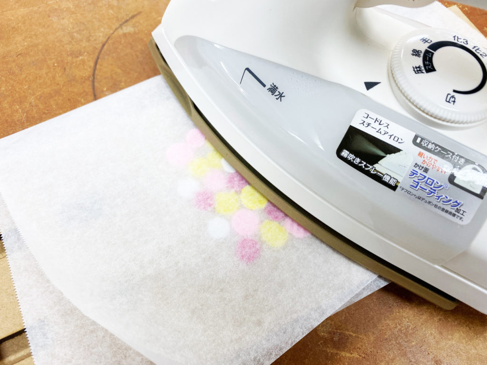

 

## **#13/25 [ 2019/12/13 ]** 
### by Shino ONODERA （FabLab SENDAI - FLAT）
  

 

### **材料**

* 3Dプリント時に出たラフト部分（PLA）
* クッキングシート
* ボールチェーン

 

### **技術**

* データ作成：Adobe Illustrator
* カット：レーザーカッター（trotec speedy100）

 

### **作り方**
 

### **1.** 
3Dプリンタで造形物を作ったときにできた“ラフト”を、クッキングシートの上に並べます。 

  

### **2.** 
アイロンを当てて“ラフト”を溶かしてシート状にします。 

  

### **3.** 
Illustratorでデータを作り、2.で作ったシートをレーザーカットします。 

  

### **4.** 
ボールチェーンを通したら完成！ 

    

3Dプリント時に失敗した造形物を砕いてリサイクルすることも可能ですが、ラフトを使うとより手軽にシートづくりが楽しめるのでおすすめです！
  

（Last Updated: 2023.04.11）

