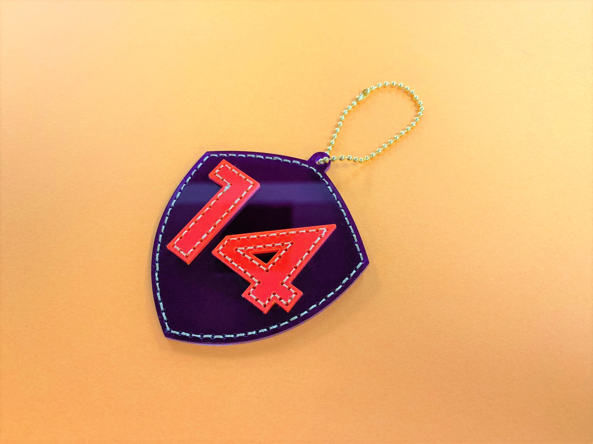
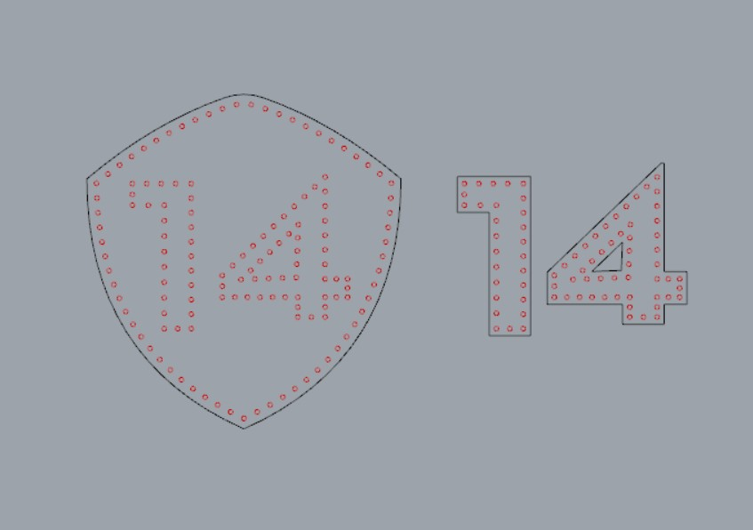
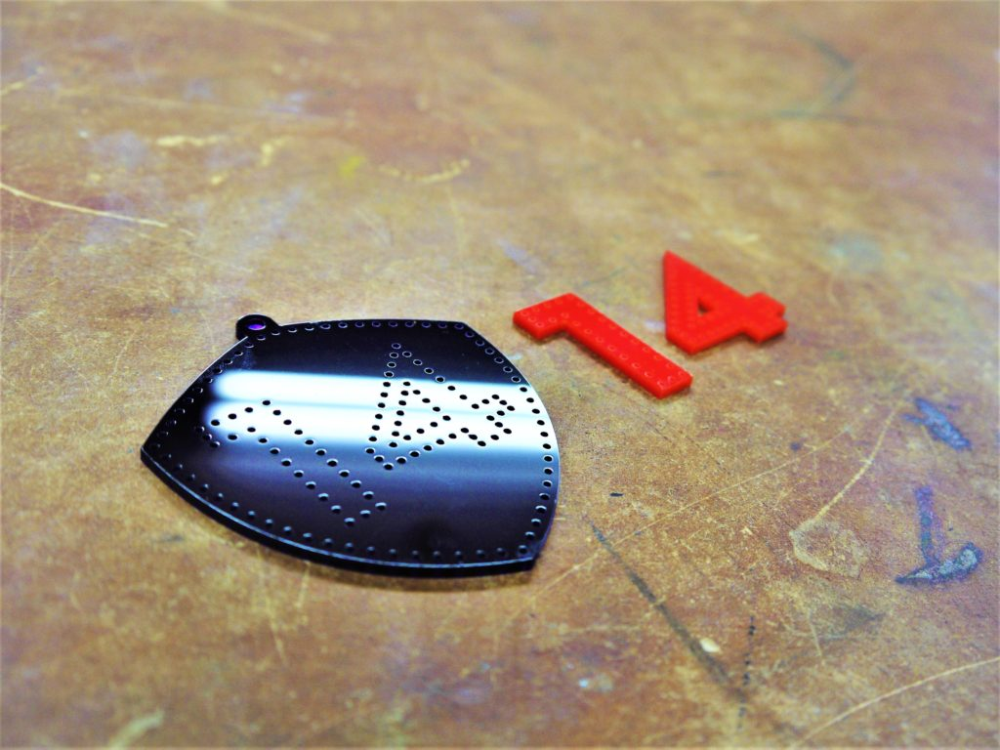
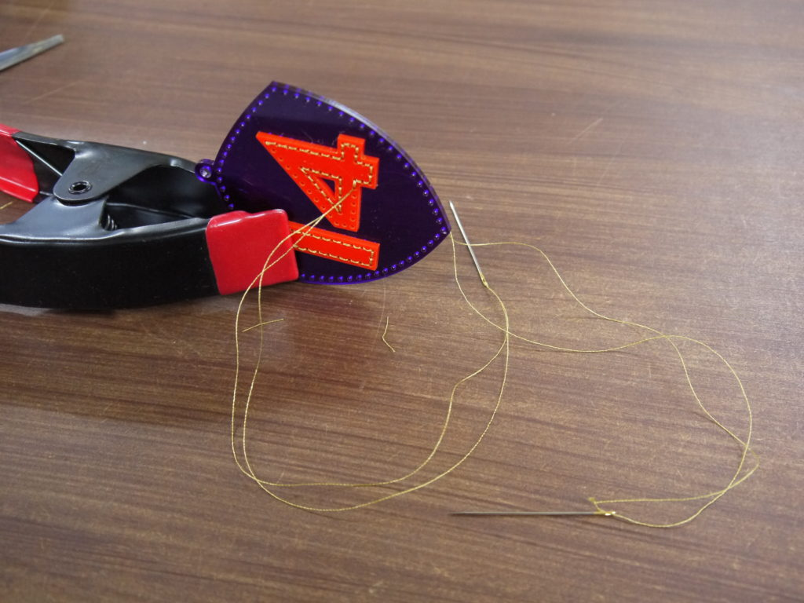

 

## **#14/25 [ 2019/12/14 ]** 
### by Takuma OAMI （FabLab SENDAI - FLAT）
  

 

### **材料**

* アクリル板2mm厚(オレンジ, パープル)
* 糸(ゴールド)
* ボールチェーン

 

### **技術**

* データ作成：Adobe Illustrator
* カット：レーザーカッター（trotec speedy100）

 

### **作り方**
 

### **1.** 
まずはイラレでデータ作成。ベースとなるパーツと、上に乗る数字パーツの穴の位置が対応するように設計してます。 

  

### **2.** 
パーツをレーザーカット。ベースと数字のパーツで色は変えてます。 

  

### **3.** 
パーツ同士を糸で縫い合わせていきます。データ上で位置合わせしておいたので、狙ったところにピッタリ数字がきます。 

  

### **4.** 
ボールチェーン通して完成ー！ 

    

レーザー加工したパーツを組み合わせる時に、どうしても接着剤だったりネジだったりで固定することが多いんですが、なんか別の方法で組み合わせることできないかな？と考えたところ、縫ってみることにしました。刺繍みたいなんだけどアクリルの部分はツルっとしてる不思議な風合いになるし、なにより縫ってる時が無心になれて日々の息抜きに良いです。
  

（Last Updated: 2023.04.11）

