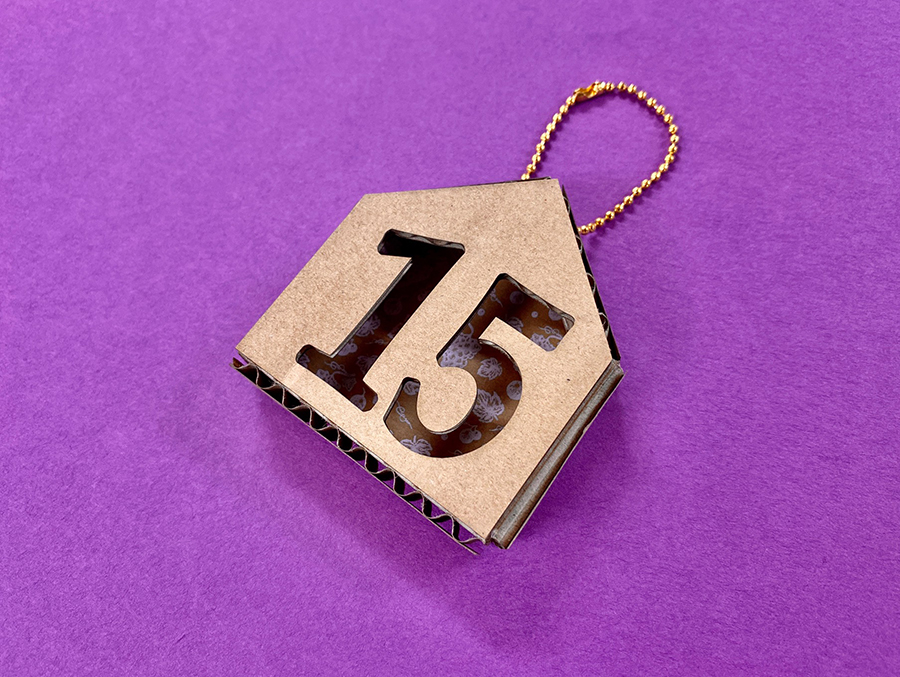
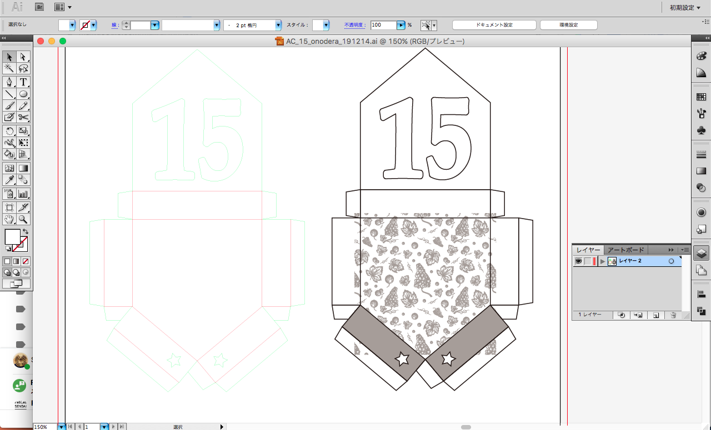
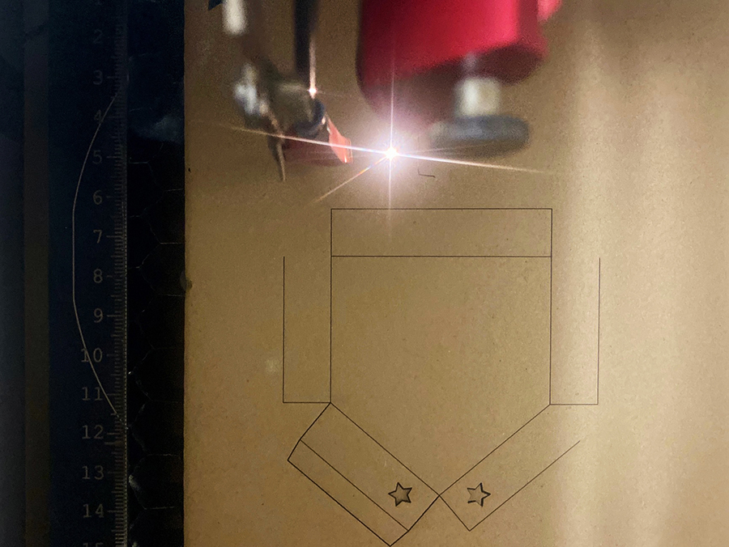
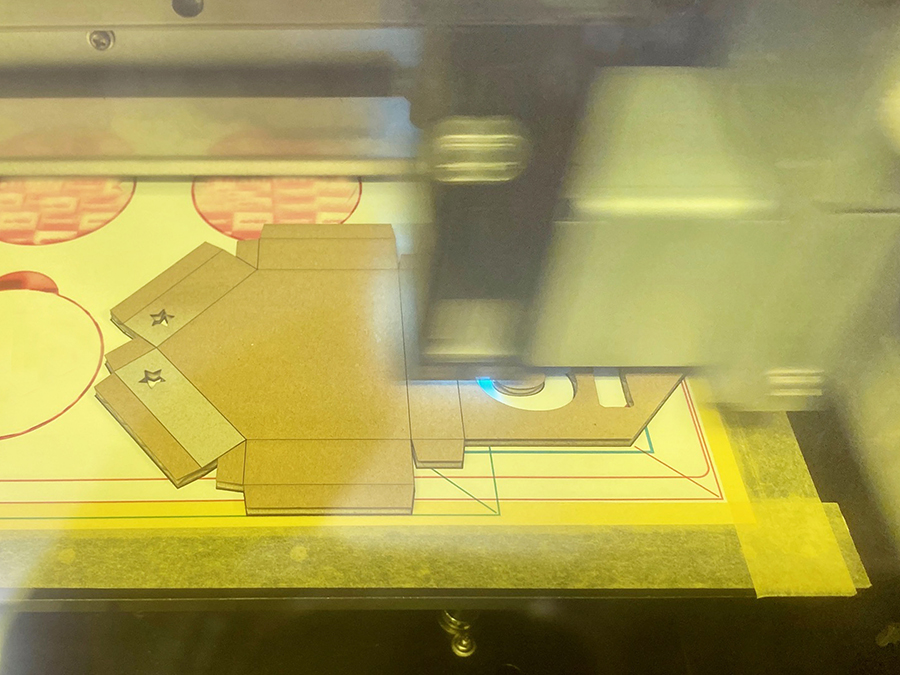

 

## **#15/25 [ 2019/12/15 ]** 
### by Shino ONODERA （FabLab SENDAI - FLAT）
  

 

### **材料**

* ダンボール（2mm厚）
* ボールチェーン

 

### **技術**

* データ作成：Adobe Illustrator
* レーザーカット：trotec Speedy100
* UVプリント：Roland LEF-12

 

### **作り方**
 

### **1.** 
まずはIllustratorでデータ作成。左がレーザーカット用のデータで、赤線は折り曲げ用にハーフカット、緑線は切り抜きを行います。 
右はUVプリント用のデータです。グレーになっているところがホワイトプリントを行う部分で、柄と長方形は裏表別にプリントします。 

  

### **2.** 
ダンボールは、中に空洞があり材質が均一ではないため、レーザー加工はやや難しい素材。今回は薄めのダンボールシートを使用したので、焦げることなく綺麗に加工できました。 

  

### **3.** 
レーザー加工が終わったらUVプリント。表の長方形のホワイトプリントが完了したら、ひっくり返して裏面の柄もホワイトプリントします。 

  

### **4.** 
組み立てたら完成！文字の穴から、奥の壁に印刷された柄が見えるようにしてみました。（ちょっと分かりにくいですが…） 

    

薄手のダンボールはちょっとした製作に使いやすいので、FLATではダンボールで荷物が届いたときにコツコツ溜めています。 
また、普通のプリンタでは行うことができない「白いインク」で印刷できることがUVプリンタの特徴のひとつ。濃いめの素材にちょっとプリントするだけで、オシャレに見えるのでおすすめですよ〜！
  

（Last Updated: 2023.04.11）

