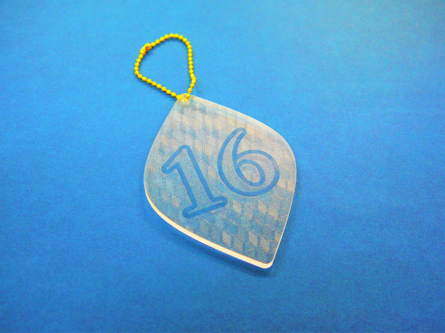
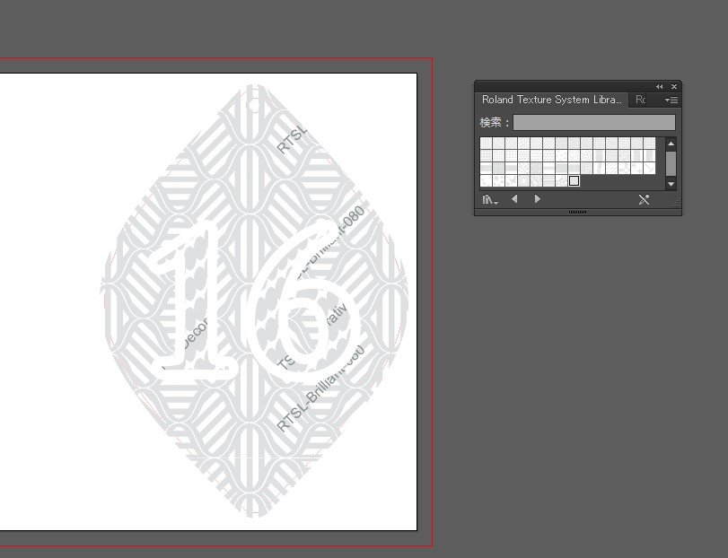
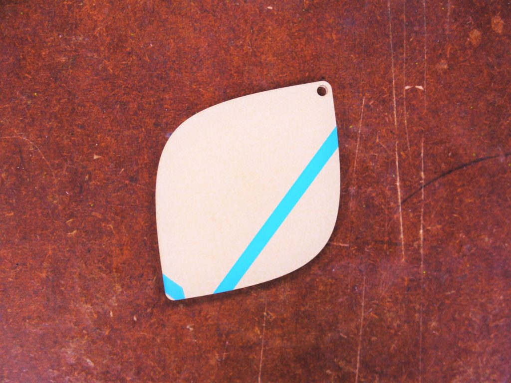
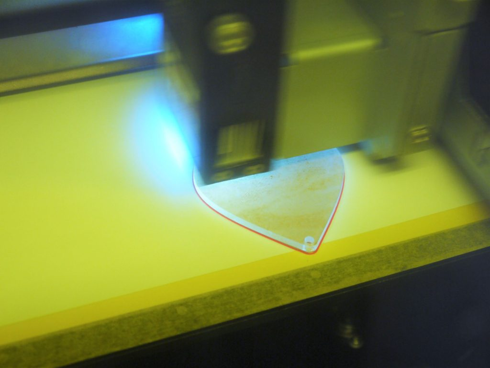

 

## **#16/25 [ 2019/12/16 ]** 
### by Takuma OAMI （FabLab SENDAI - FLAT）
  

 

### **材料**

* 透明アクリル（3mm厚）
* ボールチェーン

 

### **技術**

* データ作成：Adobe Illustrator
* レーザーカット：trotec Speedy100
* UVプリント：Roland LEF-12

 

### **作り方**
 

### **1.** 
まずはIllustratorでデータ作成。今回は、RolandDGから配布されているテクスチャデータをつかって、模様をつけていきたいと思います。 

  

### **2.** 
次にレーザーカッタでアクリル板をカット。写真だと表面に保護シートがついているので分からないですが、シートを向くと無色透明です。 

  

### **3.** 
カットしたパーツをUVプリンタにセット。透明なグロスインクで先ほどイラレで設定した模様をつけていきます。 

  

### **4.** 
完成！ 

    

角度で光の反射の濃淡が変わるので、面白いです。自分で作ろうとすると手間のかかるグロスプリントのテクスチャですが、プリセットの物を使えば簡単だし、これだけでも結構遊べますね！ラボにサンプルもあるので見たい人はお声がけ下さい～。ではまた次回！
  

（Last Updated: 2023.04.11）

