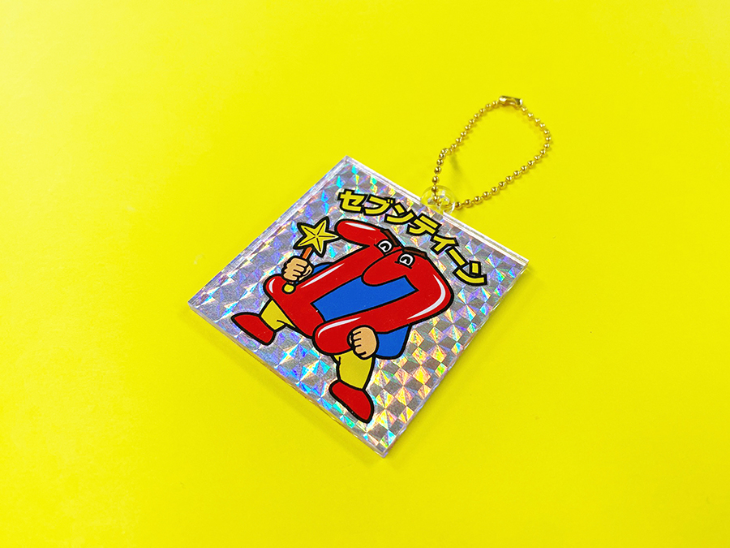
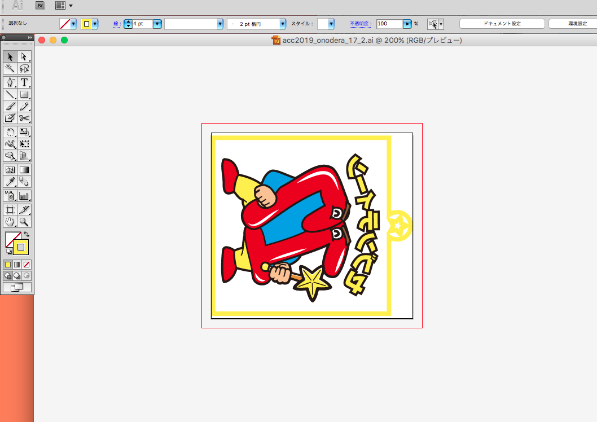
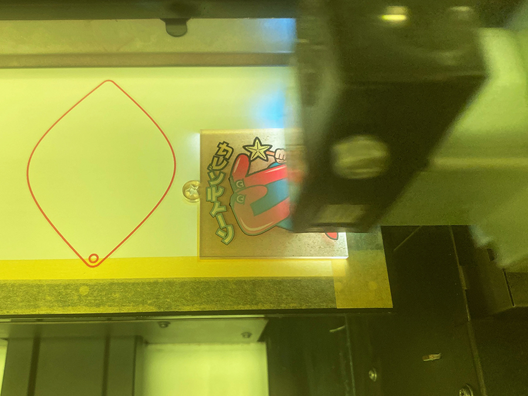
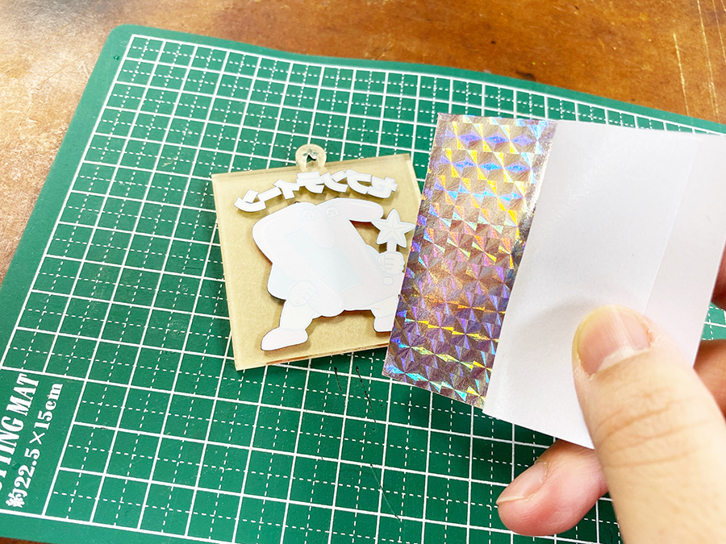

 

## **#17/25 [ 2019/12/17 ]** 
### by Shino ONODERA （FabLab SENDAI - FLAT）
  

 

### **材料**

* 透明アクリル（3mm厚）
* シールちよがみ（ホログラム／ダイソーで購入）
* ボールチェーン

 

### **技術**

* データ作成：Adobe Illustrator
* レーザーカット：trotec Speedy100
* UVプリント：Roland LEF-12

 

### **作り方**
 

### **1.** 
まずはIllustratorでデータを作成。チャームの裏面にプリントをしたいので、データは反転させておきます。 

  

### **2.** 
レーザーカットしたアクリル板にUVプリント！色をはっきり出したかったので、フルカラー2回→ホワイト2回の順にプリントしました。 

  

### **3.** 
UVプリントした面にシールちよがみを貼ります。
商品自体には色が付いていますが、糊が付いている面はシルバーです。 

  

### **4.** 
アクリル板の保護紙をはがしたら完成！ 

    

ホログラムシート自体は、光をよく反射するためUVプリントをするのは避けたいところですが、こんなふうにUVプリントしたものの上からシートを貼ってみるのは、方法としてアリだな〜と思いました。（UVプリント箇所も保護されるので一石二鳥です！）
  

（Last Updated: 2023.04.11）

