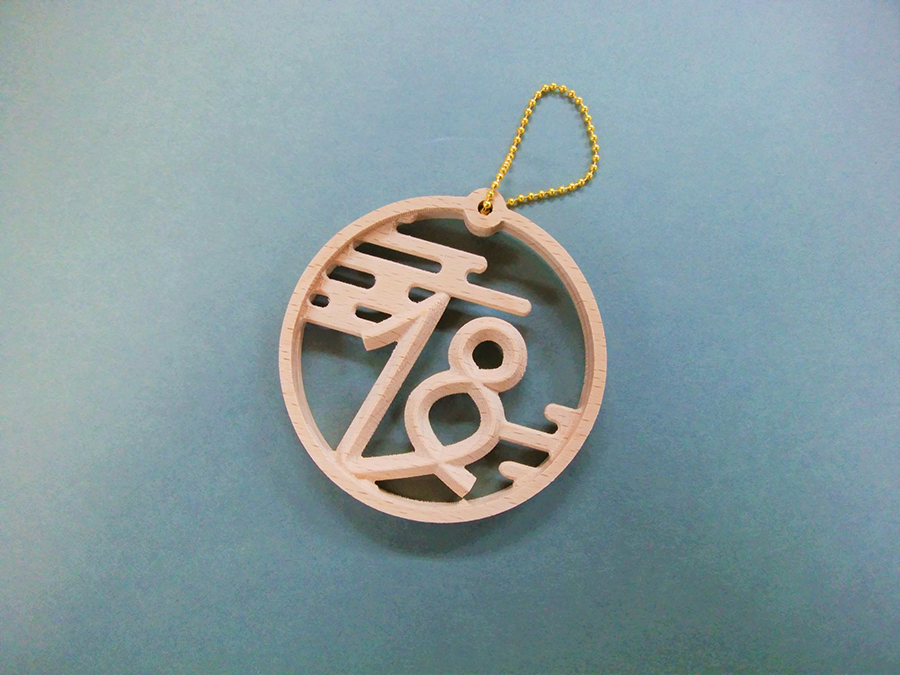
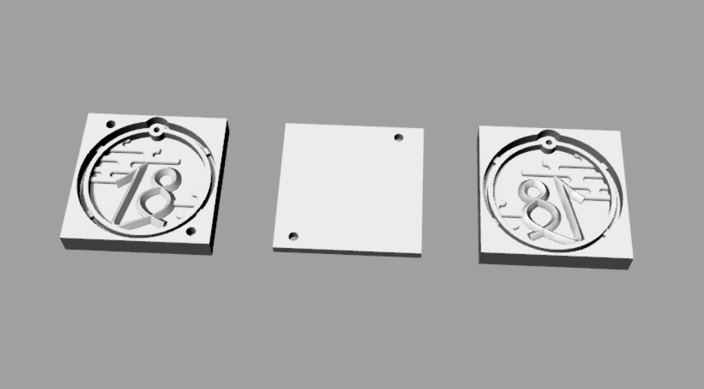
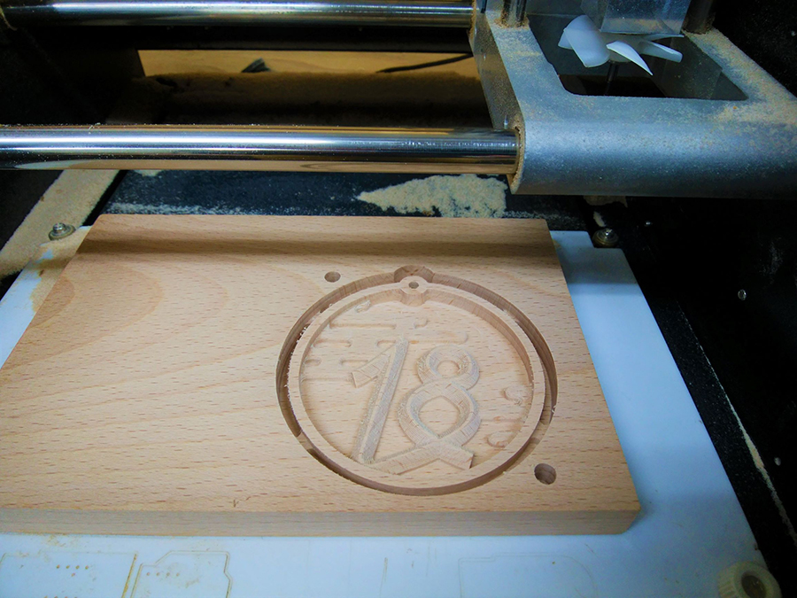
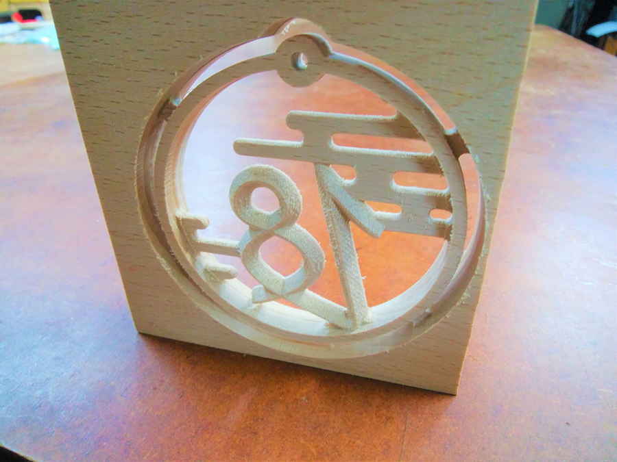

 

## **#18/25 [ 2019/12/18 ]** 
### by Takuma OAMI （FabLab SENDAI - FLAT）
  

 

### **材料**

* 無垢板（15mm厚）
* ボールチェーン

 

### **技術**

* データ作成：Rhinoceros
* CNC切削：Roland Modela MDX-20

 

### **作り方**
 

### **1.** 
まずはRhinocerosでデータを作成。表と裏両面から削るのと、素材をひっくり返した時の位置合わせ用に３種類データを用意しました。 

  

### **2.** 
卓上CNCルータ”MDX-20”に素材をセットし、まずは表面を切削。 

  

### **3.** 
表面が完了したら、素材をひっくり返して裏面も切削。透かし彫りっぽくなっております。下の写真はCNC加工を終えた時のもの。ここから、素材の枠から切り離し、すこし紙やすりをかけていきます。 

  

### **4.** 
ボールチェーンを通して完成！ 

    

本当は、ここで紹介しきれないくらい細かい設定や、切削加工失敗の絶望とかありました。データ作ってる時から『これ、時間かかるだろうな～』みたいなことは考えるんですが、それでも木材削るの好きなんですよね。やはり手間かけた分できた時の満足感もひとしおですね。最終的には日本家屋の”らんま”のような雰囲気に落ち着きました。
  

（Last Updated: 2023.04.11）

