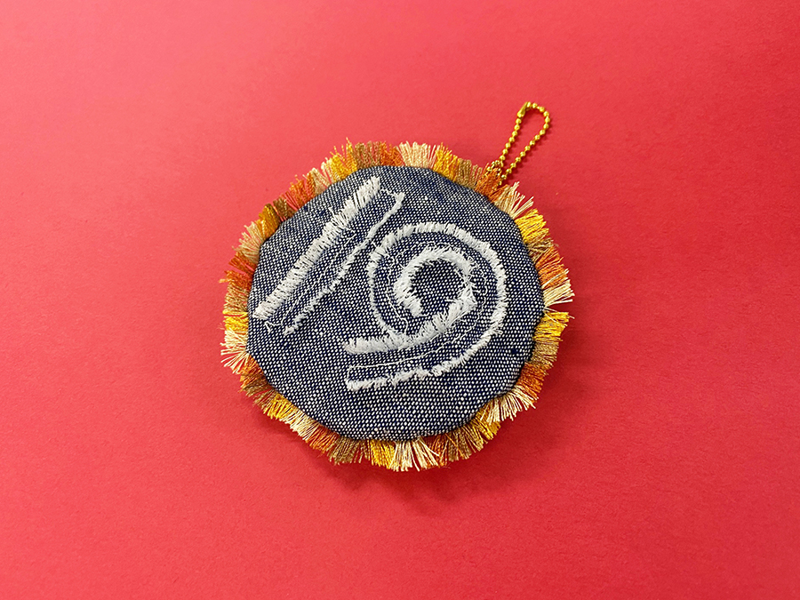
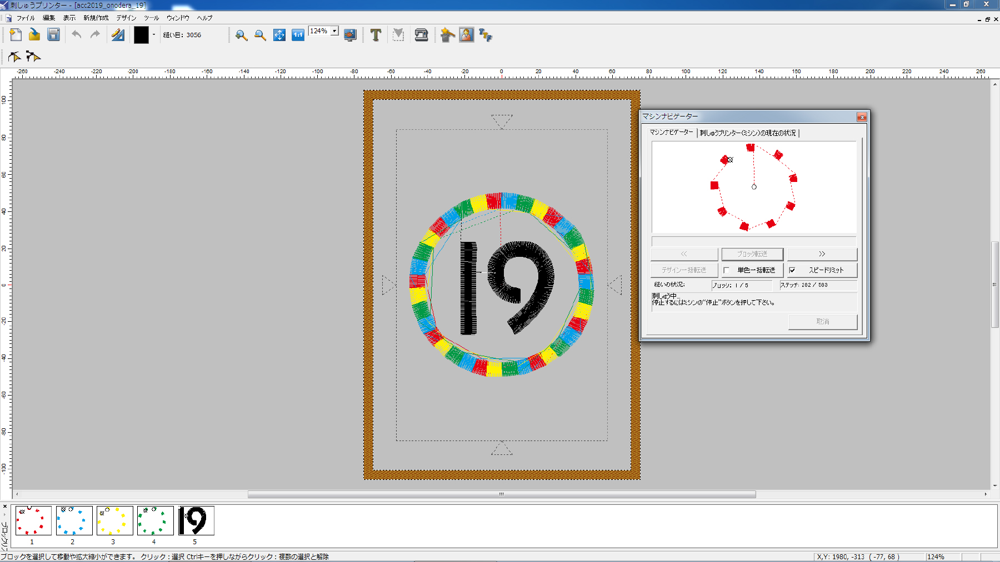
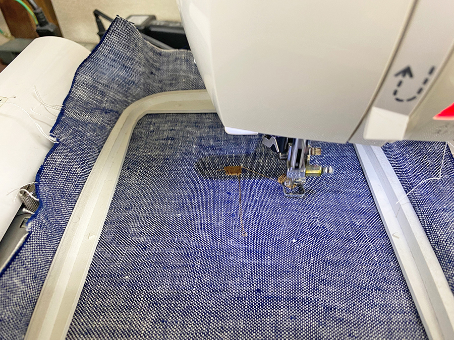
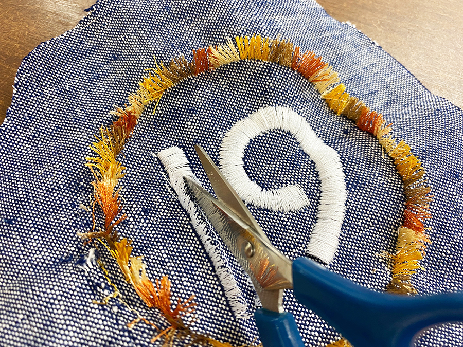

 

## **#19/25 [ 2019/12/19 ]** 
### by Shino ONODERA （FabLab SENDAI - FLAT）
  

 

### **材料**

* 布
* 刺繍糸（5色）
* ボールチェーン

 

### **技術**

* データ作成：Adobe Illustrator
* 刺繍：JAGUAR SP-4000

 

### **作り方**
 

### **1.** 
Illustratorで作成した画像データを刺繍ミシン用ソフトで読み込み、刺繍用データに変換。今回は、全て「コラム×フィルステッチ」という方法で刺繍することにしました。 

  

### **2.** 
データが完成したらひらすら刺繍！ 

  

### **3.** 
刺繍が完成したら、裏面にボンドを塗ってから全てカット！ 
今回使用したステッチはワッペンの周縁によく使われているものです。画像の枠内を畳のように埋め抜いしているわけではないので、糸の一部をカットすると写真のようにバサっと立ち上がります。 

  

### **4.** 
外側の刺繍の周りをぐるっと縫い、中に丸く切った紙と綿を詰め、糸を引っ張ったらできあがり！ 

    

外側の糸を、もっと長めにしてもよかったかなと思いますが、まずはずっと考えていたことをかたちにできたので良かったです！タッセルにも応用できそうなので、もうちょっと実験を続けてみます！
  

（Last Updated: 2023.04.11）

