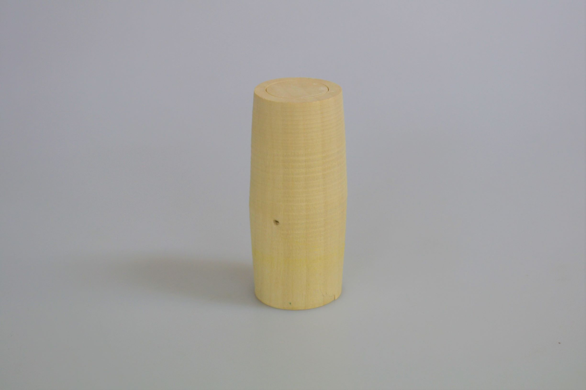

 

## **#20/25 [ 2019/12/20 ]** 
### by Takuma OAMI （FabLab SENDAI - FLAT）
  

 

### **材料**

* 丸棒(ミズキ)
* 厚紙
* ボールチェーン

 

### **技術**

* データ作成：Adobe Illustrator
* CNC切削：Shaper Origin

 

### **作り方**
 

### **1.** 
今回使用する素材はこれ。ミズキっていう木の丸棒です。こけしを作る工房で出た端材をもらってきました。 

  

### **2.** 
治具で固定した丸棒の小口に、鏡文字にした数字を切削して刻みます。 

  

### **3.** 
削った文字にインクをつけ、紙にギュッと押し付けます。そうですスタンプです。 

  

### **4.** 
ボールチェーンでスタンプ本体とそれを押した紙をつなげて完成！ 

    

今回は、文字そのものじゃなく、文字をプリントするための道具を作ってみましたー
  

（Last Updated: 2023.04.11）

