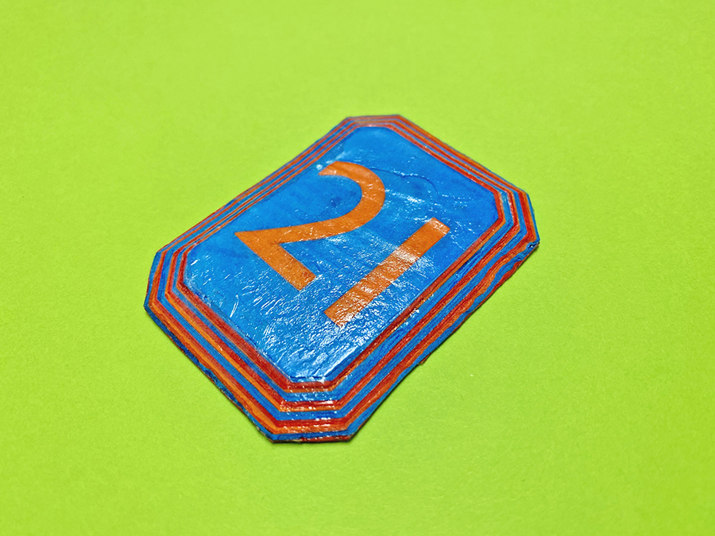
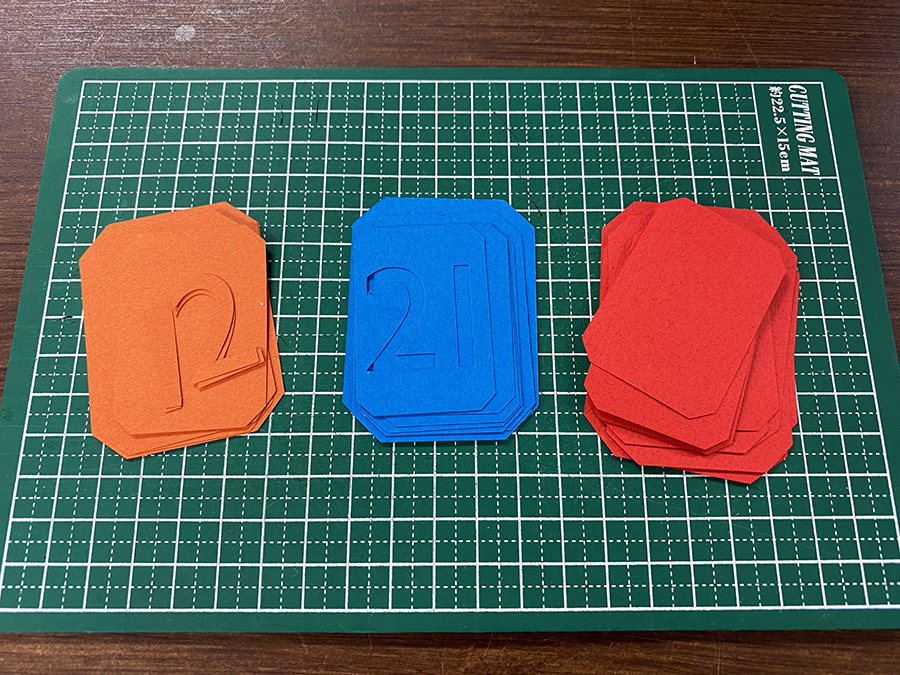
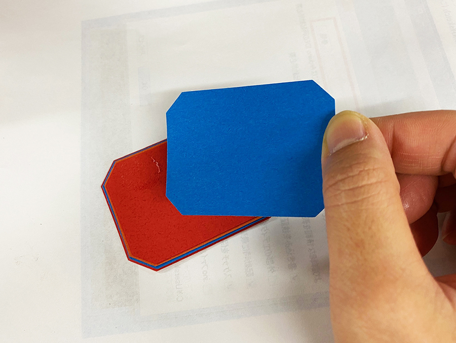
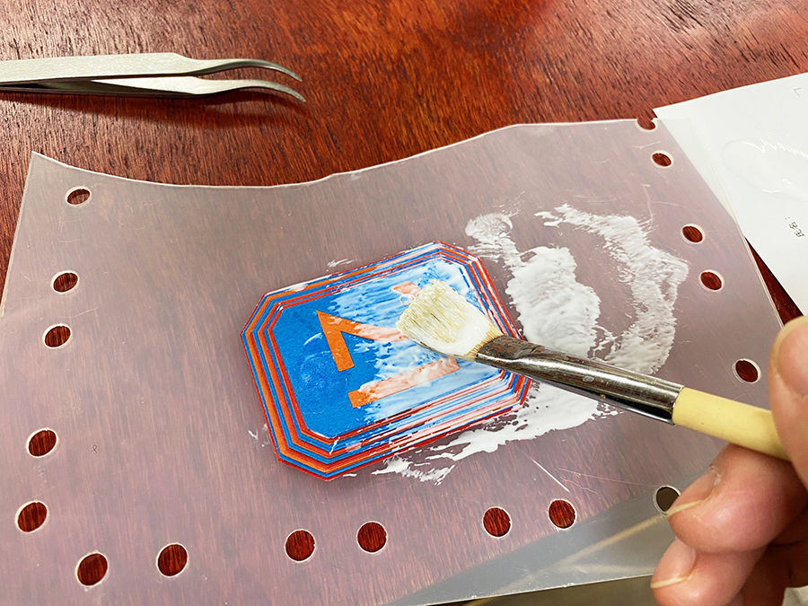

 

## **#21/25 [ 2019/12/21 ]** 
### by Shino ONODERA （FabLab SENDAI - FLAT）
  

 

### **材料**

* 色紙
* ボンド
* ボールチェーン（あとでつけます！）

 

### **技術**

* データ作成：Adobe Illustrator
* ペーパカット：silhouette CAMEO

 

### **作り方**
 

### **1.** 
まずはIllustratorで作ったデータを元に、3色の色紙をカッティングマシンでカット。 

  

### **2.** 
スティックのりで接着していきます。 

  

### **3.** 
紙を全て積層したら、ボンドを塗りたくります。 

  

### **4.** 
ボンドが乾いたら、余計なはみ出し部分をカットして完成！なんだか不思議なものができあがりました… 

    

本当はレジンを使用したかったのですが、手軽さを考えてボンドを使用したところ、むにむにとした不思議な触感のものができあがりました.. 
もうすこしやすりがけをして表面を均一にしたいので、これは早いところリベンジする必要がありそうです。
  

（Last Updated: 2023.04.11）

