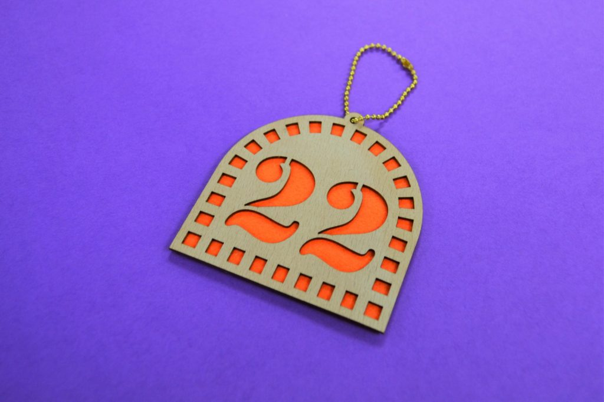
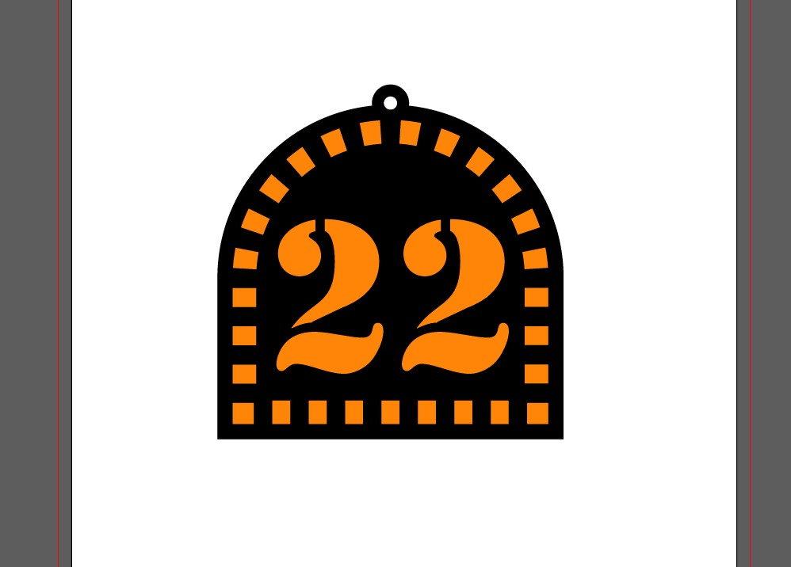
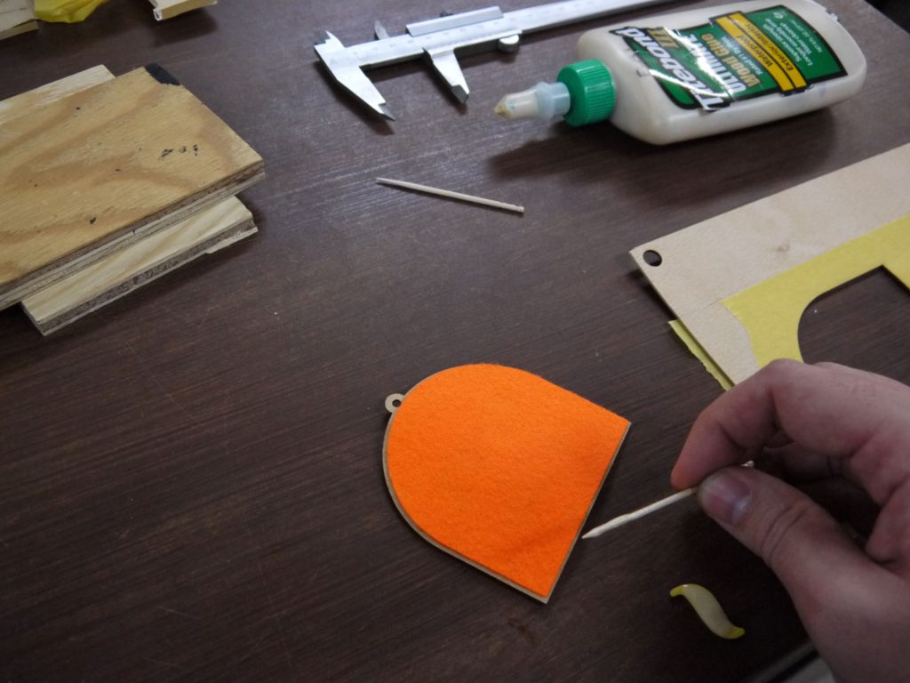
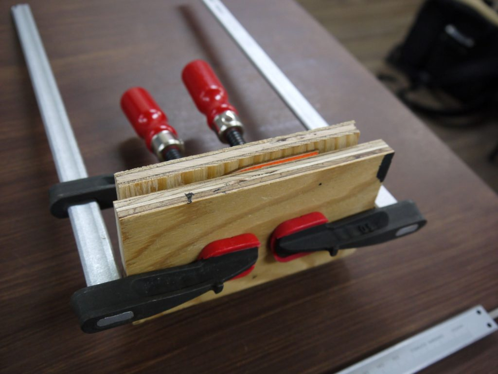

 

## **#22/25 [ 2019/12/22 ]** 
### by Takuma OAMI （FabLab SENDAI - FLAT）
  

 

### **材料**

* フェルト（オレンジ）
* 曲げ用ラワン板(1mm厚)
* ボンド
* ボールチェーン

 

### **技術**

* データ作成：Adobe Illustrator
* レーザーカッター：trotec Speedy100

 

### **作り方**
 

### **1.** 
イラレで作った今回のデータ。完成予想図です。黒い部分が、白木っぽいラワン板になります。 

  

### **2.** 
カットしたフェルトと木を貼り付けます！ 

  

### **3.** 
しっかりクランプで厚をかけながらボンドが固まるのを待ちます。(大体一時間くらい？) 

  

### **4.** 
ボールチェーン通して完成ー！ 

    

今回使ったフェルトは化繊100%のものだったのですが、レーザーできると小口が固まってほつれにくくなるので愛称GOODです。異素材の組み合わせもなかなか奥深いものですね。
  

（Last Updated: 2023.04.11）

