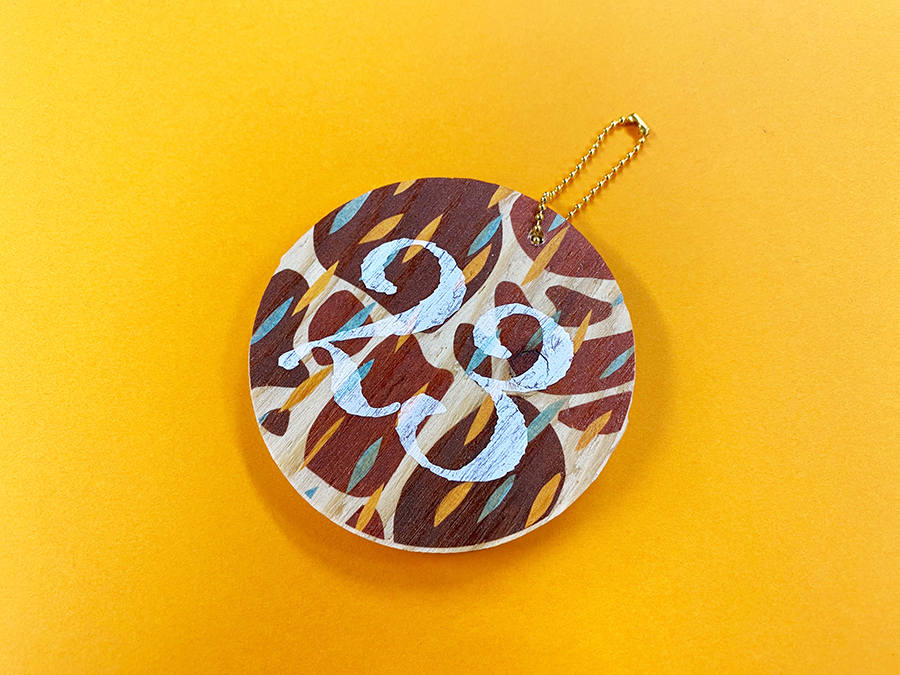
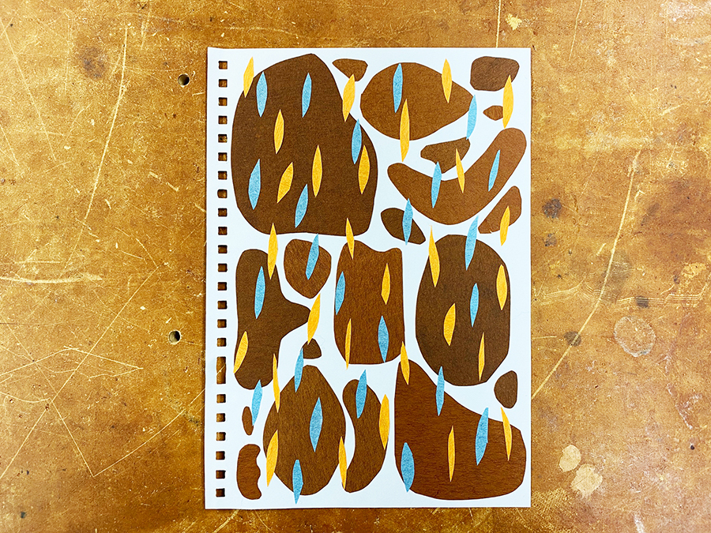
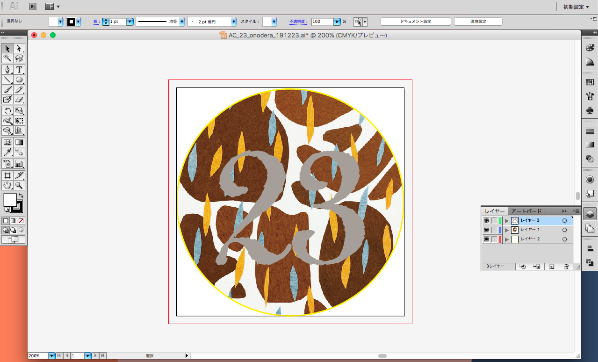
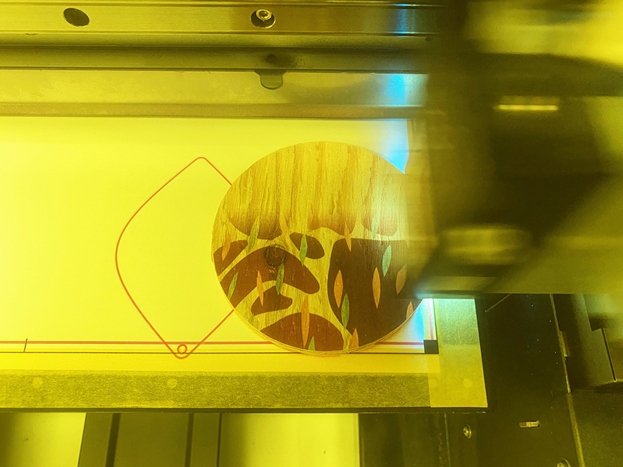

 

## **#23/25 [ 2019/12/23 ]** 
### by Shino ONODERA  （FabLab SENDAI - FLAT）
  

 

### **材料**

* 針葉樹合板の端材（直径85mm）
* ボールチェーン

 

### **技術**

* データ作成：Adobe Illustrator
* UVプリント：Roland LEF-12

 

### **作り方**
 

### **1.** 
まずはベースのデザインを考えます。今回は紙を切り貼りして作りました。 

  

### **2.** 
1.で作ったデザイン画をパソコンに取り込み、Illustratorで直径85mmの円に収まるように修正し文字を追加。23の部分のみ白インクで印刷をすることにしました。 

  

### **3.** 
データが完成したら、フルカラー→ホワイトの順にプリント！ 

  

### **4.** 
上部に穴をあけてボールチェーンを取り付けたらできあがり！ 

    

今回使用した板材は木目がはっきり出ているので、面白い質感の仕上がりになりました。
普段はアクリル板などツルッとした素材にプリントすることがほとんどですが、こんなふうにテクスチャを活かしたプリントもまた可愛いものです。
  

（Last Updated: 2023.04.11）

