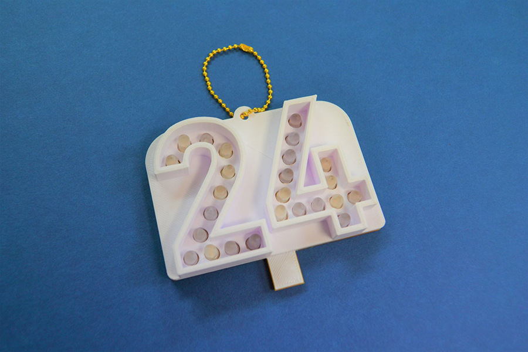
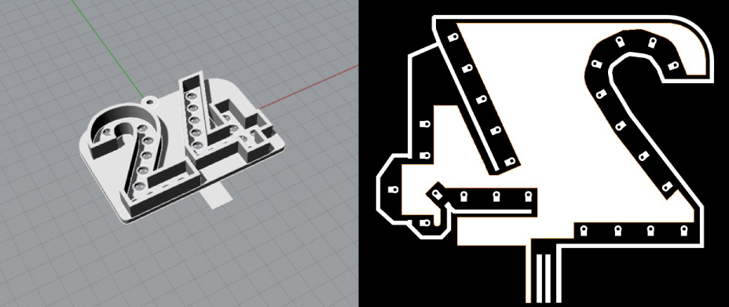
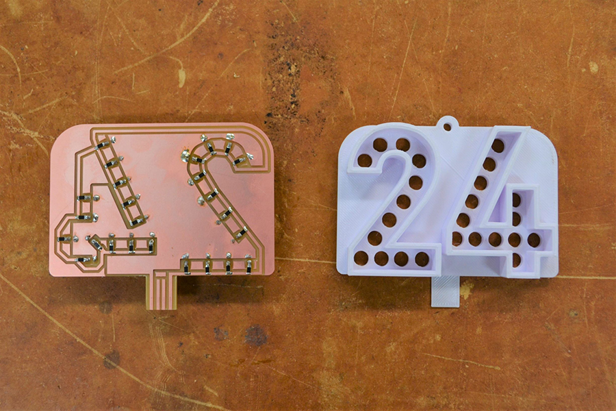
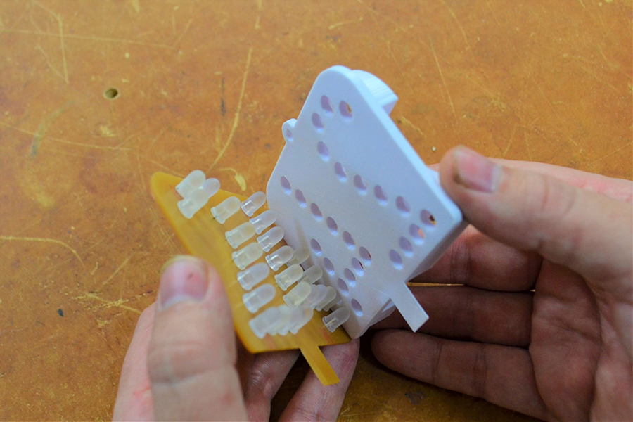
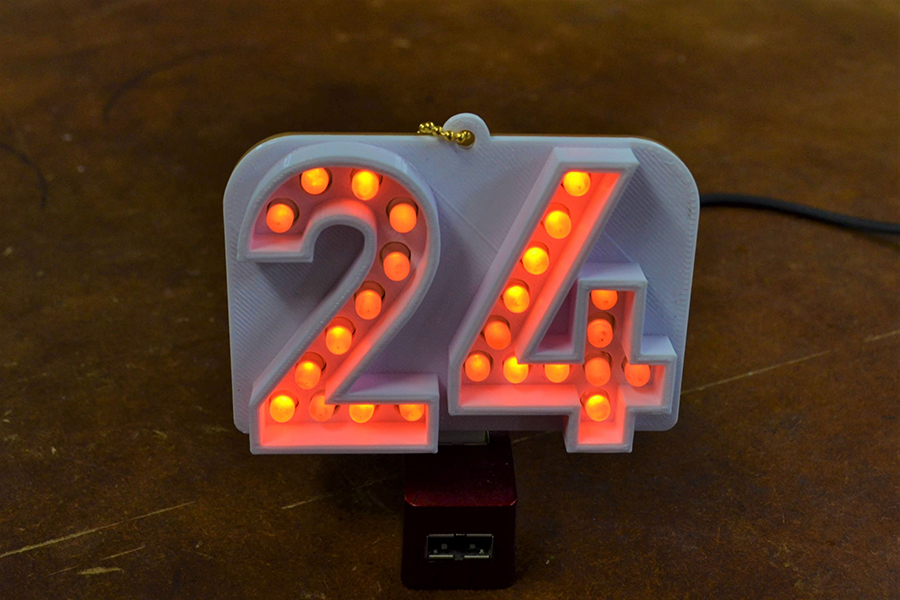

 

## **#24/25 [ 2019/12/24 ]** 
### by Takuma OAMI （FabLab SENDAI - FLAT）
  

 

### **材料**

* PLA（ホワイト）
* LED（オレンジ、５mm）
* 紙フェノール基板・PLA（ホワイト）
* 表面実装抵抗(499Ω)
* ボールチェーン

 

### **技術**

* データ作成：Adobe Illustrator、Rhinoceros
* 3Dプリント：MakerBot Replicator2
* 基盤切削：Roland Modela MDX-20

 

### **作り方**
 

### **1.** 
今回は僕にとって最後のターンという事で、気合を入れて作りました！データもPCB基板と3Dプリント用２種類です！ 

  

### **2.** 
削り出した基板の方にはLED(裏側にびっちりついてます)と抵抗を自分ではんだ付けします！3Dプリントパーツも出来上がりました。 

  

### **3.** 
この二つのパーツをドッキングさせます！ 

  

### **4.** 
下のでっぱりはUSBコネクタになっていて、USBにさすと光りまーす！！！完ッ成ィ！！！！！！！ 

    

クリスマスイブまでドタバタ作ってきましたが、なんとかやり遂げました。継続は力なりとは真実ですね。仕事もある中で、毎日一個はなかなかしんどいですが、続けるうちにだんだんと慣れてきて『こうしたら面白いんじゃないか？』みたいな勘も冴えてきたように感じます。来年といわず半年後くらいにまたチャレンジしたいです。 

明日はいよいよ今年のアドベントカレンダーチャレンジも一区切りの25日目です。ここまで追っていただいた方、ホントにありがとうござます！ではでは！
  

（Last Updated: 2023.04.11）

