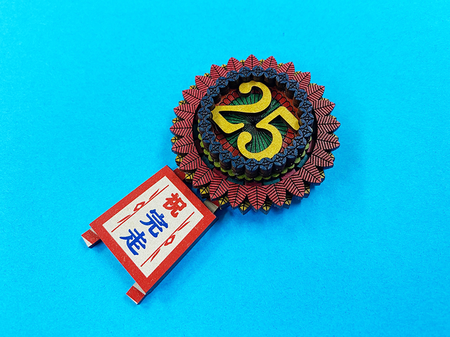
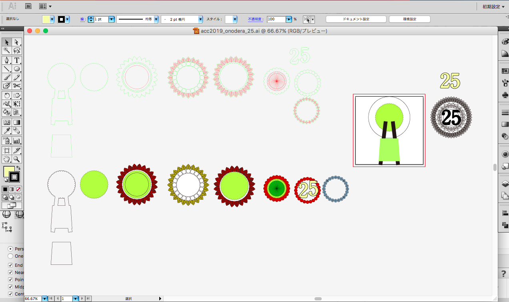
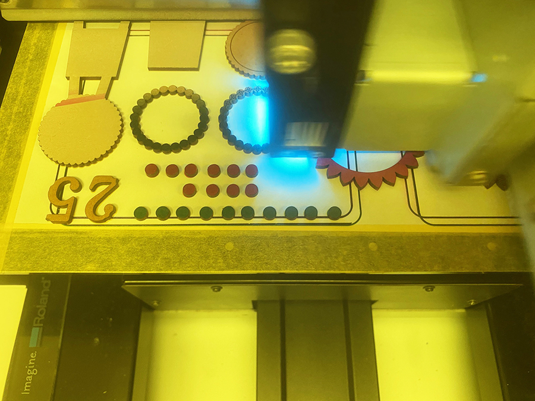
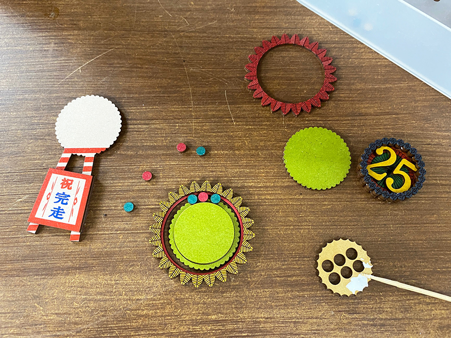

 

## **#25/25 [ 2019/12/25 ]** 
### by Shino ONODERa （FabLab SENDAI - FLAT）
  

 

### **材料**

* MDF（2.5mm厚）
* ボールチェーン

 

### **技術**

* データ作成：Adobe Illustrator
* レーザーカット：trotec speedy100
* UVプリント：Roland LEF-12

 

### **作り方**
 

### **1.** 
まずはIllustratorでデータ作成。上部のパーツの外側部分を回転させたかったので、ベアリングのようなしくみにすることに。 

  

### **2.** 
レーザーカットしたパーツにUVプリンタで着色。細いライン部分はレーザーカッターで罫書き加工をし、ベタ塗り部分のみUVプリントをしました。 
（小さい円形パーツが飛びそうでハラハラしたので、小さなパーツを加工するときは台座を設置した方が良さそうです） 

  

### **3.** 
加工が完了したらボンドを塗りながら組み立て！ 

  

### **4.** 
完成したものがこちら！うーん謎の仕上がりです！ 

    

チャレンジの最後にふさわしいよう、花輪をイメージして作ってみたのですが、上部もホワイトプリントをしてからカラープリントをすればよかったなと思いました..（なんだか東南アジアのお土産っぽくなってしまいました。） 

あとは、ベアリング風にした輪っか部分は、指で動かすとちゃんと回転します。ぜひぜひFLATで実物を見て触ってみてください！！
  

（Last Updated: 2023.04.11）

