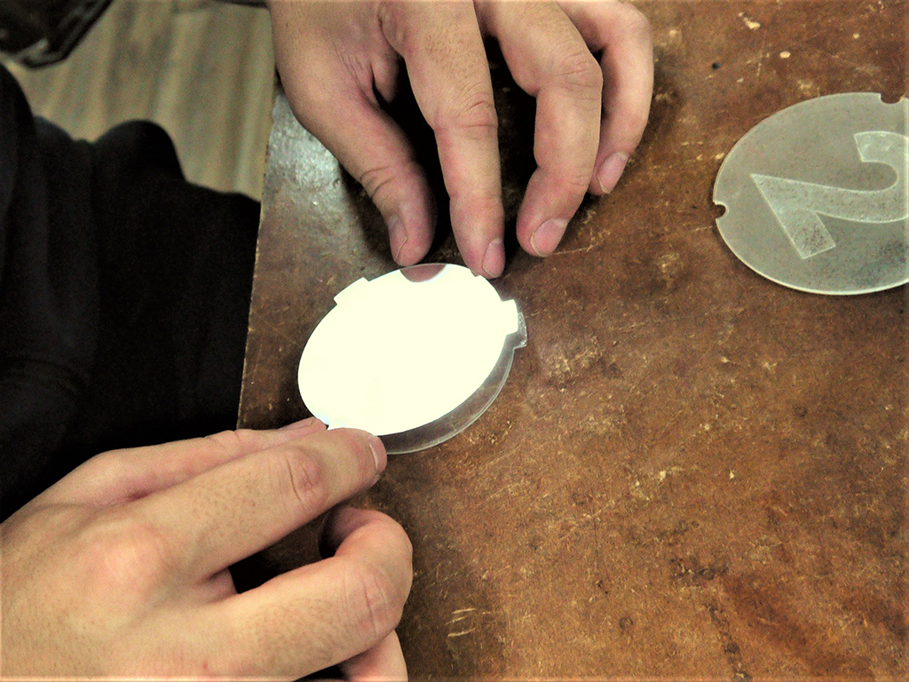
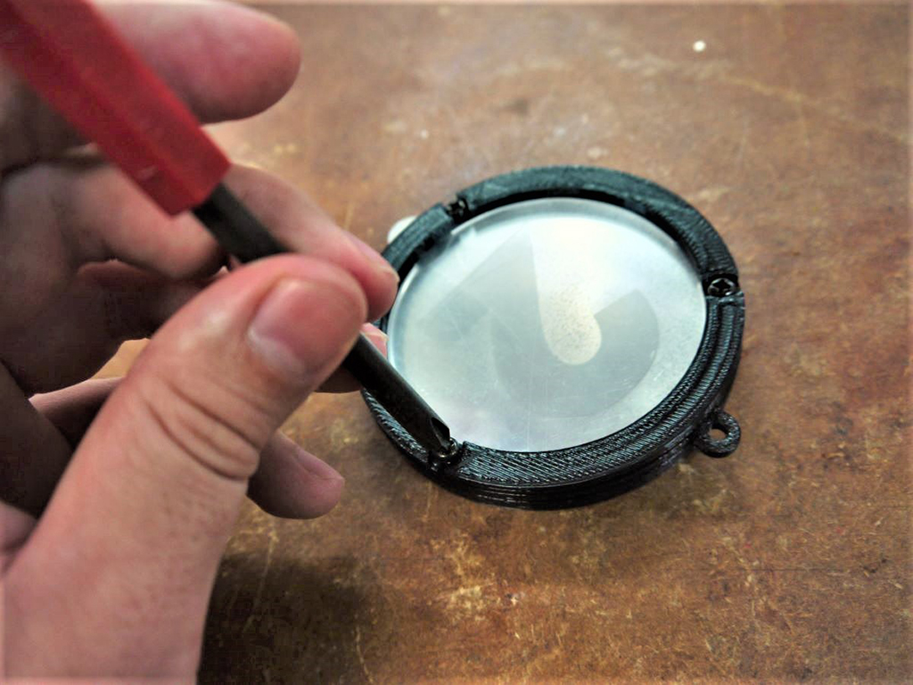

 

## **#02/25 [ 2020/12/02 ]** 
### by Takuma OAMI (FabLab SENDAI - FLAT)
  

 

### **材料**

* 透明アクリル（1.0mm厚）
* 偏光フィルム
* PLA(ブラック)
* ボールチェーン

 

### **技術**

* データ作成：Rhinoceros
* レーザーカット：trotec speedy100
* カッティングプロッタ：Craft ROBO PRO CE5000-40-CRP
* 3Dプリント：MakerBot Replicator 2

 

### **作り方**
 

### **1.** 
まずは作ったデータをマシンで出力。あらかじめ、3Dモデリングしたパーツを各マシンで加工します！黒いフレームパーツ(写真左側)は3Dプリンタ、透明アクリル(写真右上)はレーザーカッター、偏光フィルム(写真右下)はカッティングプロッタで加工しました。偏光フィルムは、２枚重ね合わせて角度を変えていくと、通過する光の量が変わる不思議な素材です。 

  

### **2.** 
偏光フィルムをアクリルパーツに接着する。偏光フィルム単体だとフニャフニャなので、対応するアクリルパーツに貼り付けます、１つはスプレー糊でびったり、もう１つは端のとこだけを瞬間接着剤でちょこっとくっつけてみました。(アクリルパーツの保護シートは、接着前にはがしておきます。) 

  

### **3.** 
パーツを重ねてネジ止め。接着剤が固まったら、各パーツを重ねてネジ止めします。このネジが各層をひとまとめにしてくれる、今回の”肝”です。 

  

### **4.** 
完成したものがこちら！ 

<iframe width="680" height="382.5" src="https://www.youtube.com/embed/YhXTF2OudSE" title="YouTube video player" frameborder="0" allow="accelerometer; autoplay; clipboard-write; encrypted-media; gyroscope; picture-in-picture; web-share" allowfullscreen></iframe>
    

外側のツマミを動かすと、文字部分とそれ以外の部分の明るさが切り替わりますー。偏光フィルムがメチャ傷つきやすく、取り扱いに苦労しました。次回はもっときれいに貼れるようになりたいっす。

  

（Last Updated: 2023.04.11）

