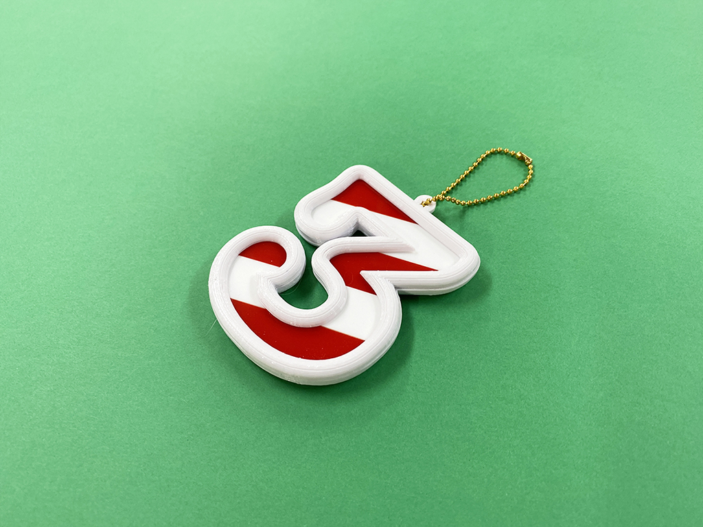
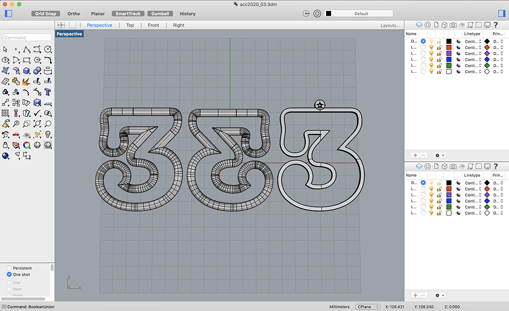
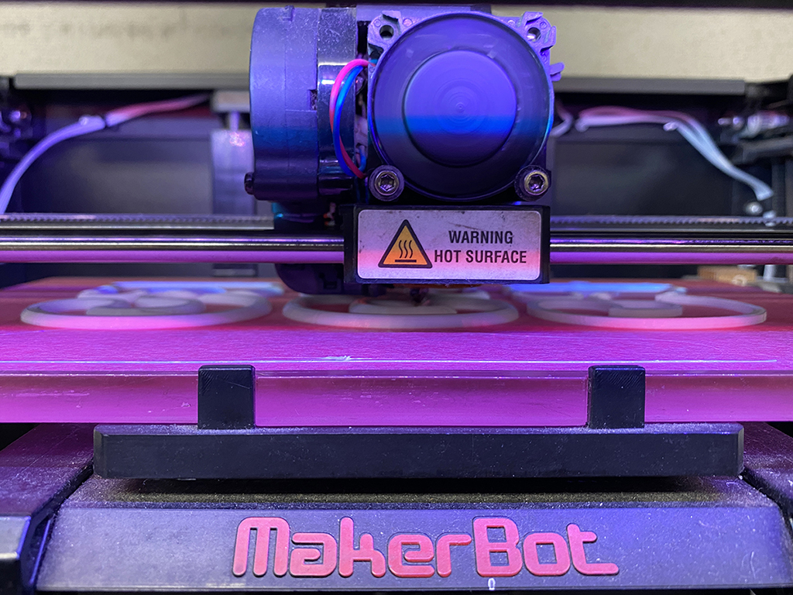
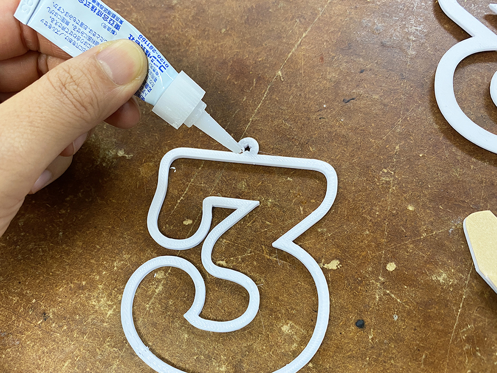

 

## **#03/25 [ 2020/12/03 ]** 
### by Shino ONODERA (FabLab SENDAI - FLAT)
  

 

### **材料**

* アクリル板（赤、白／各2.0mm厚）
* PLA（ホワイト）
* ボールチェーン

 

### **技術**

* データ作成：Adobe Illustrator、Rhinoceros
* レーザーカット：trotec speedy100
* 3Dプリント：MakerBot Replicator 2

 

### **作り方**
 

### **1.** 
RhinocerosとIllustratorでデータを作成。
3Dプリント用のデータはRhinoceros、レーザーカット 用のデータはIllustratorで仕上げました。
3Dプリントしたパーツでアクリル板を挟み込みたかったので、左右反転させたパーツを作成しています。 

  

### **2.** 
外側の白いパーツを3Dプリント、間にはさんだ赤と白のパーツをレーザーカット。3Dプリントの設定は、積層ピッチ0.3mm、infill5%、shell2で、全てのパーツをプリントするのに50分程度かかりました。 

  

### **3.** 
全てのパーツが完成したら接着剤で固定。このフレームのようなパーツの中に、アクリル板のパーツがぴったり収まるようになっています。 

  

### **4.** 
完成したものがこちら！ 

    

アクリル板などをただレーザーカットしただけのものとは一味違う文字パーツができあがりました。3Dプリントしたパーツ同士の接着部分のズレや隙間は、3Dペンで埋めてみても良いかもしれません。

  

（Last Updated: 2023.04.11）

