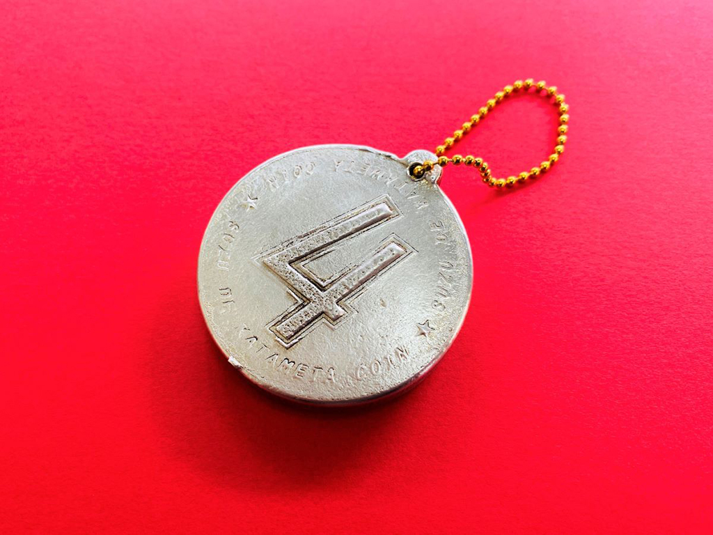
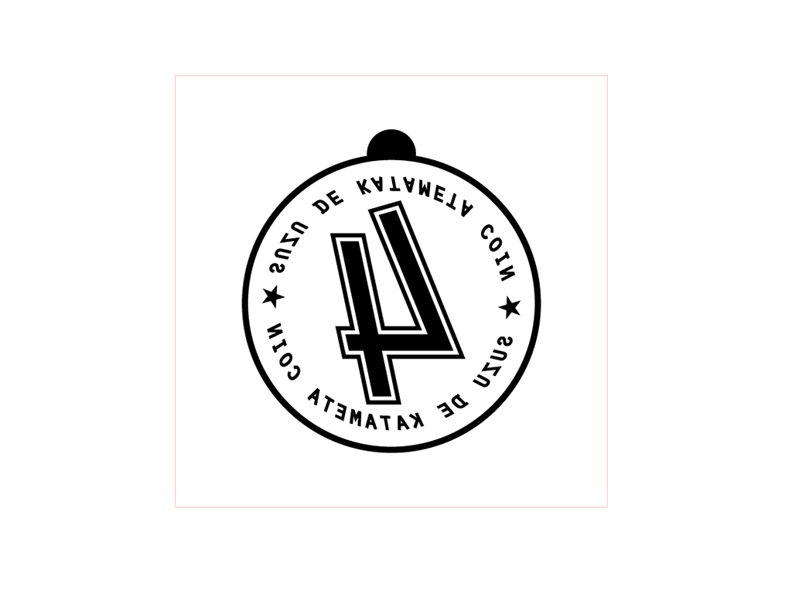
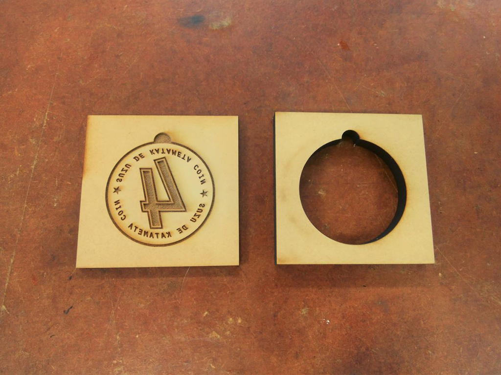
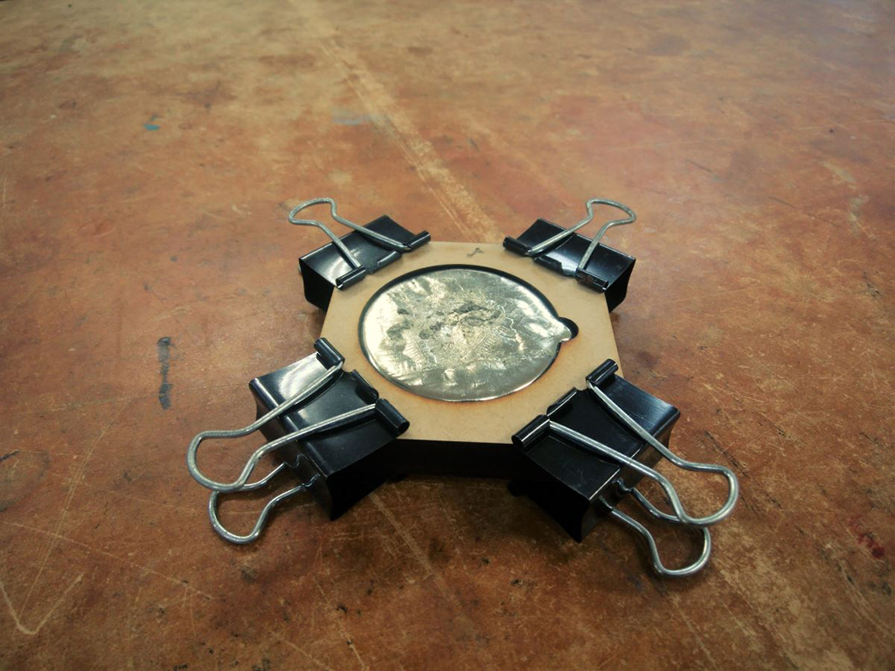
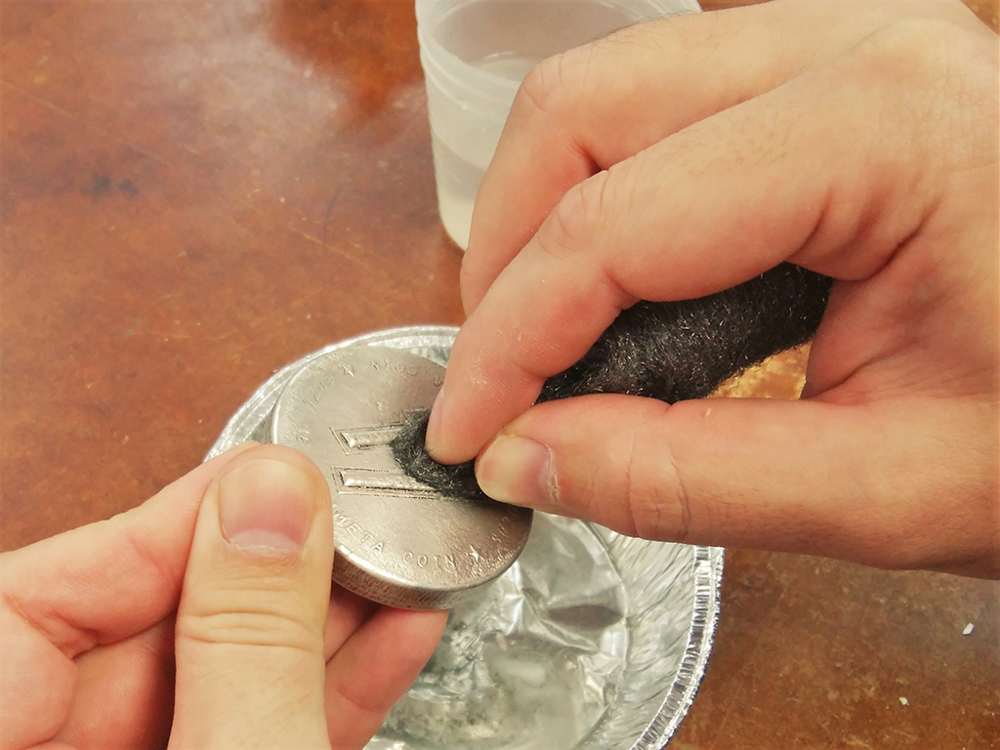

 

## **#04/25 [ 2020/12/04 ]** 
### by Takuma OAMI (FabLab SENDAI - FLAT)
  

 

錫(スズ)という金属を溶かして作った、銀色のコインです。ズシッと重くペーパーウェイト等を作るのに向いてそうな方法ですね。
数字の周囲に”SUZU DE KATAMETA COIN”という文字が入っております。
  

### **材料**

* 錫(スズ)
* MDF (型)
* ボールチェーン

 

### **技術**

* データ作成：Adobe Illustrator
* レーザーカット：trotec speedy100
* 鋳造：カセットガスコンロ

 

### **作り方**
 

### **1.** 
Illustratorでデータを作成。レーザーカッターでMDF製の型を作るのですが、そのためのデータをIllustratorで作っていきます。 
黒い部分が最終的にコイン表面の模様になるのですが、あらかじめ左右反転しとかないと完成品の模様が反転しちゃいます。 

  

### **2.** 
MDFの型をレーザーカット。MDFをレーザーカッターで切り出して、錫を流し込む型を作ります。型の側面になる部分は9mm厚、底面になる部分(模様がついてる方)は4mm厚のMDFで切り出してます。 
模様が細かいと錫が流れ込みにくくなるんですが、今回はどれぐらいの細さでも行けるのか試したくなり、あえて細い部分も入れてます。 

  

### **3.** 
型に溶けた錫を流し込む。錫は融点がとっても低い金属なので、家庭用ガスコンロでも溶かすことができます。溶けたらスプーンやおたまですくって型に流し込みます。 
型は先ほど切り出したパーツを重ねてクリップで固定しております。流し込んだら、なるべく振動を与えず(振動が伝わると、冷える時に変なヒビやシワが入ります)冷えるまで放置。 

  

### **4.** 
固まったら、磨く！十分に冷えたら、型からコインを取り外し磨いていきます。MDFから移った汚れを落としていきましょう。まずは、濡らしたスチールウールで大まかな汚れを取り、そのあと歯ブラシと研磨剤入りの歯磨き粉でこすっていきます。 
自分が納得いくまで磨いたら完成です！ 

    

金属鋳造と聞くと、大掛かりなマシンや道具を想像するかと思いますが、金属と一言にいってもサイズや種類は様々です。工夫次第で今回のように卓上で完結するような制作方法もあるので、ご興味あれば是非挑戦してみてはいかがでしょう？

  

（Last Updated: 2023.04.11）

