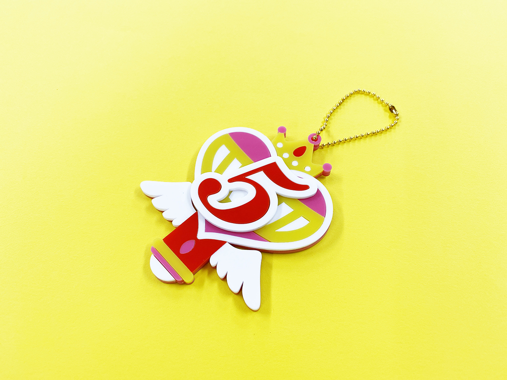
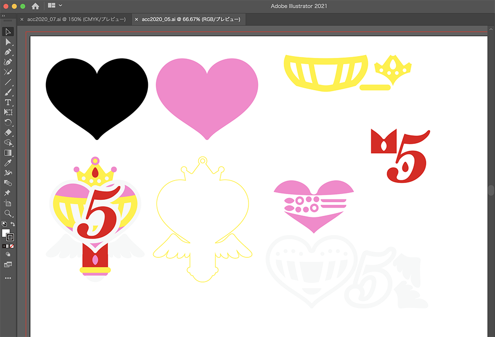
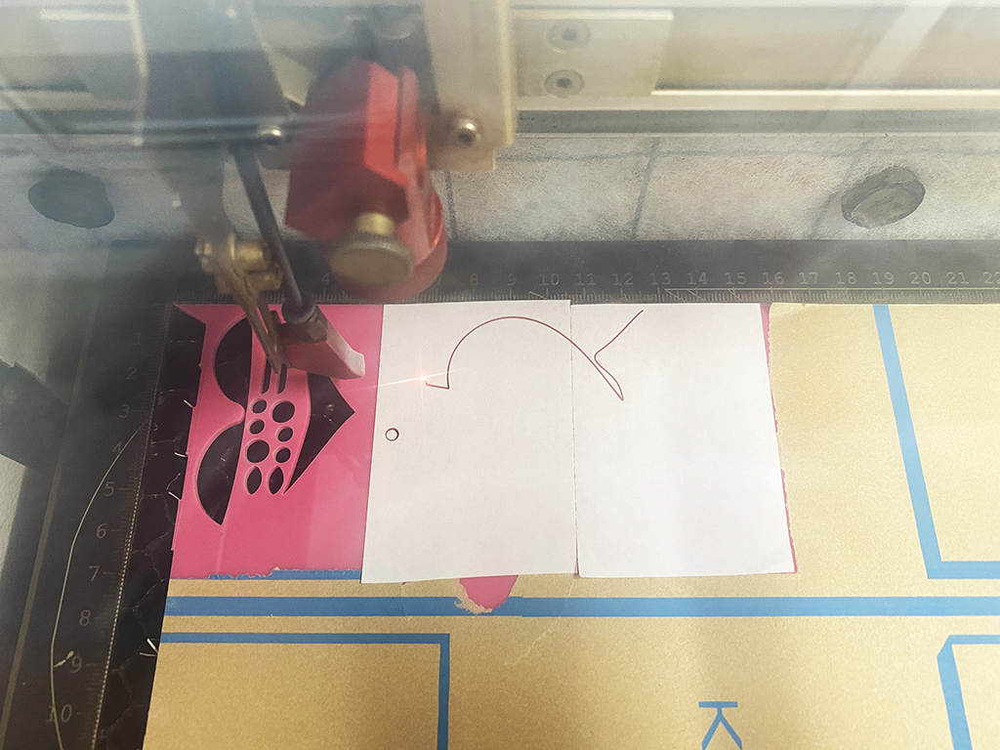
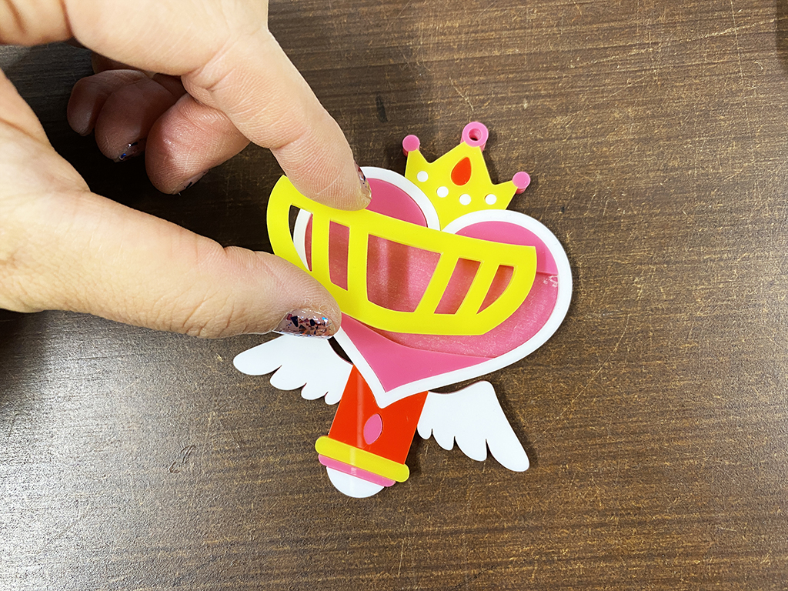

 

## **#05/25 [ 2020/12/05 ]** 
### by Shino ONODERA (FabLab SENDAI - FLAT)
  

 

カラーアクリルを組み合わせて作った、変身ステッキ風オーナメントです🌟
  

### **材料**

* アクリル板（2mm厚／赤、白、黄、ピンク）
* ボールチェーン

 

### **技術**

* データ作成：Adobe Illustrator
* レーザーカット：trotec speedy100

 

### **作り方**
 

### **1.** 
まずはIllustratorでデータを作成。紙に手描きでラフスケッチしながら大まかなデザインを考えた上で、パソコンで細かい形状を検討していきます。今回は上部にハートを使いたかったので、それをベースに周りのデザインを考えていきました。 

  

### **2.** 
アクリル板をレーザーカット。パーツを貼り付ける土台にはあらかじめ両面テープを貼っておき、それごとレーザーカットすることで、後で細かいパーツに接着剤を付けるという手間を省いています。 

  

### **3.** 
パーツを組み合わせる。元のデザインを参考に、パーツを慎重に貼り合わせます。 

  

### **4.** 
完成したものがこちら！ 

    

使用するアクリル板の色や数字を変えて、シリーズ物として作ってみても楽しそうです。こういった思いつきをすぐ形にできるのは本当に楽しいですね〜

  

（Last Updated: 2023.04.11）

