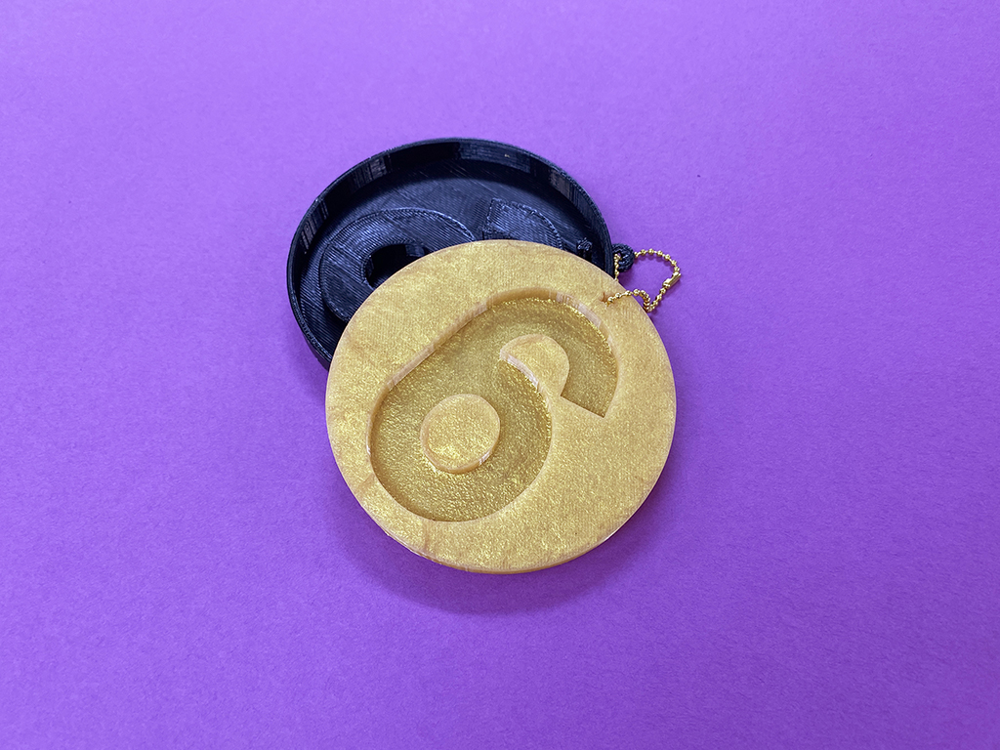
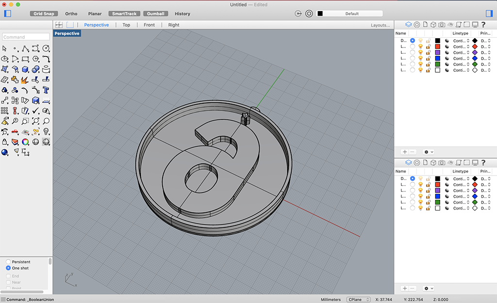
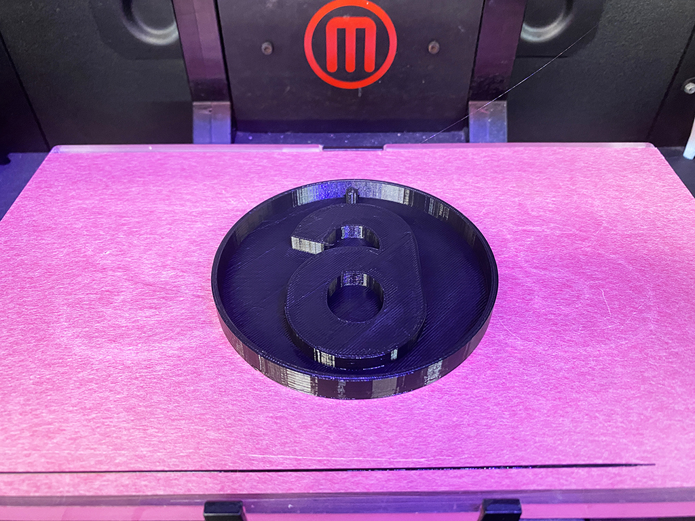
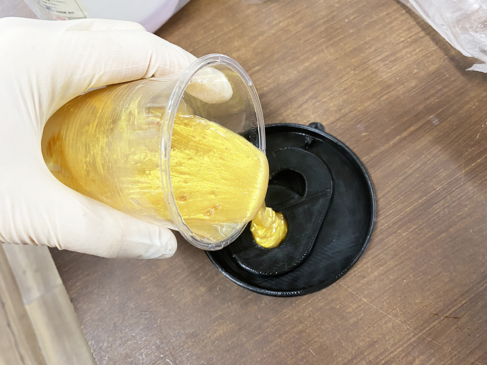
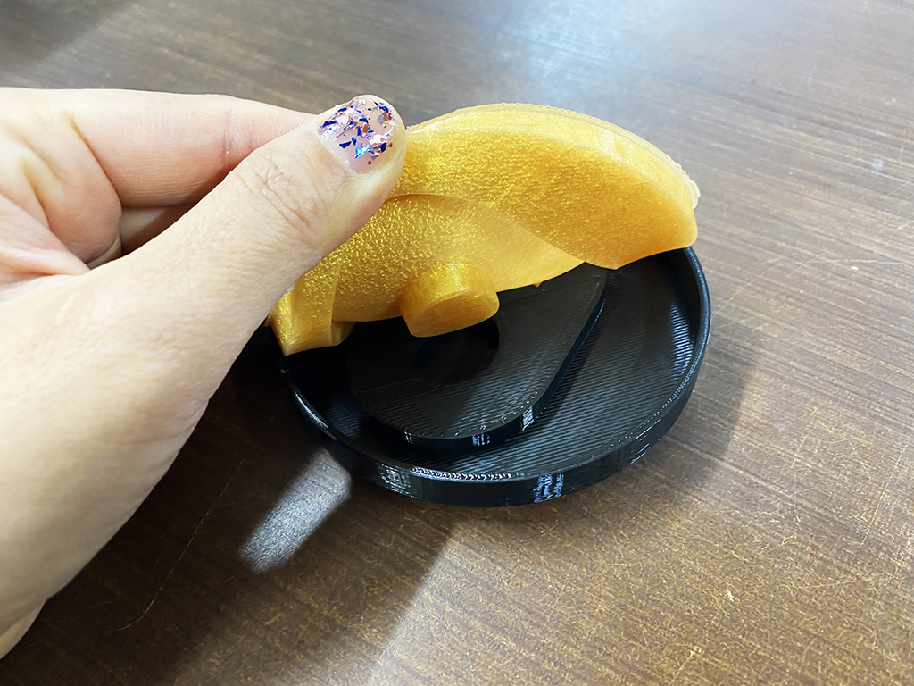

 

## **#06/25 [ 2020/12/06 ]** 
### by Shino ONODERA (FabLab SENDAI - FLAT)
  

 

3Dプリンタで作った型に、シリコーンを流し込んでみました！
  

### **材料**

* PLA（ブラック）
* シリコーン（乳白色）
* ネイル用ラメ（ゴールド）
* ボールチェーン

 

### **技術**

* データ作成：Rhinoceros
* 3Dプリント：Makerbot Replicator2
* シリコーン型取り

 

### **作り方**
 

### **1.** 
Rhinocerosで型のデータを作成。「6」は高さ6mm、その上の「☆」は高さ8mmに設定しました。 

  

### **2.** 
3Dプリント。Infii10%、Shell2、積層ピッチ0.3mmに設定し、1時間程度でプリントが完了しました。 

  

### **3.** 
プリントした型にシリコーンを流し込み。シリコーンはそのままだと味気ないので、今回はネイル用のラメを混ぜ込んでゴールドカラーにしてみました。 

  

### **4.** 
硬化が完了したら、型から外して完成！型には離型剤は塗っていませんが、特に問題なく取り外すことができました。 

  

    

今回使ったネイル用ラメは非常に粒子が細かいので、全体にムラなく混ざるほか、シリコーンの硬化中に沈殿してしまうこともなくとても扱いやすかったです。もっと色々な樹脂でも試してみたい…！

  

（Last Updated: 2023.04.11）

