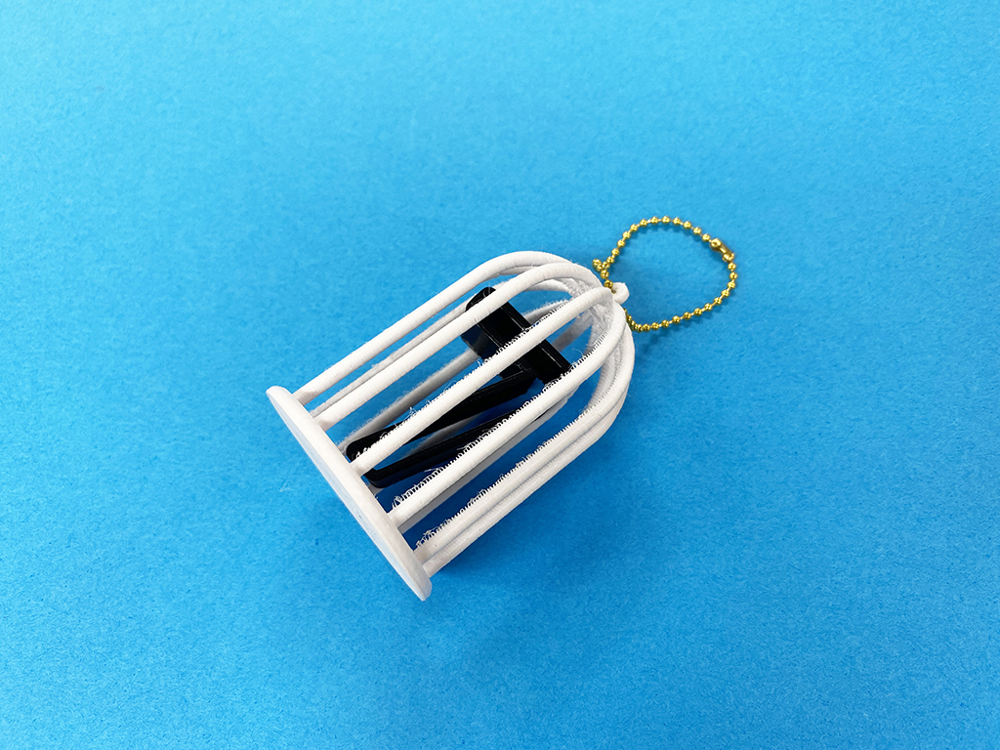
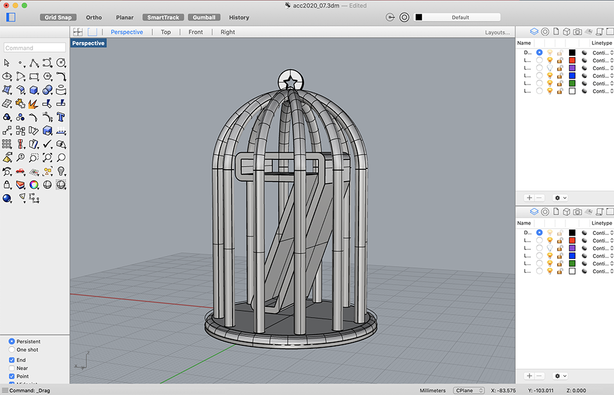
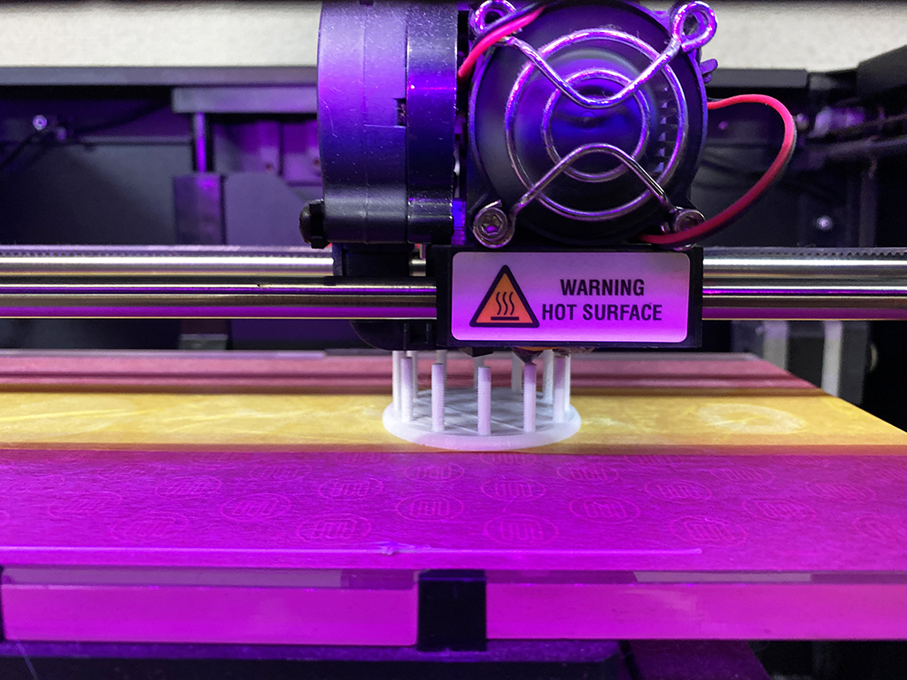
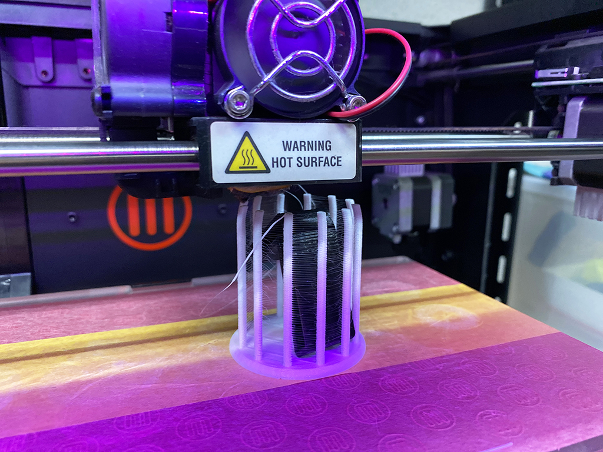
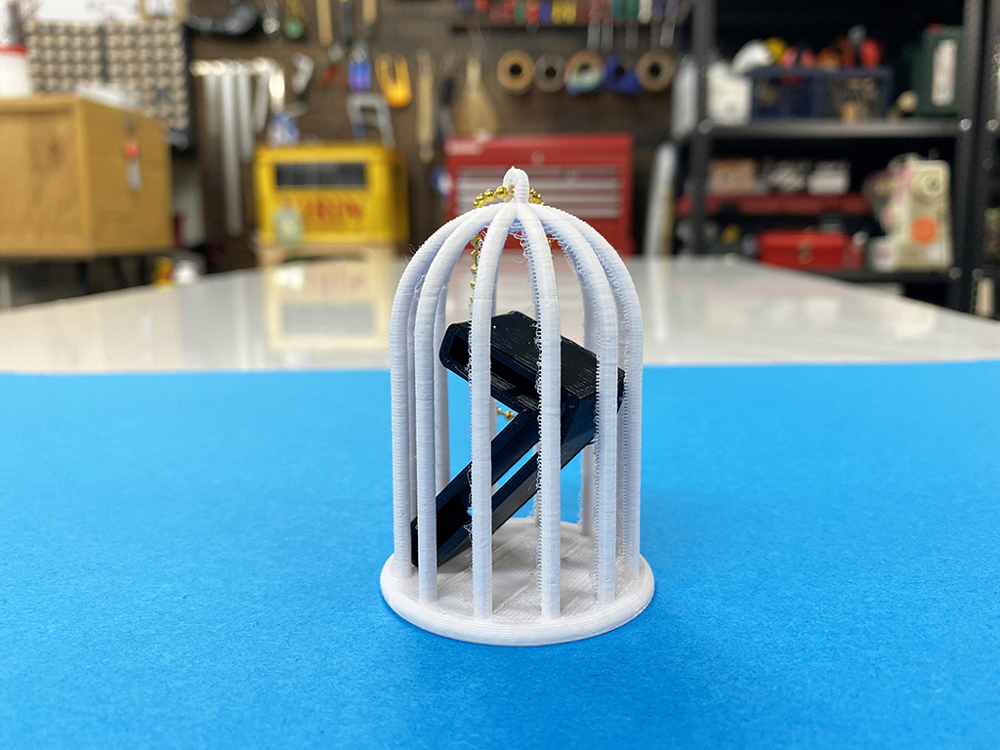

 

## **#07/25 [ 2020/12/07 ]** 
### by Shino ONODERA (FabLab SENDAI - FLAT)
  

 

異なる色で作った3Dプリントパーツを組み合わせた作品です！
  

### **材料**

* PLA（ブラック、ホワイト）
* ボールチェーン

 

### **技術**

* データ作成：Rhinoceros
* 3Dプリント：Makerbot Replicator2

 

### **作り方**
 

### **1.** 
Rhinocerosで3Dデータを作成。鳥カゴのようなオブジェクトの中に、「7」が入っているというデザインにしました。 

  

### **2.** 
今回は、「7」を黒で、外側を白でプリントしました。「7」のプリントが完了したら、まずは通常通り外側もプリントしていきます。 

  

### **3.** 
外側が「7」と同じくらいの高さまでできあがったら、一度プリントを停止し、中に「7」を入れて再度途中からプリント！ 

  

### **4.** 
プリントが完了したら、バリなどを取って完成！ 

    

ご興味のある方はぜひチャレンジしてみてください！

  

（Last Updated: 2023.04.11）

