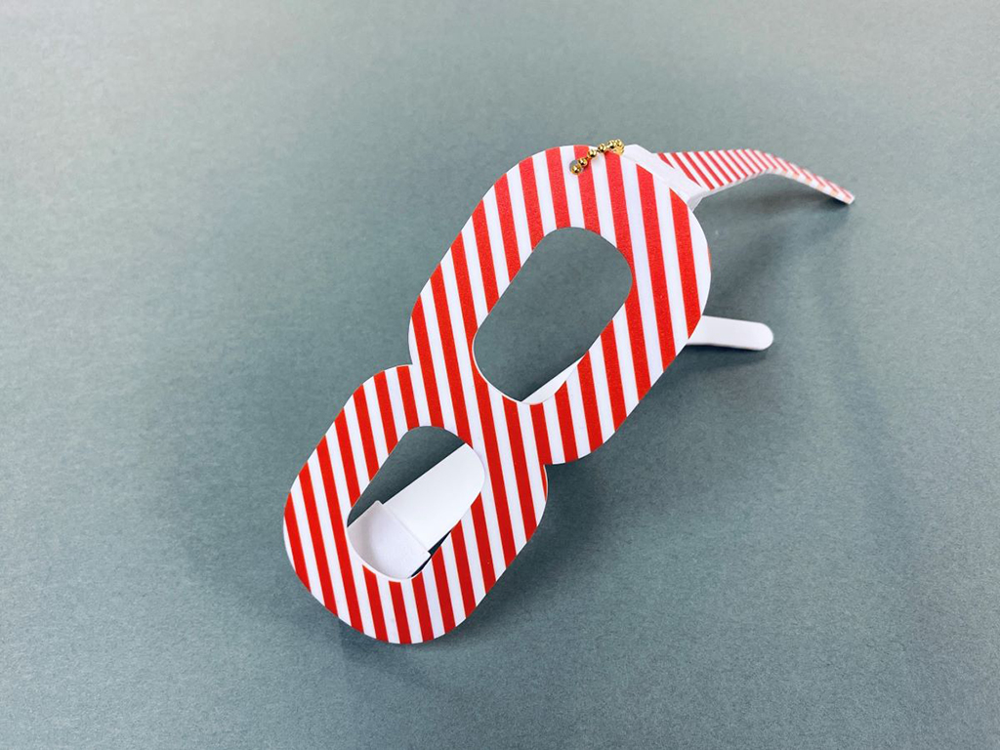
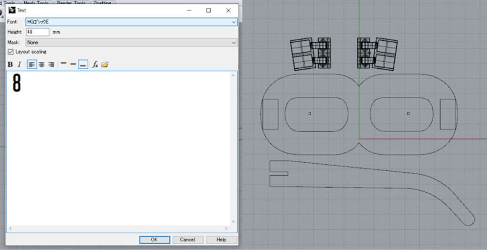
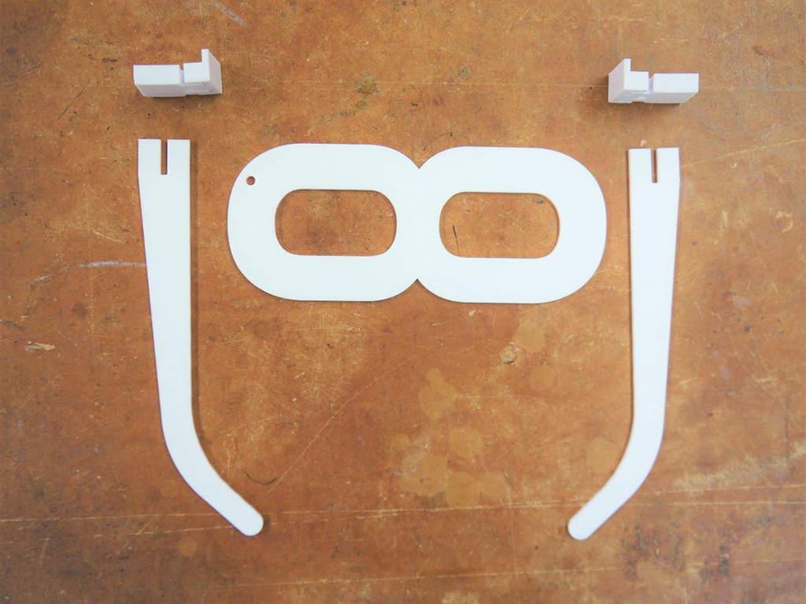
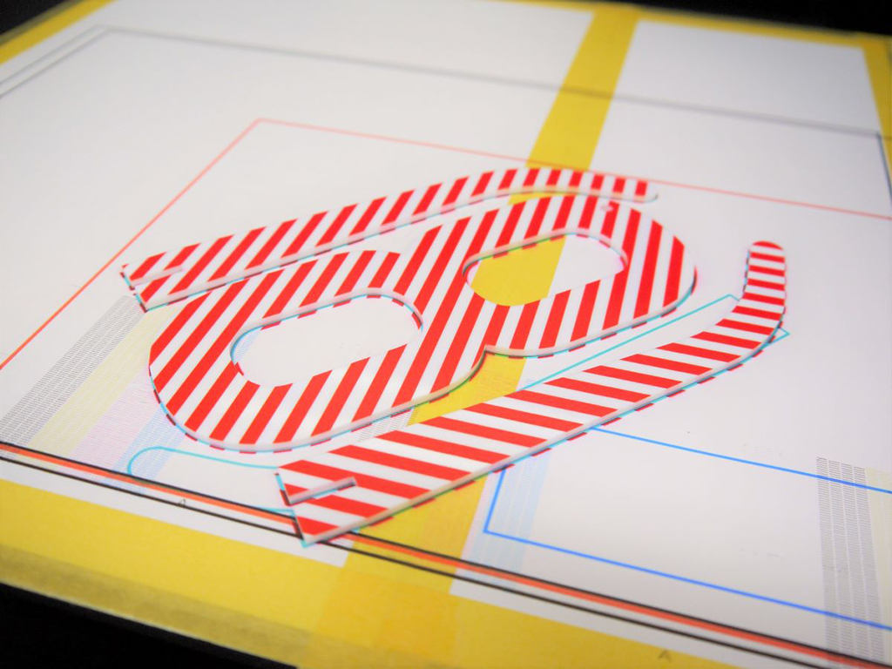
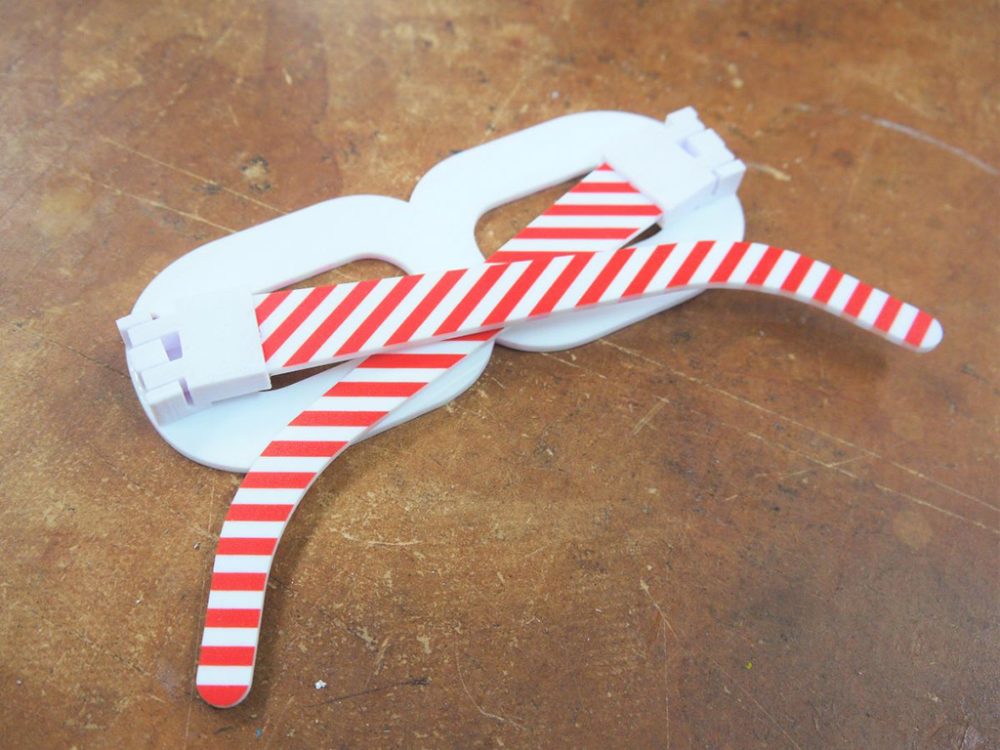

 

## **#08/25 [ 2020/12/08 ]** 
### by Takuma OAMI (FabLab SENDAI - FLAT)
  

 

“8”を身につけったかったので、眼鏡にしました！
  

### **材料**

* アクリル板（2mm厚、ホワイト）
* PLA (ホワイト)
* ボールチェーン

 

### **技術**

* データ作成：Rhinoceros, Illustrator
* レーザーカット：trotec Speedy 100
* 3Dプリント：MakerBot Replicator2
* UVプリント：Roland DG LEF-12

 

### **作り方**
 

### **1.** 
かけたい”8″を選んで、データを作成。眼鏡にしやすようなフォントの”8″を選んで、データを作っていきます。 

  

### **2.** 
マシンで加工していきます。眼鏡の大体のパーツはホワイトアクリルをレーザーカットし、ヒンジは3Dプリントしました。 

  

### **3.** 
フレームとツルに模様をプリントします！フレームにはめでたい紅白模様をあしらいました。 

  

### **4.** 
各パーツを組み立てて、完成でーす。うしろから見るとこんな感じ、ヒンジもちゃんと動くので、折りたたみでき実際にかけれます。 

    

作る時に、自分の眼鏡を参考にしながら設計しました。市販されてる製品は、シンプルに見えても随所に細かな工夫がちりばめられていて、単純に見えてもしっかり、それぞれの形に意味があります。何か作る時は、何も見ずに自分の考えだけで作るのも良いものですが、既に存在している製品や作品を参考にして、先人の工夫を学びながら作るとグッと経験値があがりますよ！

  

（Last Updated: 2023.04.11）

