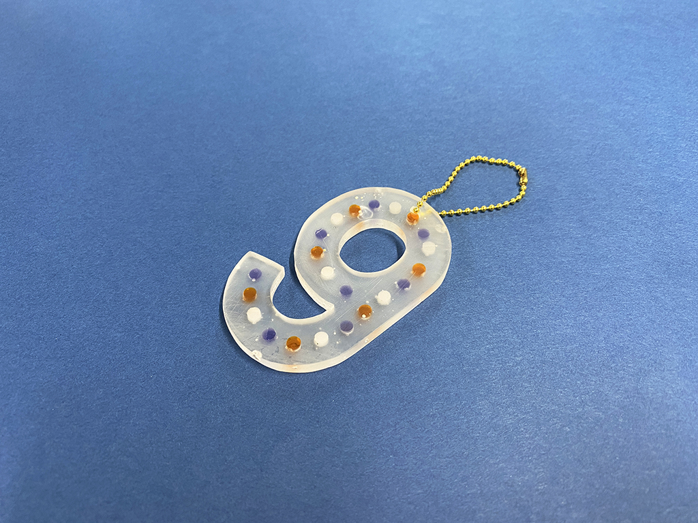
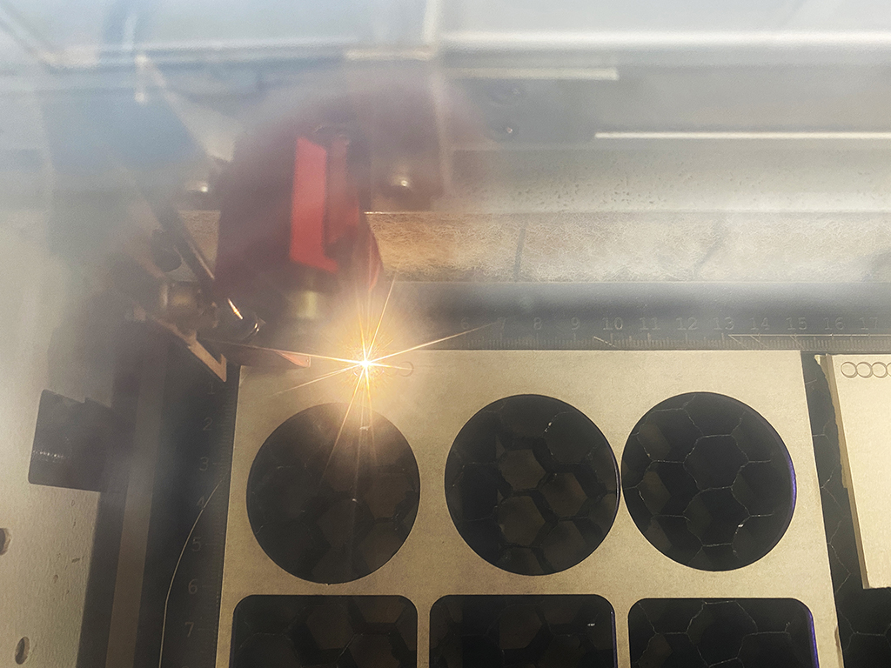
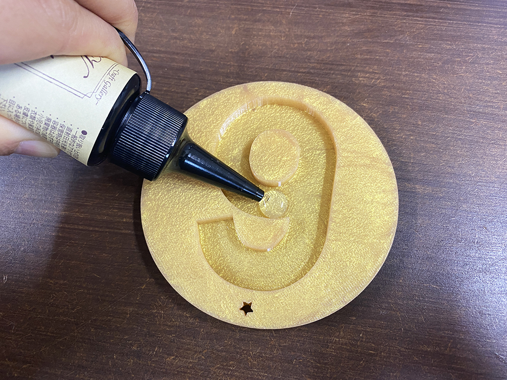
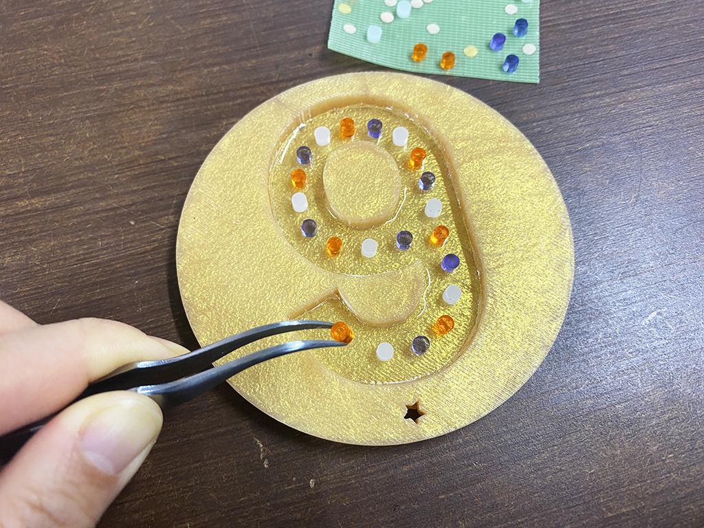

 

## **#09/25 [ 2020/12/09 ]** 
### by Shino ONODERA (FabLab SENDAI - FLAT)
  

 

UVレジンで9を作ってみました。
  

### **材料**

* アクリル板（3mm厚／ホワイト、オレンジ、紫）
* UVレジン
* ボールチェーン

 

### **技術**

* データ作成：Illustrator
* レーザーカット：trotec Speedy 100

 

### **作り方**
 

### **1.** 
まずはUVレジンに埋め込みたいパーツをレーザーカット 。今回は直径4mmの円をパーツとして使用することにしました。 

  

### **2.** 
[12月6日に作ったシリコン型](https://fablabsendai.github.io/acc/2020/1206.html)にUVレジンを2mmほど流し込み、一旦硬化させます。 

  

### **3.** 
硬化させたUVレジンの上に、アクリル板で作ったパーツを並べていきます。並べ終わったら再度UVレジンを流し込み、完全に硬化させます。 

  

### **4.** 
表面をやすりがけして曇りガラスのようになったら完成！ 

    

シリコン型の色のせいか、UVレジンの流し込みムラが分かりにくく、大きな気泡が入ってしまったのが反省点です..。

  

（Last Updated: 2023.04.11）

