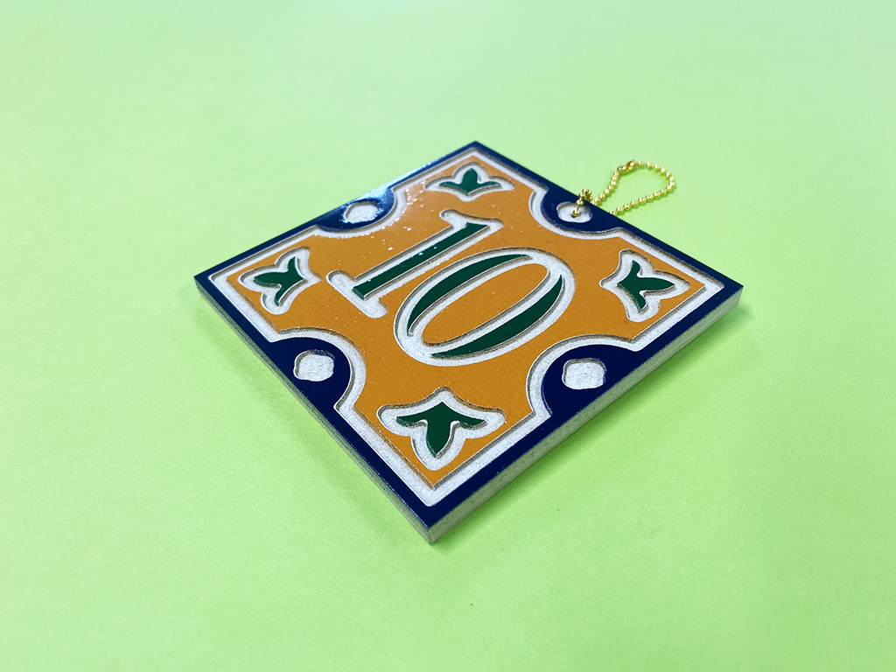
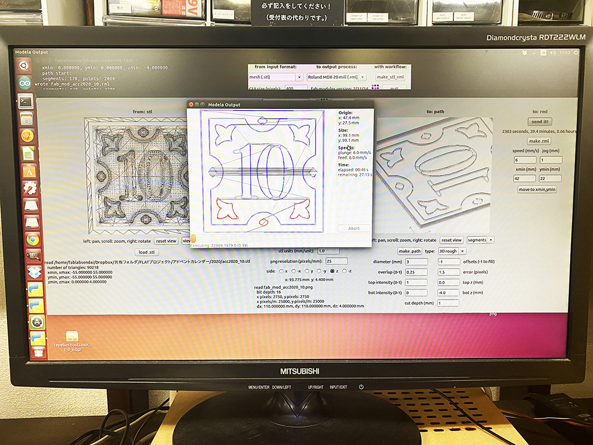
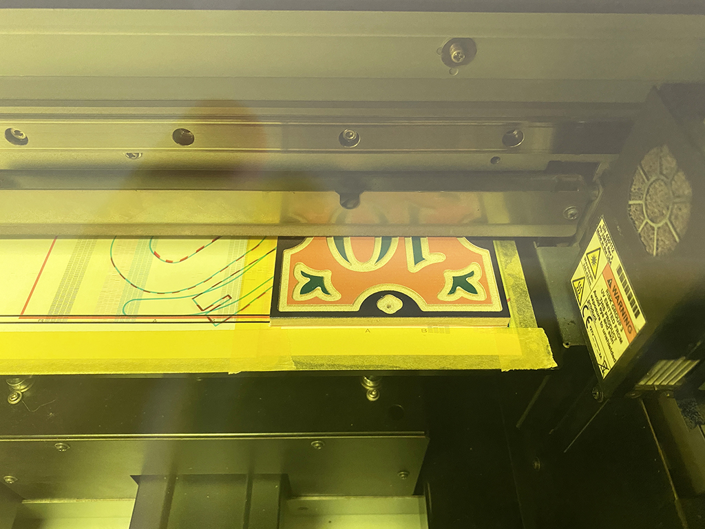
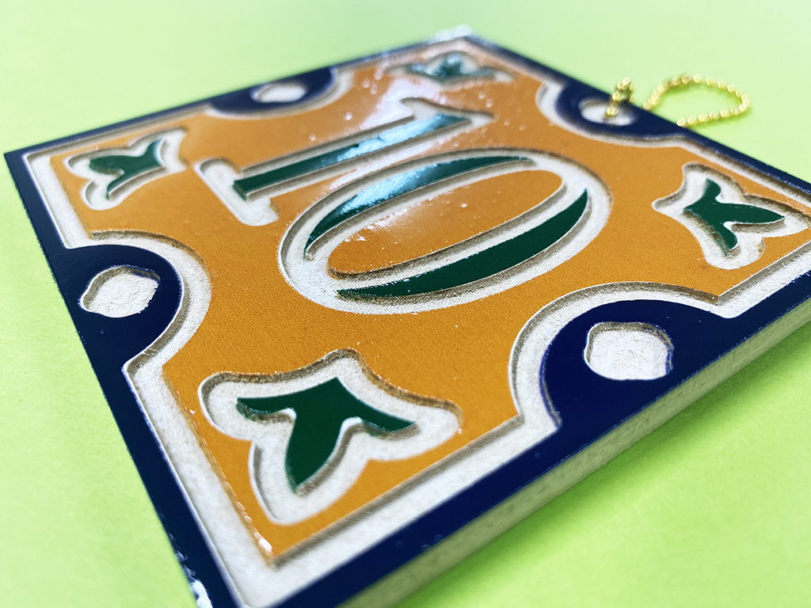

 

## **#10/25 [ 2020/12/10 ]** 
### by Shino ONODERA (FabLab SENDAI - FLAT)
  

 

MDFを切削加工して、タイルっぽい作品をつくってみました。
  

### **材料**

* MDF（5.5mm厚）
* ボールチェーン

 

### **技術**

* データ作成：Adobe Illustrator, Rhinoceros
* 切削加工：Roland MODELA MDX-20
* UVプリント：Roland LEF-12

 

### **作り方**
 

### **1.** 
3DデータをMODELA用のソフトウェアで開き、切削方法を設定します。尚、今回は切削用の3DデータはRhinocerosで、UVプリント用のカラーデータはIllustratorで作成しました。 

  

### **2.** 
MODELAにセットしたMDFをゴリゴリ削っていきます。約30分ほどで加工が完了しました。
加工直後の素材の表面にはバリが出ているので、紙やすりで削り落とします。 

<iframe width="680" height="382.5" src="https://www.youtube.com/embed/1ye1WPWIdGw" title="YouTube video player" frameborder="0" allow="accelerometer; autoplay; clipboard-write; encrypted-media; gyroscope; picture-in-picture; web-share" allowfullscreen></iframe>
  

### **3.** 
お次はUVプリンタで表面に色を載せていきます。ホワイト1回→カラー2回→グロス2回という順番でプリントしました。 

  

### **4.** 
完成したものがこちら！ 

    

表面に気泡が入ってしまったり、うまく切削できなかった部分へのプリントを失敗していたりとやや反省点はありますが、グロスを2回プリントしたことによってうまくタイルっぽさが出せたかなと思います。

  

（Last Updated: 2023.04.11）

