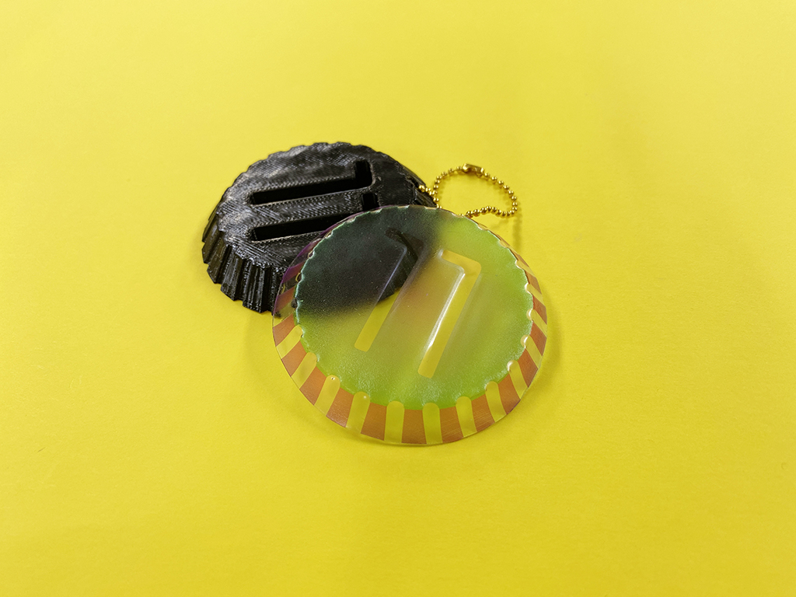
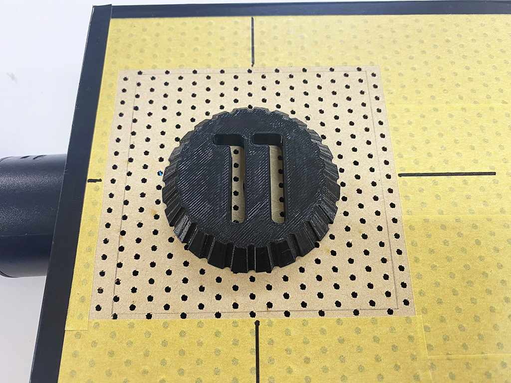
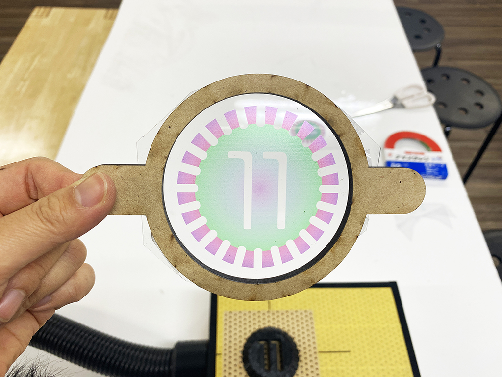
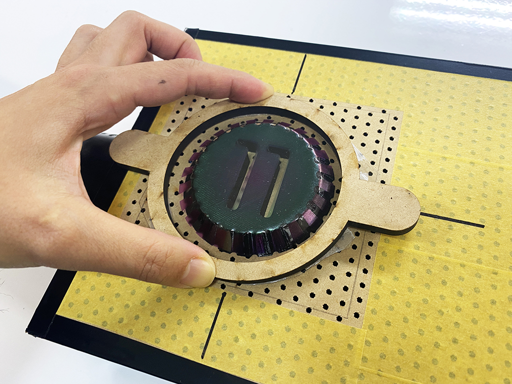
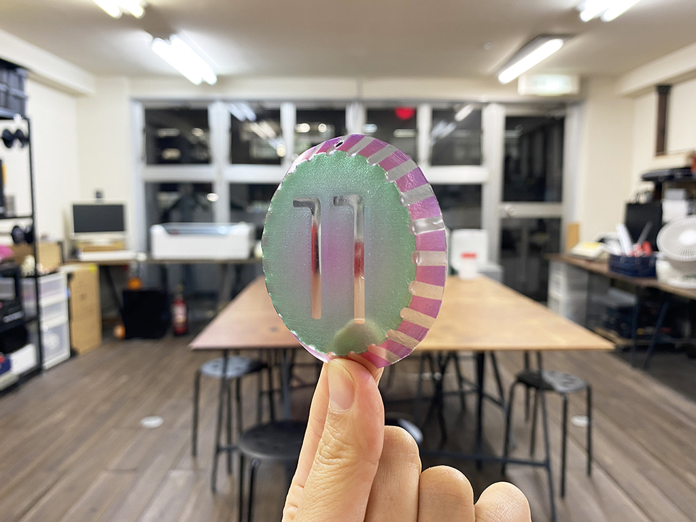

 

## **#11/25 [ 2020/12/11 ]** 
### by Shino ONODERA (FabLab SENDAI - FLAT)
  

 

UVプリントした塩ビシートを真空成型してみました。（細かい凹凸が綺麗に出ませんでしたが…）
  

### **材料**

* 塩ビシート（厚さ0.5mm）
* PLA（黒／原型用）
* MDF（厚さ5.5mm／真空成型時に塩ビシートを貼っておくフレーム用）
* ボールチェーン

 

### **技術**

* データ作成：Adobe Illustrator, Rhinoceros
* 3Dプリント：Makerbot Replicator2
* UVプリント：Roland LEF-12

 

### **作り方**
 

### **1.** 
真空成型用の原型を3Dプリントし、手作りの簡易真空成型機にセットします。真空成型とは、加熱して柔らかくなった樹脂板を原型に押し当て、真空状態にしてピッタリと密着させることで造形を行うという手法です。この簡易真空成型機では、掃除機を使って、土台の小さな穴から空気を抜きます。 

  

### **2.** 
塩ビシートには、あらかじめUVプリンタで柄を印刷しておきました。
これを、MDFで作ったフレームに貼り付けます。 

  

### **3.** 
2.の塩ビシートを電熱器で加熱して柔らかくなったら、原型に押し当てて掃除機のスイッチをオン！あっというまに塩ビシートが原型に密着します。 

  

### **4.** 
冷めたら原型から取り外し、余分なシートをカットしたら完成！ 

    

使用したシートや原型の形状に対して掃除機の吸引力が弱かったため、細かい凹凸が綺麗に出ませんでした..。0.3mm厚程度のシートだと、もう少しくっきり凹凸が出るかもしれません。
 
また、今回は塩ビシートを使用しましたが、クリアファイルやPETシートなどでも真空成型することが可能です。真空成型機は貸し出し可能ですので、ご興味のある方はぜひチャレンジしてみてください！

  

（Last Updated: 2023.04.11）

