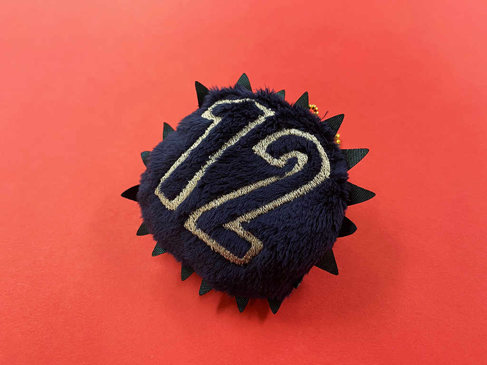
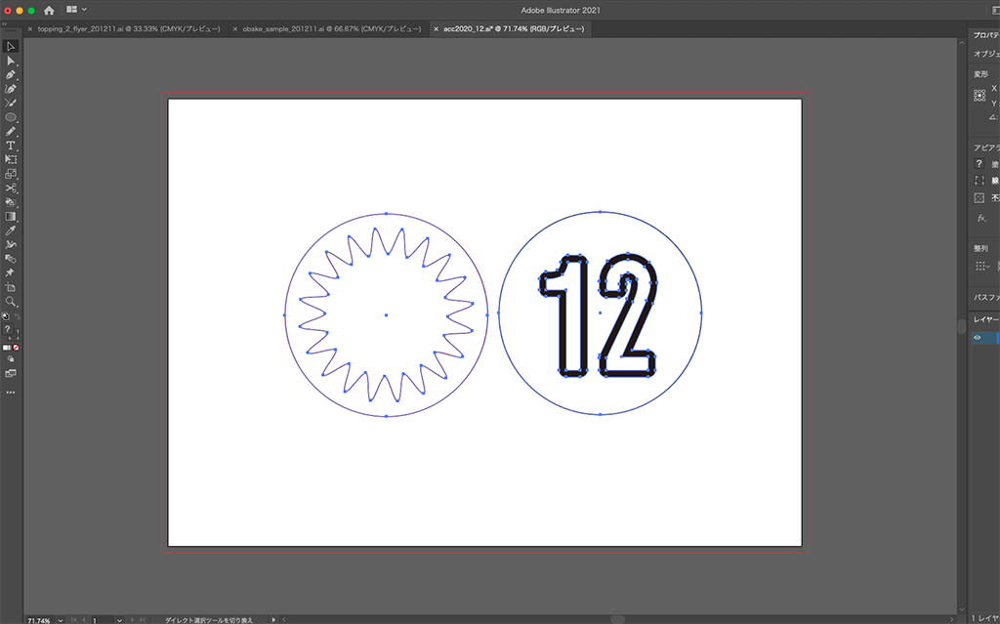
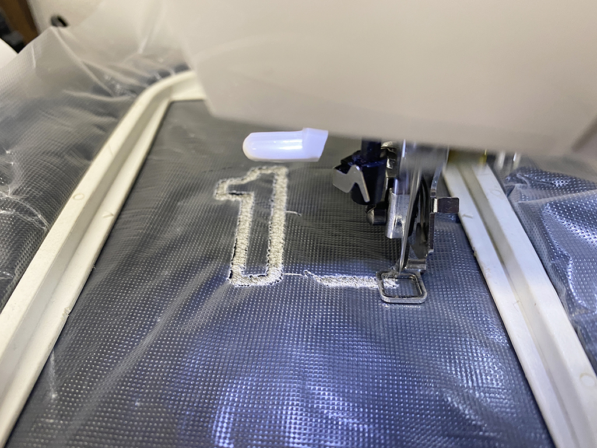
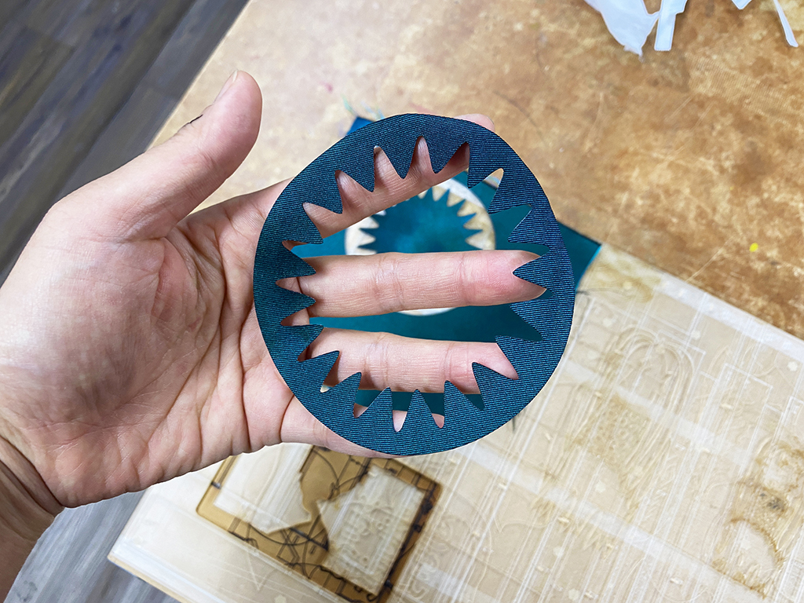
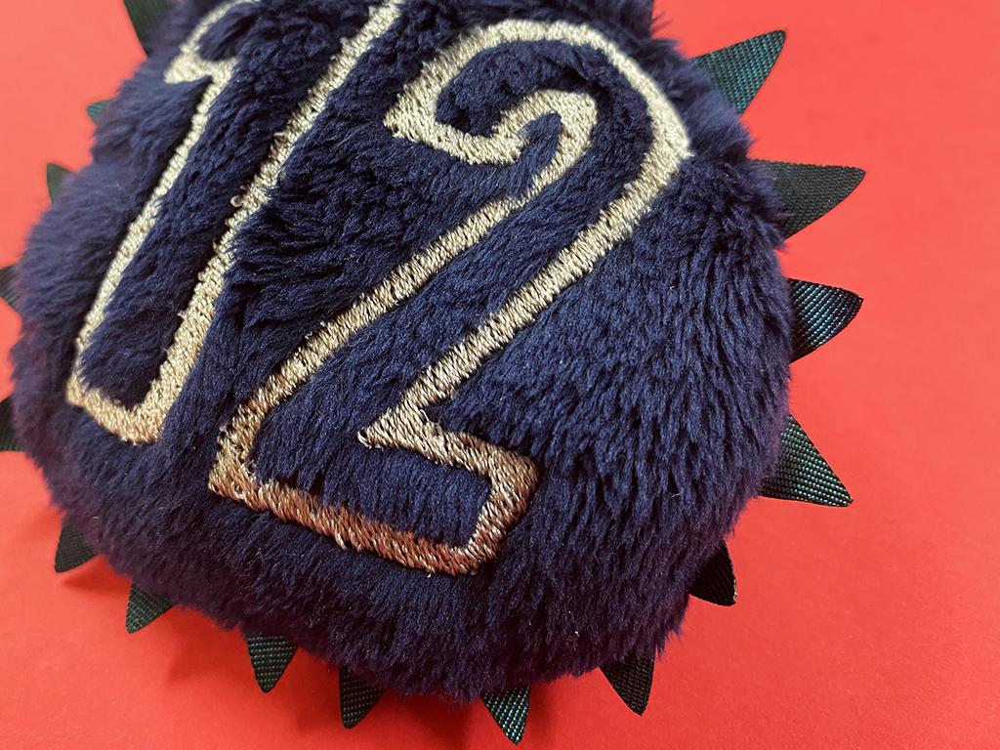

 

## **#12/25 [ 2020/12/12 ]** 
### by Shino ONODERA (FabLab SENDAI - FLAT)
  

 

ファーに刺繍をしてみました！（文字が大きすぎてバランスが悪くなってしまいました…）
  

### **材料**

* ファー（ネイビー）
* ポリエステル布（玉虫色）
* 刺繍糸（ライトグレー）
* ボールチェーン

 

### **技術**

* データ作成：Adobe Illustrator
* 刺繍：JAGUAR SP-4000
* レーザーカット ：trotec speedy100

 

### **作り方**
 

### **1.** 
まずはIllustratorでデータを作成。左がレーザーカット用、右が刺繍用のデータです。 

  

### **2.** 
データを元に、ファーの表面に「12」を刺繍します。ファーは毛足が長いため、絡まりを防止するために水溶性接着芯を重ねて刺繍しました。ちなみに、水溶性接着芯ではなくビニール袋でも代用可能です。 

  

### **3.** 
ポリエステル布もレーザーカットしておきます。これをファーの間に挟んで縫うと、円のふちからトゲのようなヒラヒラを出すことができます。 

  

### **4.** 
ファー→ポリエステル布→ファーの順で重ねて縫い合わせ、ひっくり返して綿を詰めたら完成！ 

  

なんだかウイルスのような形になりました。触り心地は最高なんですけどね… 

    

ファーやタオル素材は、毛足が長いので刺繍が難しそうに感じますが、今回のようにそれを抑えるようなシートなどを使うと、綺麗に刺繍することができるのでおすすめです！

  

（Last Updated: 2023.04.11）

