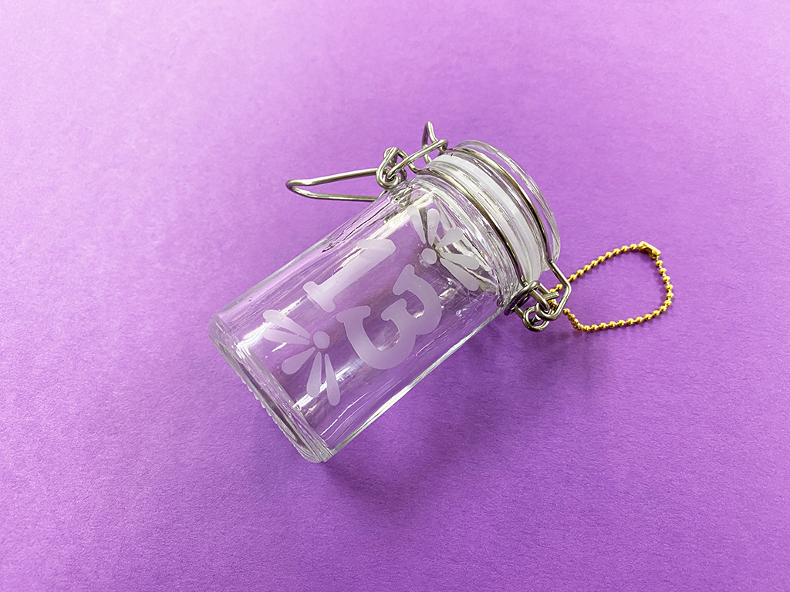
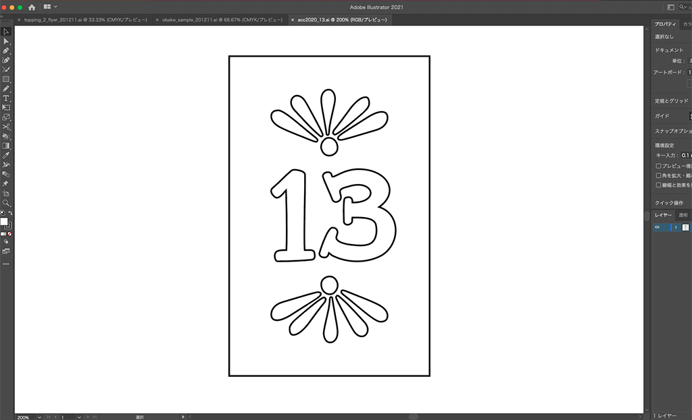
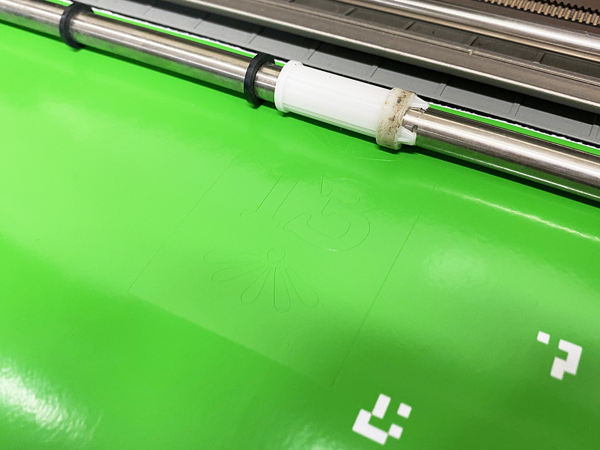
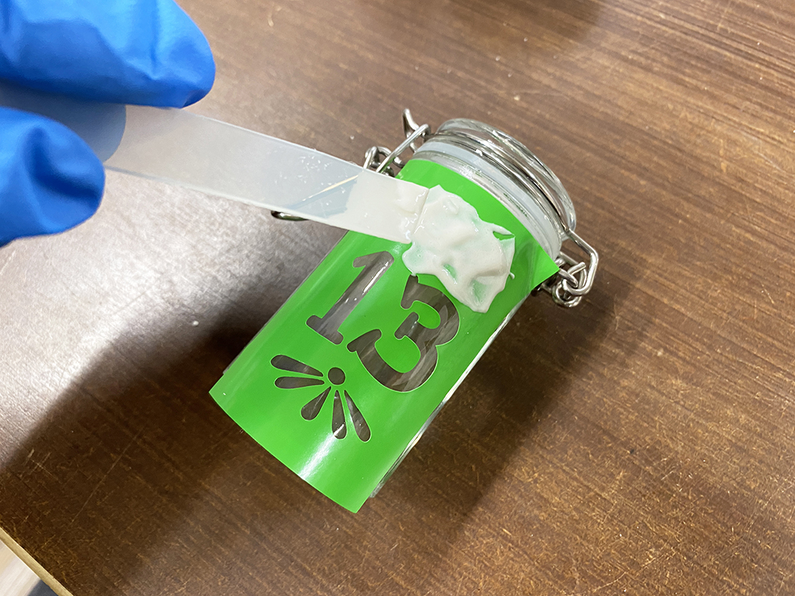

 

## **#13/25 [ 2020/12/13 ]** 
### by Shino ONODERA (FabLab SENDAI - FLAT)
  

 

既製品のボトルに、すりガラス加工をしてみました！
  

### **材料**

* ガラスボトル
* カッティングシート（塩ビ製）
* エッチングクリーム（etchall）
* ボールチェーン

 

### **技術**

* データ作成：Adobe Illustrator
* カッティングプロッター：Silhouette CAMEO

 

### **作り方**
 

### **1.** 
マスキング用シートのカットデータを作成。内側の切り抜き部分のみにエッチングクリームが乗るようにします。 

  

### **2.** 
カッティングプロッターで、カッティングシートを切ります。 

  

### **3.** 
カッティングシートをボトルに貼り、エッチングクリームを塗ったら15分ほど放置。 

  

### **4.** 
エッチングクリームをよく洗い流したら完成！ 

    

今回は100円ショップで買ったボトルを使用しましたが、もちろん空き瓶でもすりガラス加工を行うことが可能です。他にも、鏡の表面に文字などをすりガラス加工することもできるので、ウェルカムボードの制作にも活用できるかもしれません。

  

（Last Updated: 2023.04.11）

