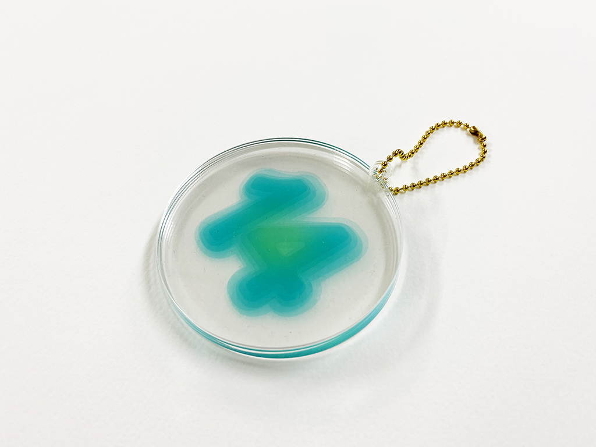
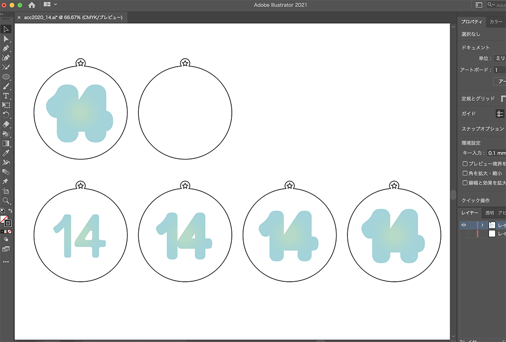
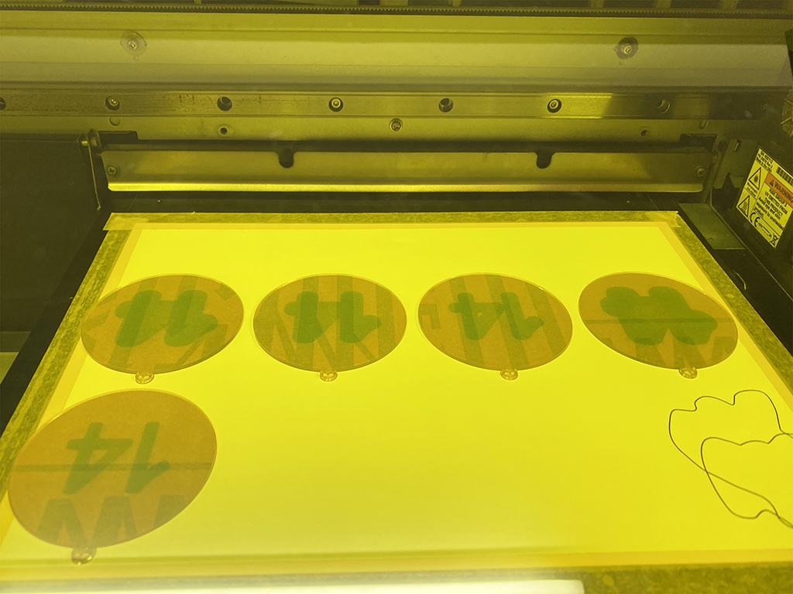
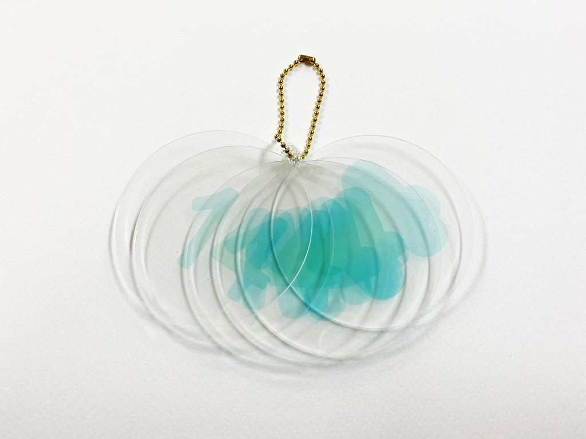

 

## **#14/25 [ 2020/12/14 ]** 
### by Shino ONODERA (FabLab SENDAI - FLAT)
  

 

アクリル板に異なるグラフィックをUVプリントして重ねることで、不思議な立体感を出してみました！
  

### **材料**

* アクリル板（透明／1.5mm厚）
* ボールチェーン

 

### **技術**

* データ作成：Adobe Illustrator
* レーザーカッター：trotec speedy100
* UVプリンタ：Roland LEF-12

 

### **作り方**
 

### **1.** 
まずはIllustratorでデータを作成。奥行きを出したかったので、下にいくほど「14」の文字が太くなるように設計しました。 

  

### **2.** 
レーザーカットしたパーツにUVプリントをして… 

  

### **3.** 
順番にボールチェーン に通したら.. 

  

### **4.** 
あっという間に完成！ 

    

写真では伝わりにくいですが、様々な方向に傾けると、また違った見え方になって面白いです。山や野菜などの立体物をこうやって表してみても綺麗そうですね。

  

（Last Updated: 2023.04.11）

