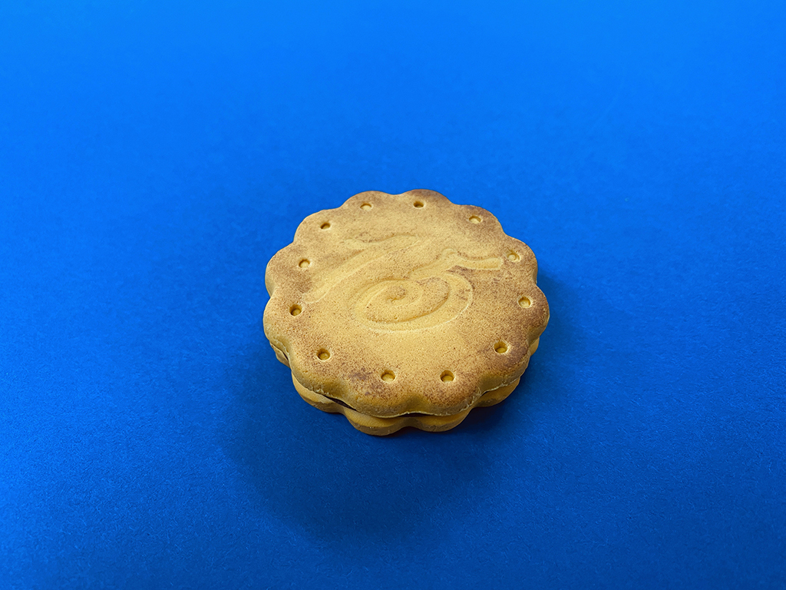
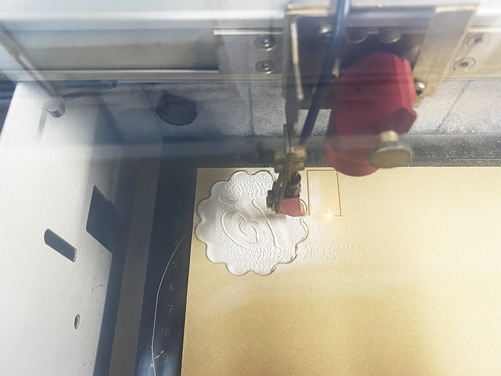
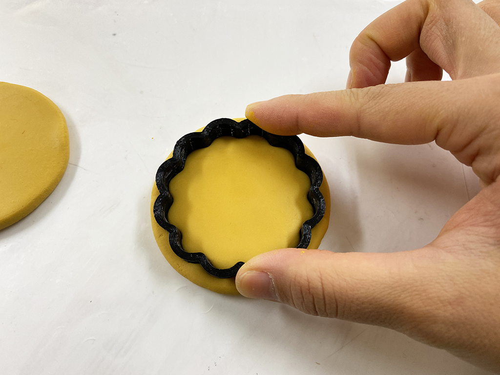
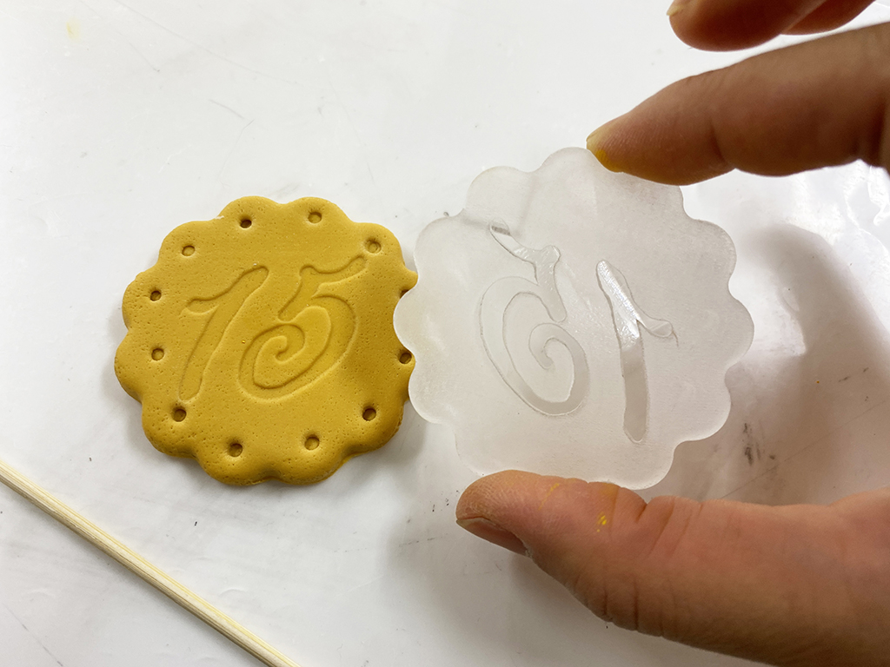
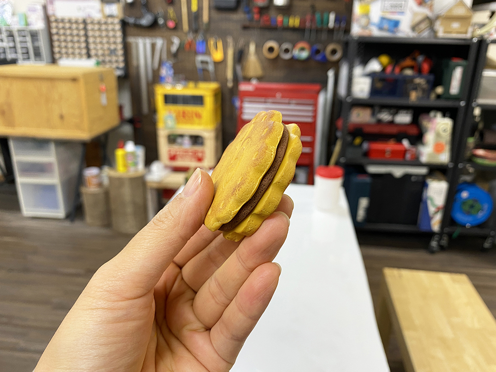

 

## **#15/25 [ 2020/12/15 ]** 
### by Shino ONODERA (FabLab SENDAI - FLAT)
  

 

樹脂粘土でクッキーを作ってみました！
  

### **材料**

* 樹脂粘土（クリームイエロー、ブラウン）
* PLA（黒／抜き型）
* アクリル板（透明3mm厚／スタンプ）
* アクリル絵具

 

### **技術**

* データ作成：Adobe Illustrator、Rhinoceros
* レーザーカッター：trotec speedy100
* 3Dプリンタ：Makerbot Replicator2

 

### **作り方**
 

### **1.** 
Rhinocerosで抜き型を、Illustratorでスタンプ部分のデータを作成し、それぞれ材料を加工します。 

  

### **2.** 
樹脂粘土にアクリル絵の具を加えてクッキーらしい色にしたら、まずは3Dプリントした抜き型で形を作ります。 

  

### **3.** 
レーザーカットしたスタンプをクッキーの表面に押し当て、「15」という窪みをつけました。
また、クッキーらしさを出すために表面を金ブラシで叩いて細かな凹凸をつけ、竹串で丸い模様を加え、最後にアクリル絵の具で焦げの色づけも行いました。 

  

### **4.** 
できたものがこちら！ 

  

こちらの写真では見えませんが、間に茶色の粘土を挟んでチョコサンドクッキー風にしてみました。 

    

今回は樹脂粘土でフェイククッキーを作りましたが、もちろん実際のクッキー生地でも同様に行うことが可能です。（その場合は、型に油などを塗った方が生地綺麗に外れやすいようです。）クリスマスやバレンタインなどのイベントでも活躍しそうなテクニックですね！

  

（Last Updated: 2023.04.11）

