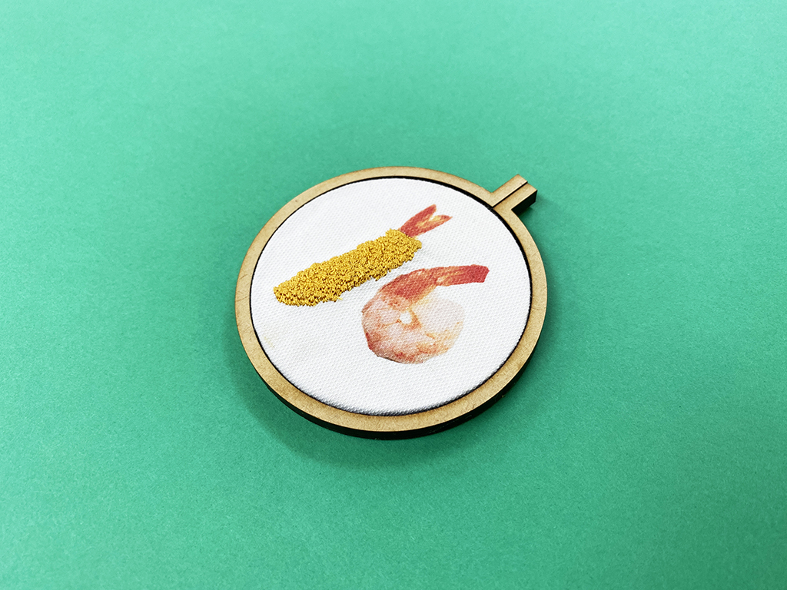
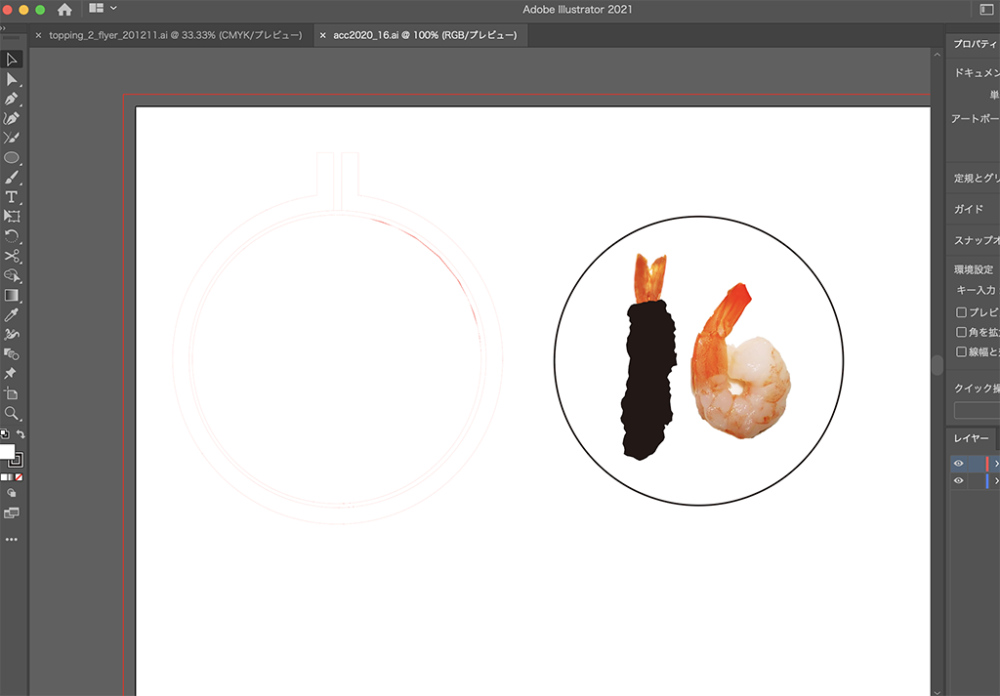
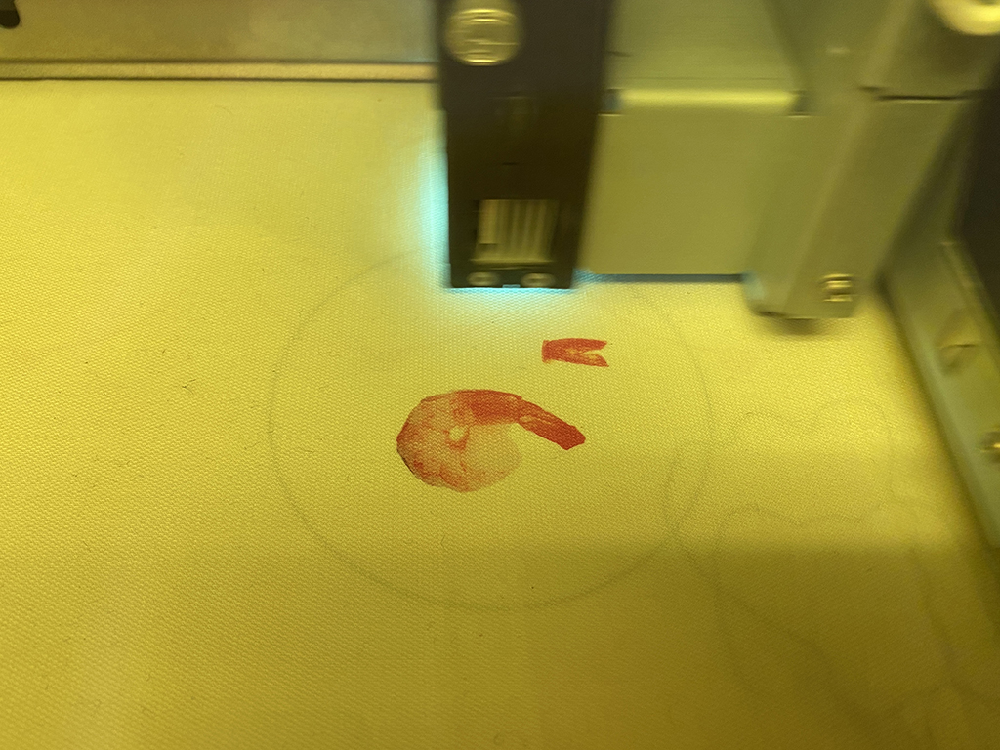
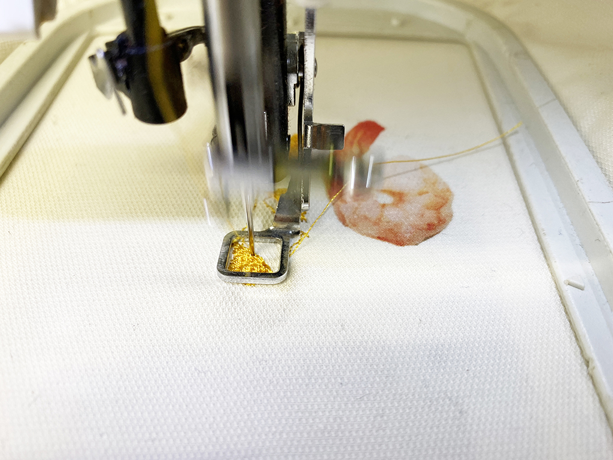

 

## **#16/25 [ 2020/12/16 ]** 
### by Shino ONODERA (FabLab SENDAI - FLAT)
  

 

エビです。
  

### **材料**

* 布
* 刺繍糸
* MDF（5.5mm厚）

 

### **技術**

* データ作成：Adobe Illustrator
* レーザーカッター：trotec speedy100
* UVプリンタ：Roland LEF-12
* 刺繍：JAGUAR SP-4000

 

### **作り方**
 

### **1.** 
まずはIllustratorでデータを作成。左の赤いラインがMDF用のカットデータ、右の実写エビがUVプリントデータ、右の黒い部分が刺繍用データです。 

  

### **2.** 
ベースの布にUVプリント。 

  

### **3.** 
 UVプリントした布をセットして刺繍を行います。エビフライの衣っぽさが出るよう、縫い方を通常と少し変えてみました。（フィルステッチ&パターンステッチにしています。） 

  

### **4.** 
レーザーカットしておいたMDFの枠にセットしたら完成！ 

    

写真と刺繍の組み合わせが好きなので、これからもっと研究していきたいと思います！

  

（Last Updated: 2023.04.11）

