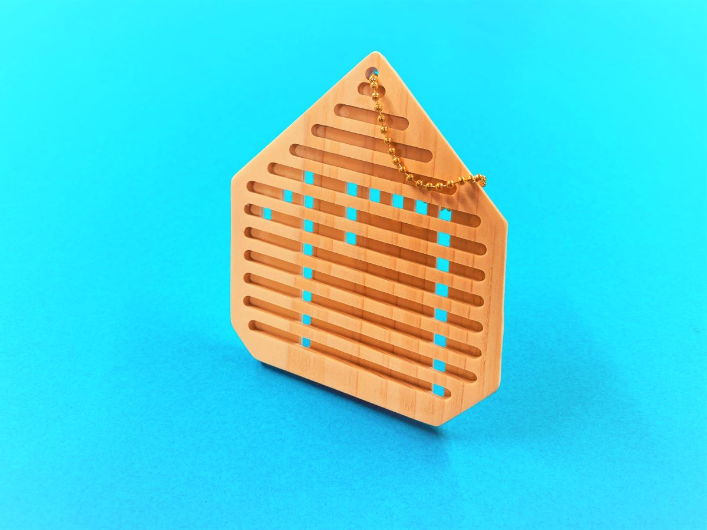
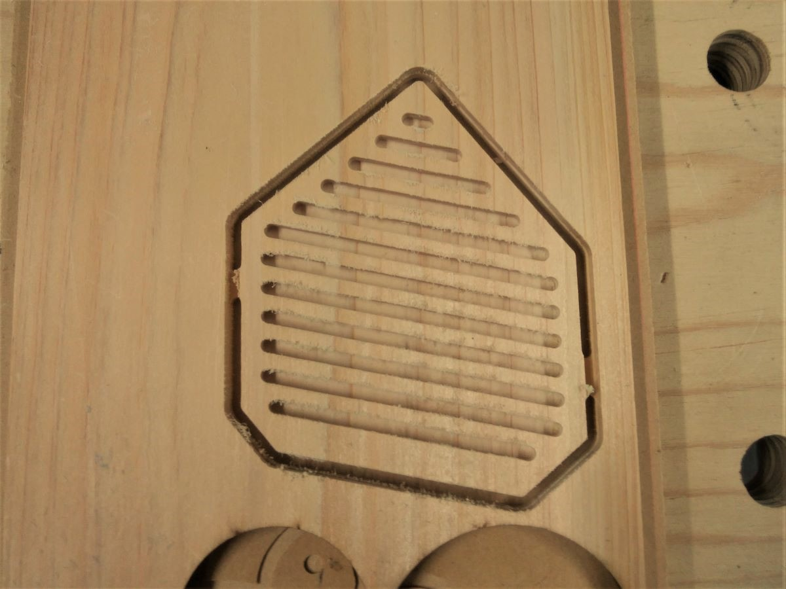
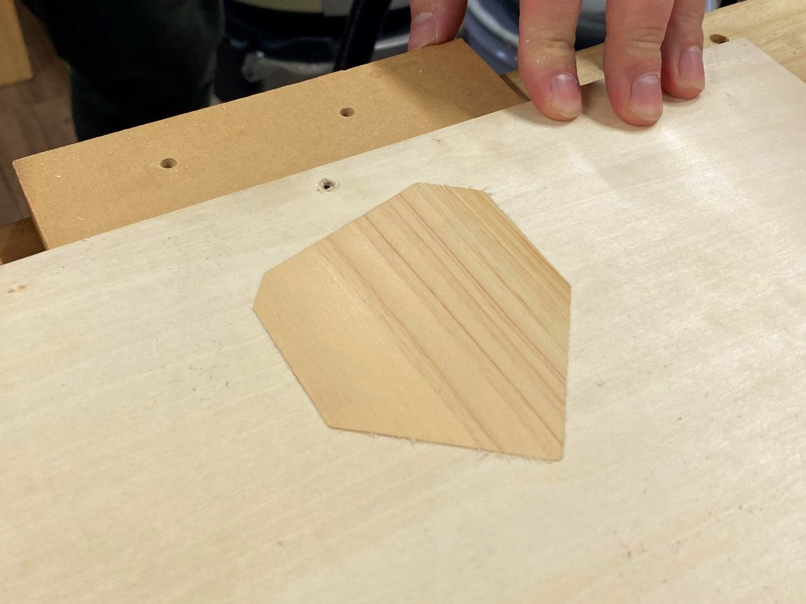
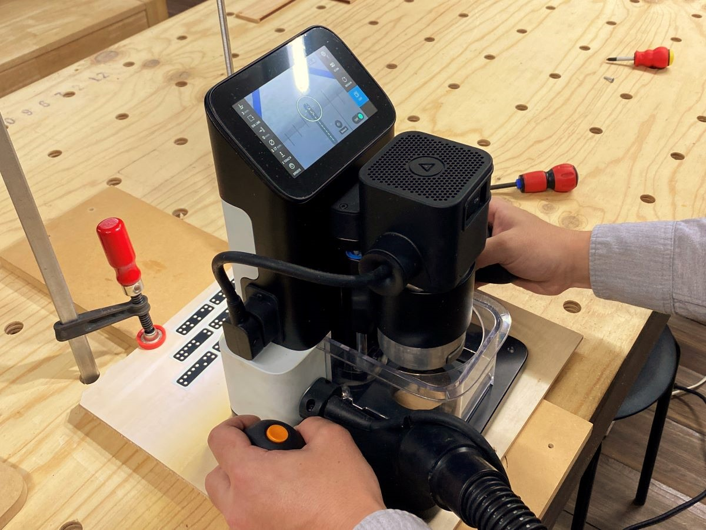
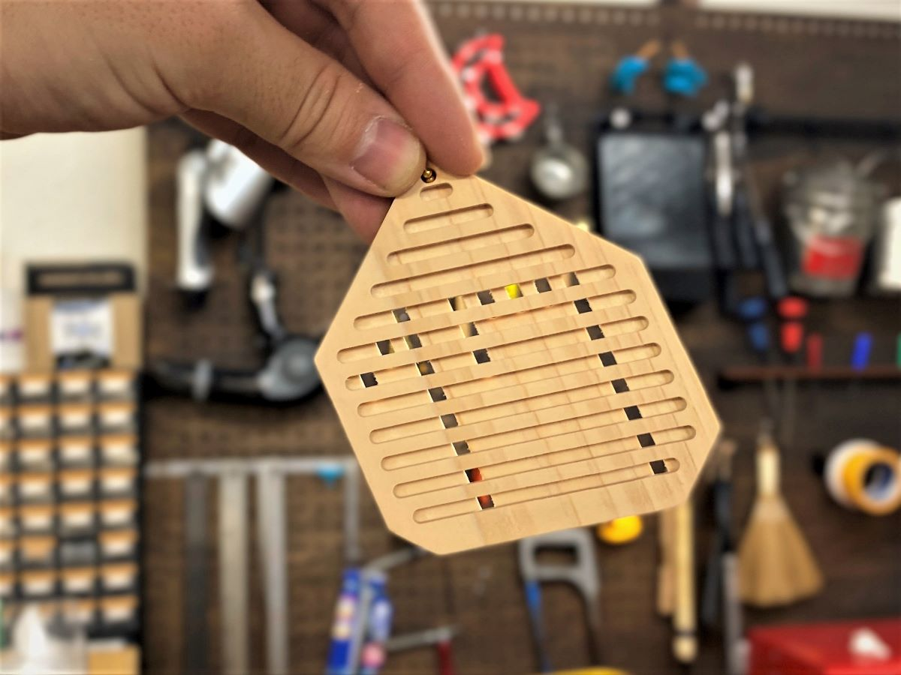

 

## **#17/25 [ 2020/12/17 ]** 
### by Takuma OAMI (FabLab SENDAI - FLAT)
  

 

表と裏から違う角度でスリット入れて、"17"を作ってみました。([これ](https://hub.shapertools.com/creators/5b437481a92ce901517c0655/shares/5a6a6773693bca000f3b4400)を参考にしましたー)
  

### **材料**

* レーザーカット用ヒノキ板
* ボールチェーン

 

### **技術**

* データ作成：Rhinoceros
* CNCルーター：Shaper Origin

 

### **作り方**
 

### **1.** 
CNCルーターでヒノキ板の表面にスリットを入れる。貫通させないで素材の厚み半分までの深さまで削るのが大事なトコ。 

  

### **2.** 
同じ厚みの別の板に、さっき削ったヒノキパーツにピッタリの穴を削り、ひっくり返したヒノキパーツをはめ込む。 

  

### **3.** 
裏面にもスリットを切削。裏面は”17″表面と穴が繋がって欲しい部分だけ削ります。 

  

### **4.** 
紙やすりをかけたら、完成！ 

    

3Dじゃなくて2Dの両面切削も、工夫すれば面白い風合いになりますねー。今回はラインで削りましたが、曲線や円などの図形でやっても楽しそうです。

  

（Last Updated: 2023.04.11）

