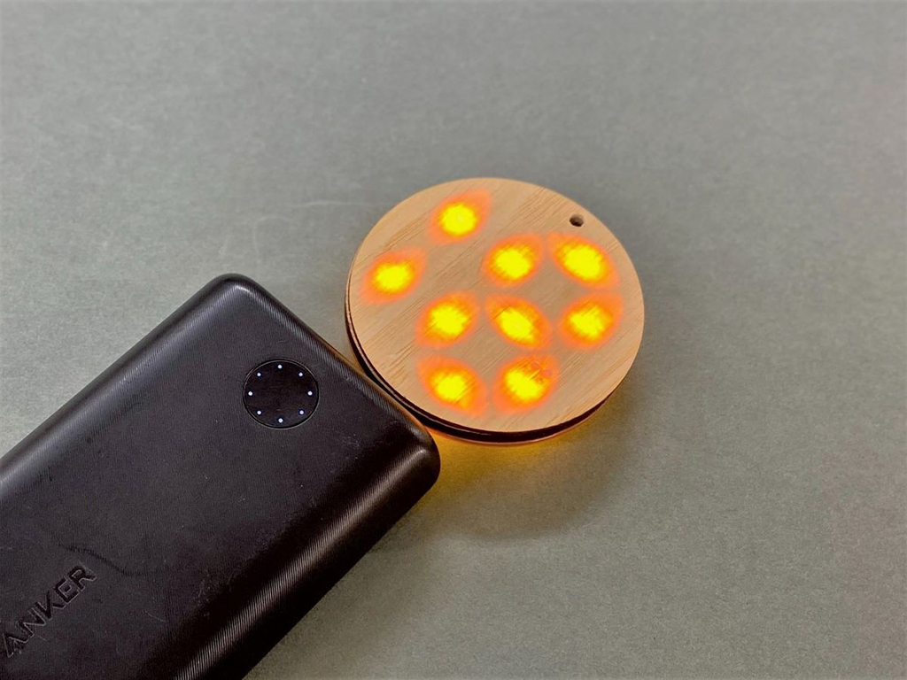
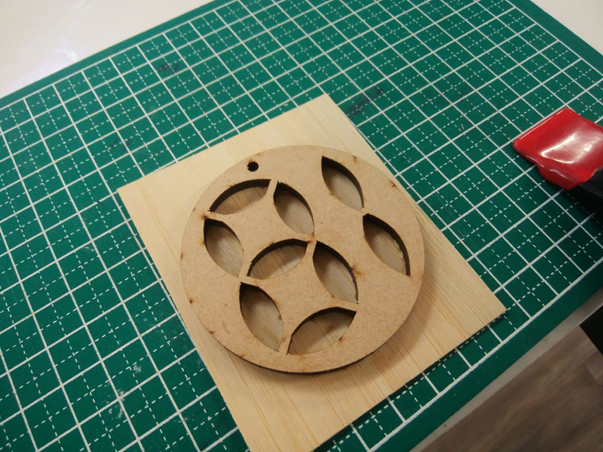
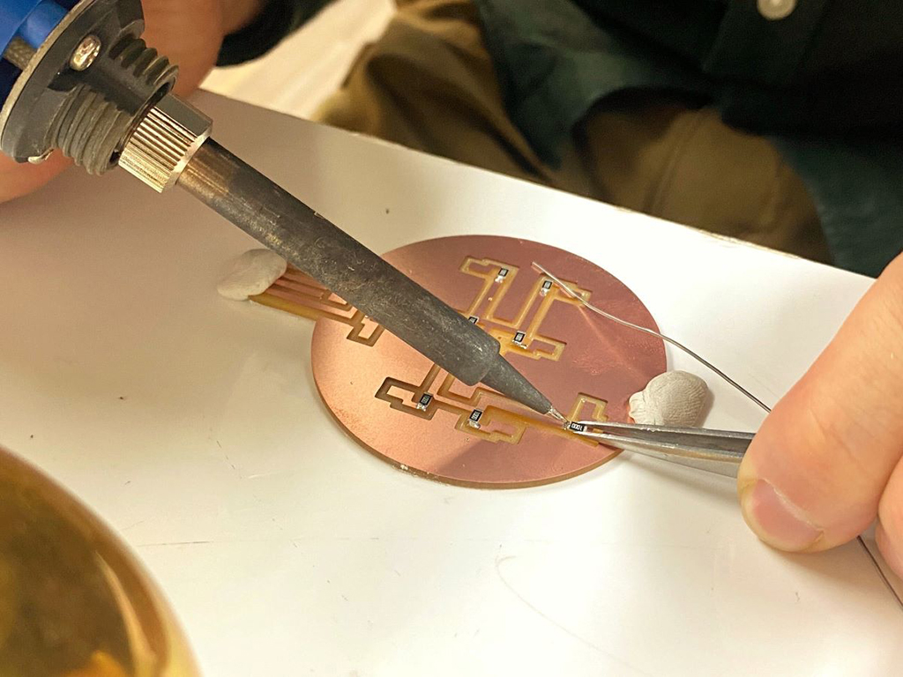
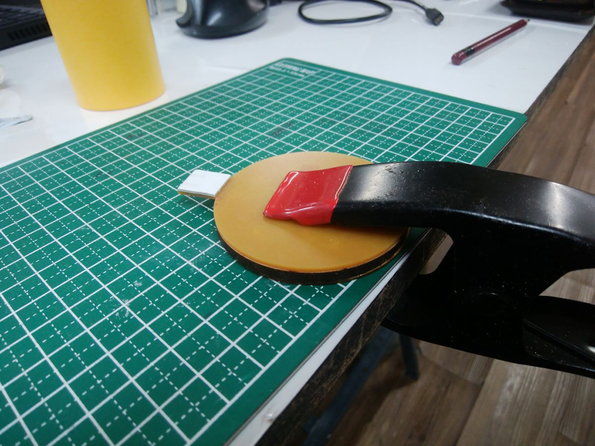
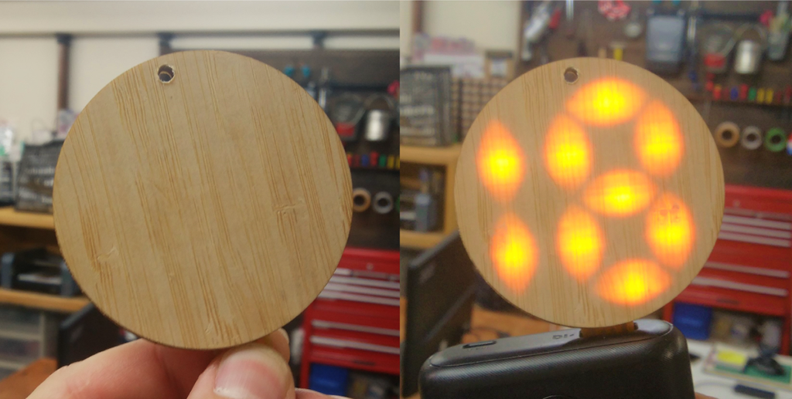

 

## **#18/25 [ 2020/12/18 ]** 
### by Takuma OAMI (FabLab SENDAI - FLAT)
  

 

左下の黒い物体はモバイルバッテリーです。
  

### **材料**

* 竹シート
* 紙フェノール基板
* 表面実装LED & 抵抗
* MDF 4mm厚

 

### **技術**

* データ作成：Rhinoceros
* 基盤切削：Modela MDX-20
* レーザーカット：trotec Speedy 100

 

### **作り方**
 

### **1.** 
MDFを切り出したフレームに竹シートを貼り付けます。（このあと、 MDFの外形に合わせて竹シートはカットします。） 

  

### **2.** 
フレームに開いた穴の位置にはまるように設計したLED基板をつくりますー。 

  

### **3.** 
LED基板とさきほどの木のフレームを接着します。 

  

### **4.** 
接着剤が固まったら、完成！一見するとただの木の板ですが、USBに差し込むとLEDが光り”18″が浮かび上がります！ 

    

種類にもよりますが、薄い木板なら光を透過するんですね。アナログな風合いの見た目から、デジタルな数字が浮かび上がるのは異様で面白いです。

  

（Last Updated: 2023.04.11）

