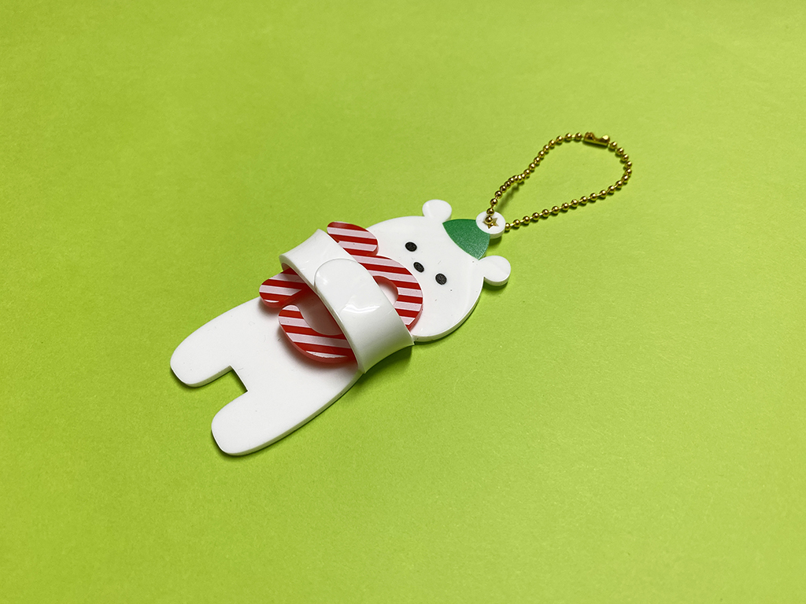
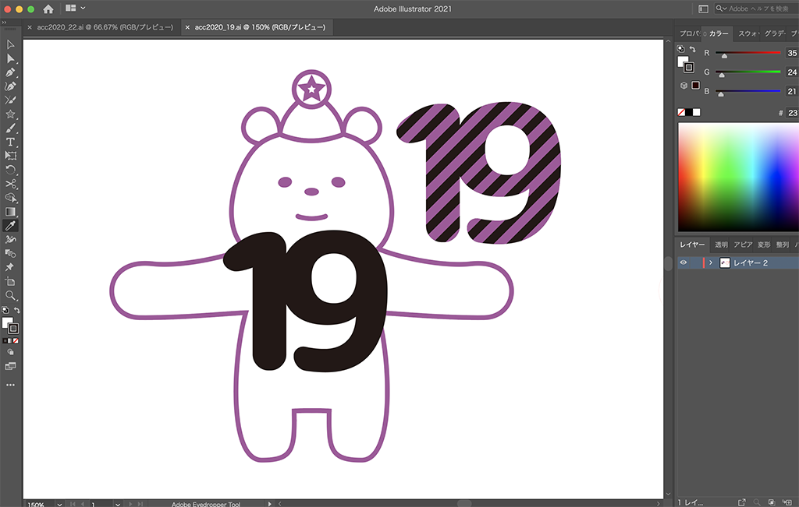
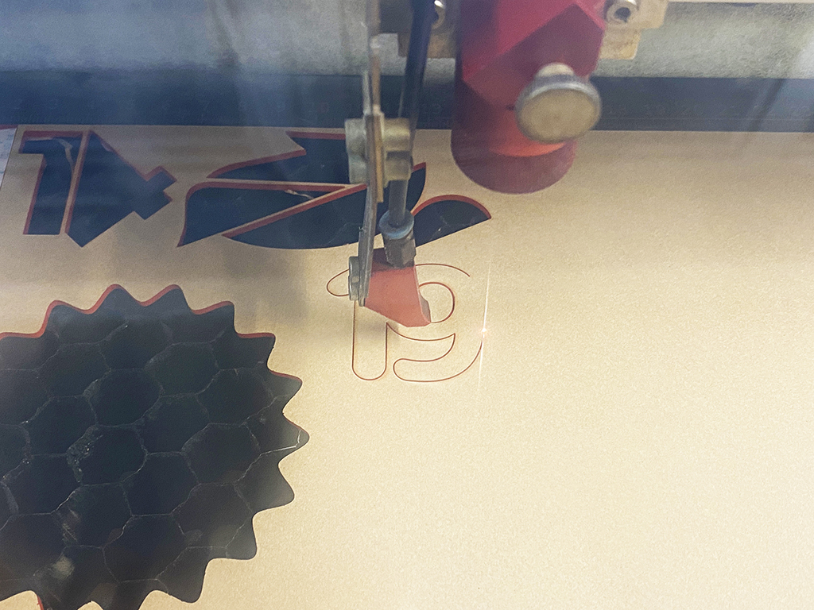
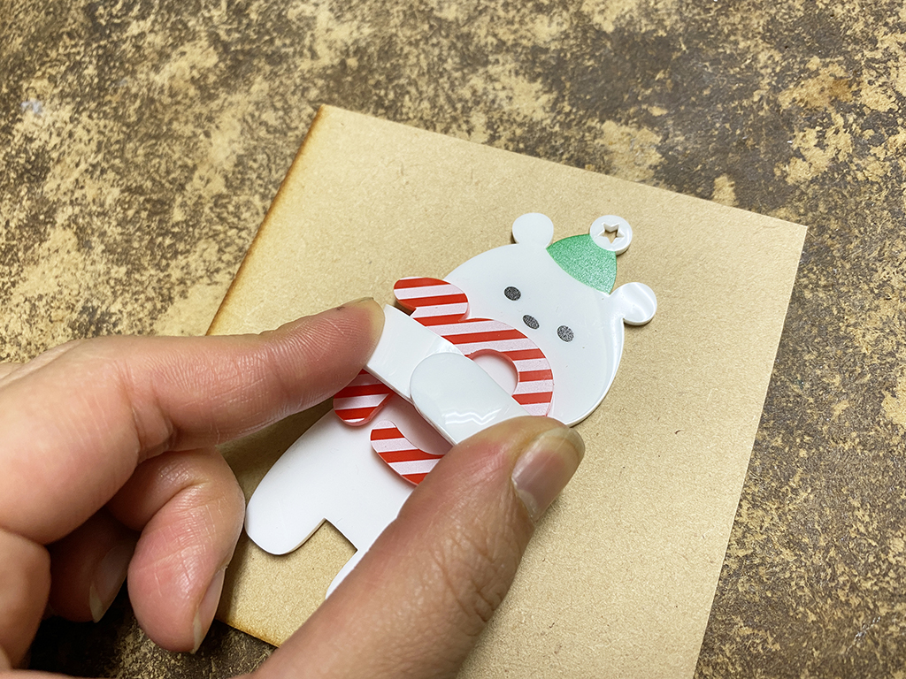

 

## **#19/25 [ 2020/12/19 ]** 
### by Shino ONODERA (FabLab SENDAI - FLAT)
  

 

完全に隠れてしまいましたが、「19」を抱き抱えるクマを作りました！
  

### **材料**

* アクリル板（2.0mm厚／白、赤）
* ボールチェーン

 

### **技術**

* データ作成：Adobe Illustrator
* レーザーカット：trotec speedy100
* UVプリンタ：Roland LEF-12

 

### **作り方**
 

### **1.** 
まずはIllustratorでデータを作成。 

  

### **2.** 
クマと数字をそれぞれレーザーカットします。 

  

### **3.** 
それぞれのパーツにUVプリントしたら、トースターで加熱して柔らかくし、クマの腕を曲げます。
（実際は革手袋をして作業を行いました。） 

  

### **4.** 
パーツが冷えたら「19」を接着して完成！ 

    

今回はトースターを使ってアクリル板を加熱しましたが、FLATではアクリル曲げ器も利用可能です。ご興味がある方はぜひどうぞ！

  

（Last Updated: 2023.04.11）

