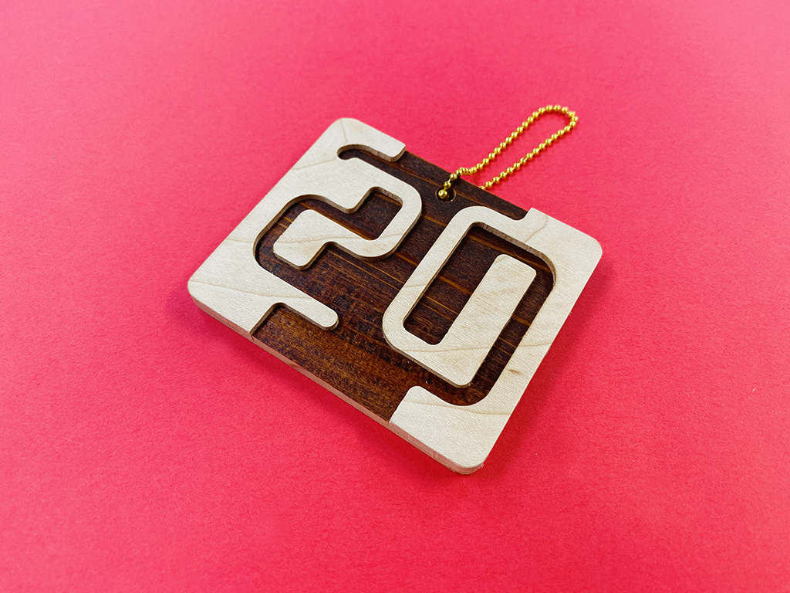
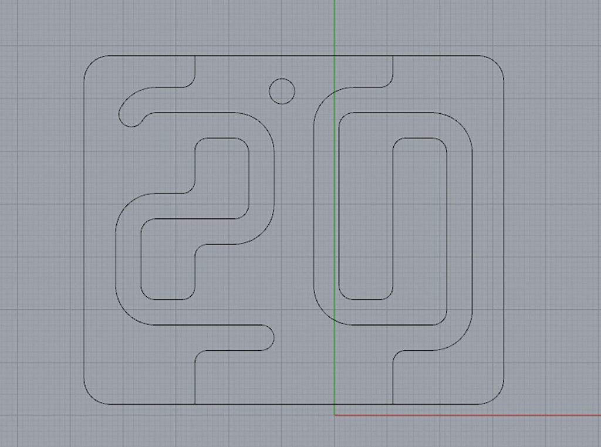
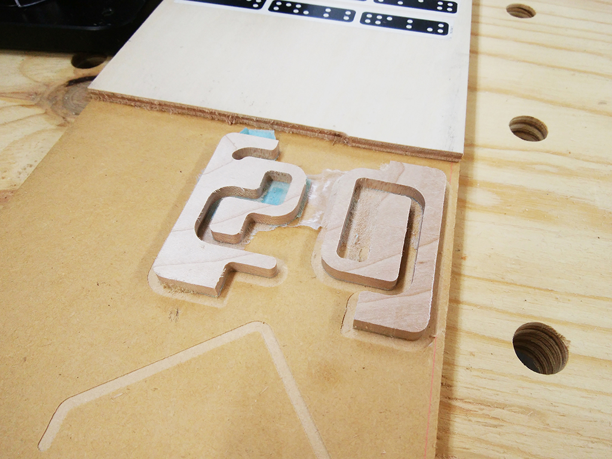
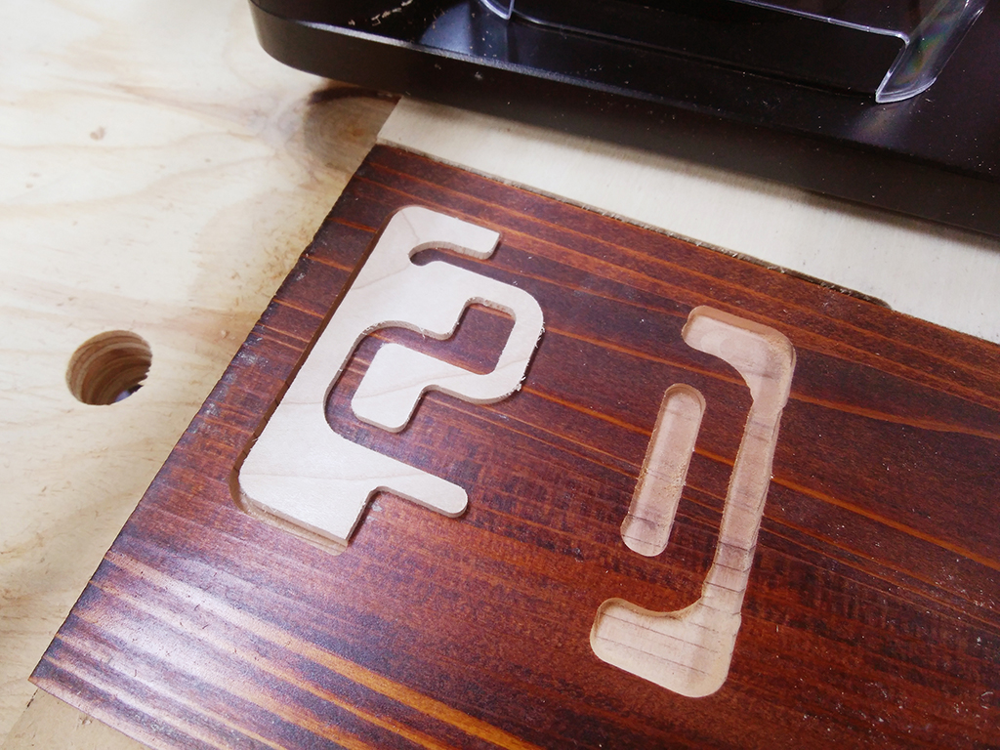

 

## **#20/25 [ 2020/12/20 ]** 
### by Takuma OAMI (FabLab SENDAI - FLAT)
  

 

違う色の木板を使って、ツートンカラーな”20″を作りました。
  

### **材料**

* 杉板（5.0mm厚 / 拭き漆仕上げ)
* イタヤカエデ板(5.0mm厚)
* ボールチェーン

 

### **技術**

* データ作成：Rhiniceros
* CNC切削：Shaper Origin

 

### **作り方**
 

### **1.** 
まずはRhinocerosでデータを作成。 

  

### **2.** 
イタヤカエデではめ込むパーツを切り出します。 

  

### **3.** 
漆仕上げの杉板を彫り込んで、さきほどのパーツがはまる穴を加工していきます。穴の大きさを慎重に調整したのでピタッとすき間なく入りました！ 

  

### **4.** 
パーツ同士を接着して、完成！！！ 

    

レーザーカッターを使っても同じようなことができますが、板を貫通せず設定した高さに穴を加工できるのはＣＮＣルーターの醍醐味ですよね。

  

（Last Updated: 2023.04.11）

