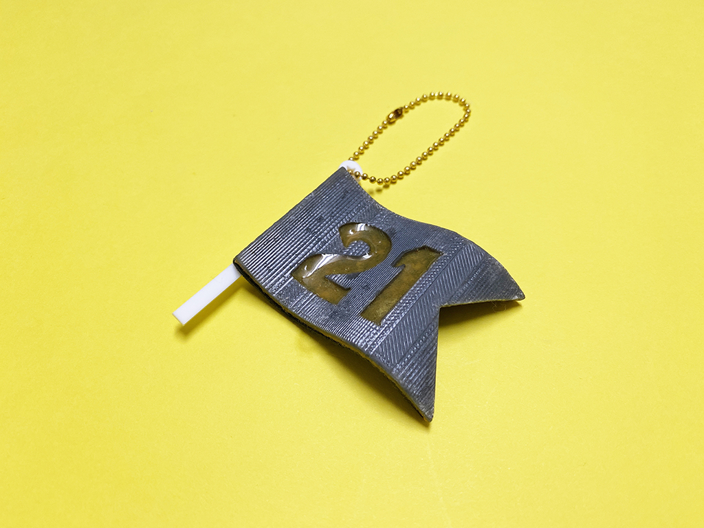
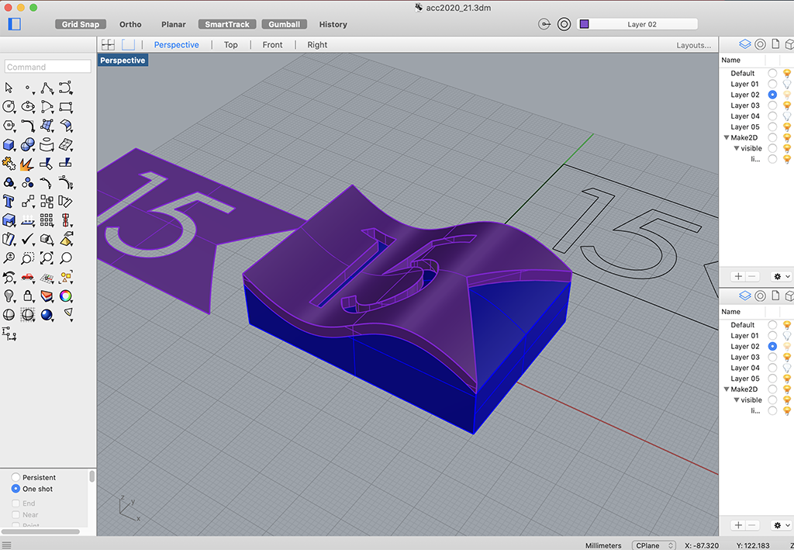
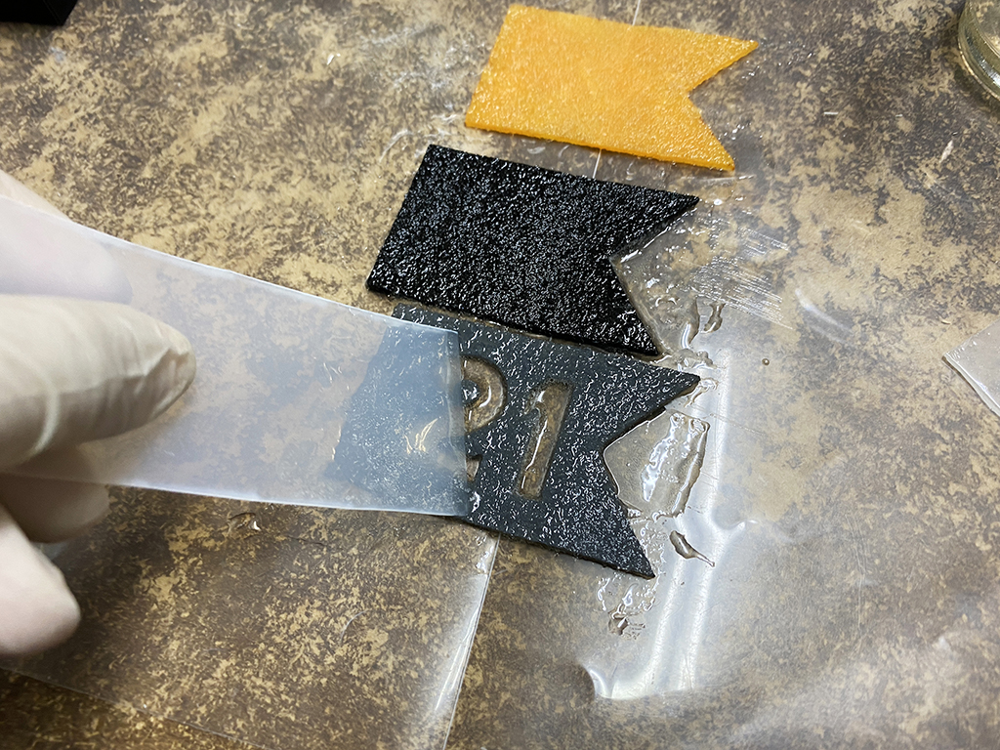
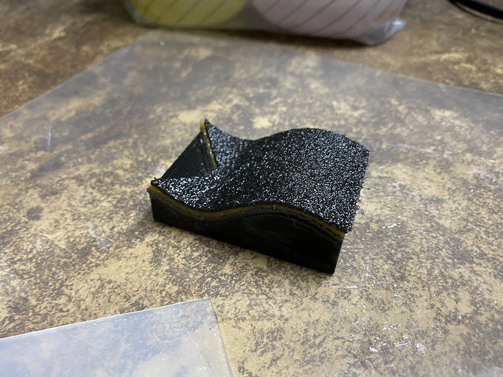
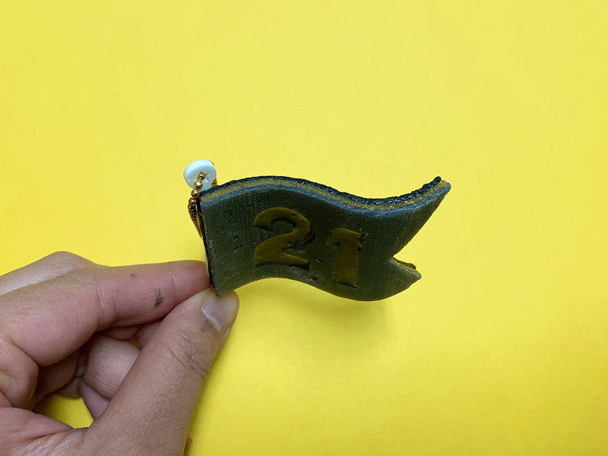

 

## **#21/25 [ 2020/12/21 ]** 
### by Shino ONODERA (FabLab SENDAI - FLAT)
  

 

フェルトをレジンで硬化させて形を作ってみました。
  

### **材料**

* フェルト（1mm厚／黒、黄色、グレー）
* PLA（黒）
* アクリル板（2mm厚／白）
* レジンキャスト（透明）
* ボールチェーン

 

### **技術**

* データ作成：Rhiniceros, Adobe Illustrator
* 3Dプリント：Makerbot Replicator2
* レーザーカット：trotec speedy100

 

### **作り方**
 

### **1.** 
まずはRhinocerosでデータを作成。画像では「15」となっていますが、この後に「19」にデータを修正して作成しました。
青い3Dモデルを3Dプリントし、紫色の3Dモデルをレーザーカット して作ります。 

  

### **2.** 
レーザーカットしたフェルトにレジンキャストを染み込ませます。 

  

### **3.** 
フェルトを3Dプリントしたパーツに重ねて硬化させます。 

  

### **4.** 
フェルトが完全に硬化したら、パーツから剥がします。最後に白いアクリルパーツを接着したら完成！ 

  

    

上から見るとこんな感じです。「21」の文字の中には、後からレジンを流し込みました。 
グレーのフェルト部分には3Dプリントしたパーツの表面のテクスチャがしっかり転写されていて、パッと見ただけではフェルトだと思えないような不思議な仕上がりに。また、今回は3Dプリントしたパーツに直接フェルトを重ねましたが、硬化後の取り外しがとても大変だったので、次回行う場合には別の樹脂シート（PET板や塩ビ板など）を挟んだり、離型材をきちんと塗らないとなぁと思いました。

  

（Last Updated: 2023.04.11）

