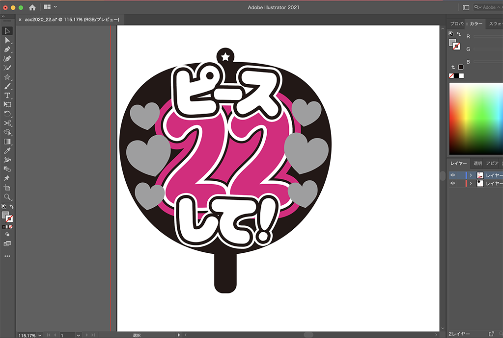

 

## **#22/25 [ 2020/12/22 ]** 
### by Shino ONODERA (FabLab SENDAI - FLAT)
  

 

カッティングシートでカットしたシールを貼り重ねて、応援うちわっぽいものを作ってみました。
  

### **材料**

* アクリル板（2mm厚／白）
* カッティングシート（白、黒、ピンク、ホログラム2種）
* ボールチェーン

 

### **技術**

* データ作成：Adobe Illustrator
* レーザーカット（アクリルパーツ）：trotec speedy100
* UVプリント（アクリルに黒プリント）：Roland LEF-12
* カッティング（カッティングシート）：silhouette CAMEO

 

### **作り方**
 

### **1.** 
まずはIllustratorでデータを作成。 

  

### **2.** 
データを元に、カッティングシート（シールシート）をカッティングプロッタで切ります。
今回使用したカッティングシートは、全て100円ショップで揃えました。 

  

### **3.** 
レーザーカットして表面を黒くUVプリントした土台に、カットしたシールを貼っていきます。 

  

### **4.** 
完成したものがこちら！ 

    

ちょっと配色が地味になってしまいました..土台の縁にキラキラのモールなどを加えても良さそうですね🌟

  

（Last Updated: 2023.04.11）

