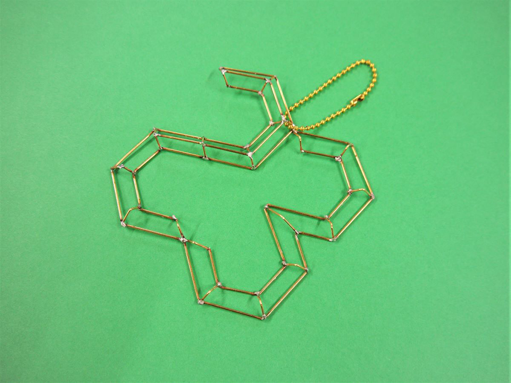
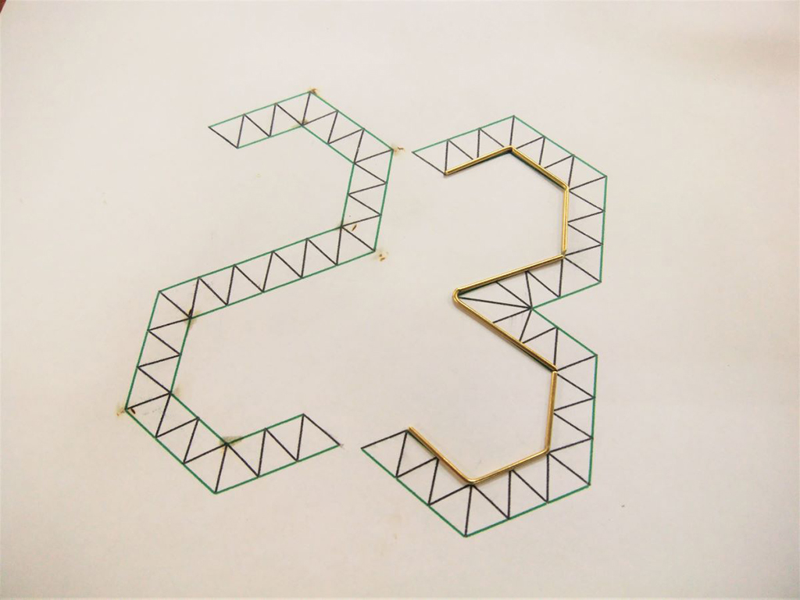
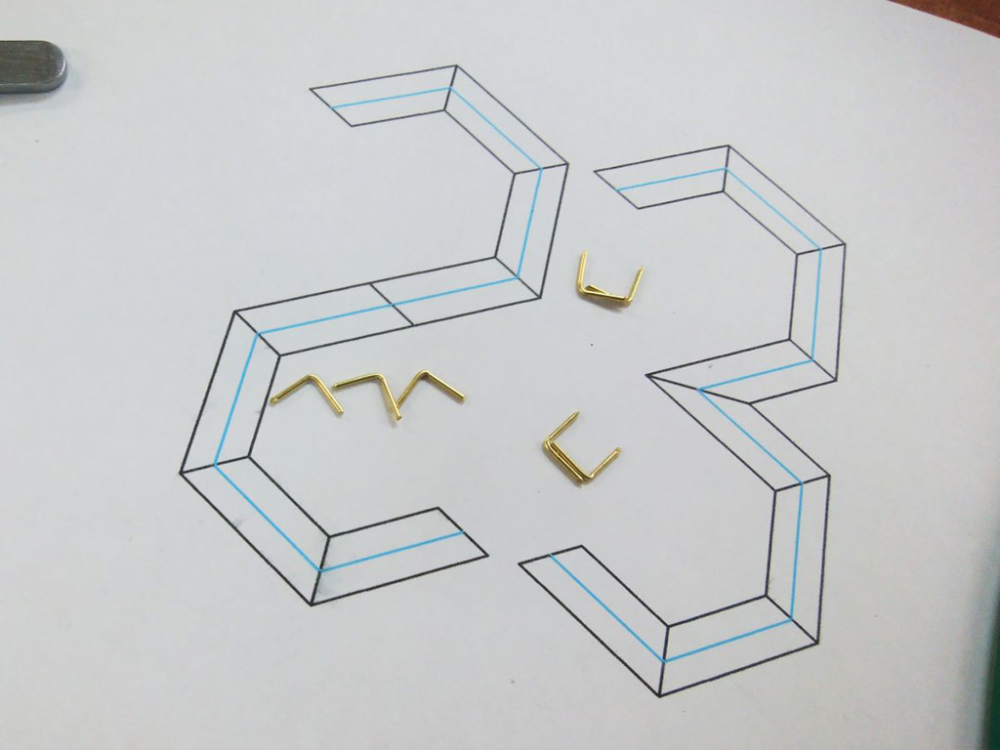
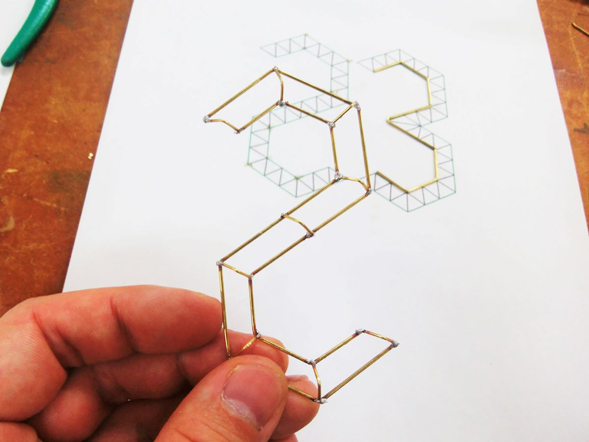
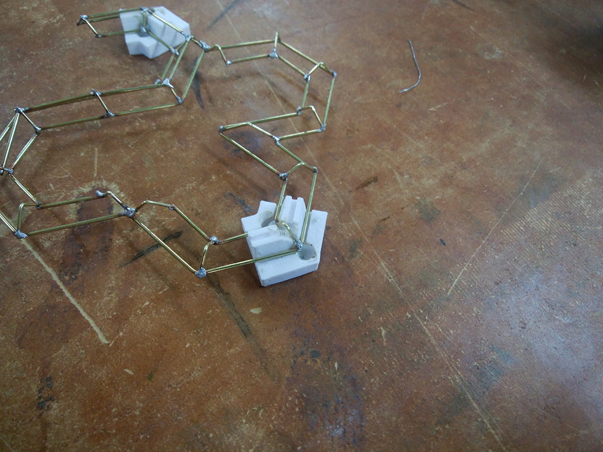

 

## **#23/25 [ 2020/12/23 ]** 
### by Takuma OAMI (FabLab SENDAI - FLAT)
  

 

真鍮棒をはんだ付けによって、つなぎ合わせて数字を作ってみました。
  

### **材料**

* 真鍮棒（直径0.8mm）
* はんだ
* ボールチェーン

 

### **技術**

* データ作成：Rhinoceros
* 3Dプリント：MakerBot Replicator2
* はんだ付け

 

### **作り方**
 

### **1.** 
Rhinoで作ったデータをプリントアウトして、真鍮棒を添わせて曲げます。 

  

### **2.** 
各角に後でつける、パーツも曲げて作っておきます。 

  

### **3.** 
“2”を先に組み立ててみました。この後組み立てた”3″とくっつける予定です。 

  

### **4.** 
はんだ付けする時にパーツがずれないように、3Dプリントした治具を使ってまーす。(しかし熱しすぎるとPLAも溶けてズレるという…) 

    

そんなこんなで、最初の写真のとおりに仕上がりましたー。治具の工夫でより、キレイに複雑に作れそうです。(興味のある方は[この資料](https://cdn.hackaday.io/files/1751737494601632/CircuitSculpture-Remoticon%202020.pdf)おススメです)

  

（Last Updated: 2023.04.11）

