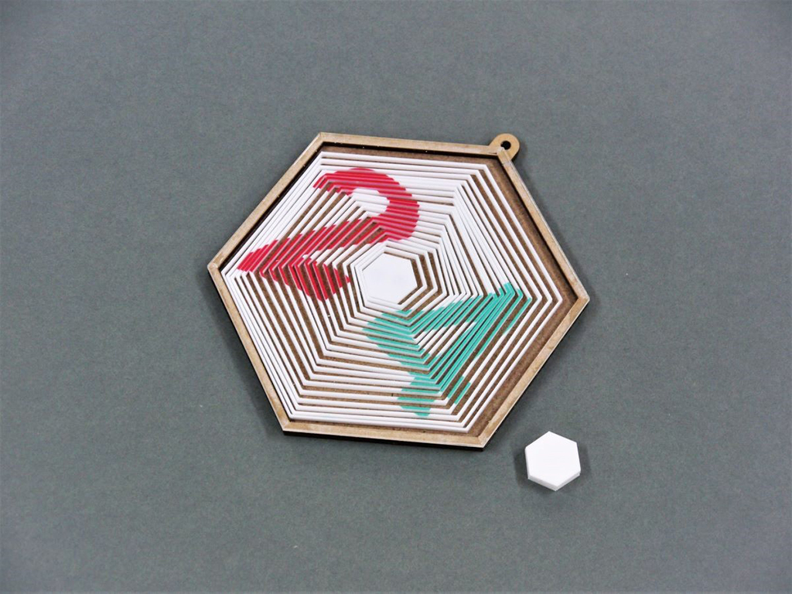
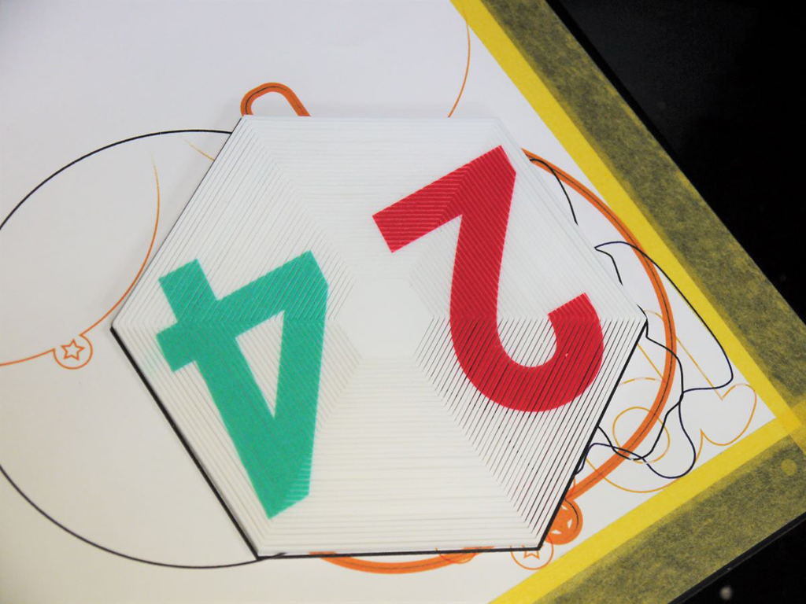

 

## **#24/25 [ 2020/12/24 ]** 
### by Takuma OAMI (FabLab SENDAI - FLAT)
  

 

磁石でグニグニゆがむ"24"を作ってみましたー。(↓動いてる動画を最後に載せてます↓)
今年の夏ごろに見つけた[THE LAZY ENGINEER氏の作品](https://cults3d.com/en/3d-model/art/satisfying-hexagons)を見て以来、やりたかったので大満足。
  

### **材料**

* アクリル板(白色、2mm厚、六角リング用)
* アクリル板(透明、1.5mm厚、カバー用)
* MDF板(2.5mm厚、壁フレーム用)
* MDF板(1mm厚、ベース板用)
* ボールチェーン

 

### **技術**

* データ作成：Rhinoceros
* レーザーカット：trotec Speedy100
* UVプリント：RoladDG LEF-12

 

### **作り方**
 

### **1.** 
Rhinoで作ったデータで各素材をカット、肝となる六角リングには数字をUVプリントします。 

  

### **2.** 
プリントした六角リングを、真ん中から交互に２グループに分別。これによってパーツ間にすき間ができ動くようになります。1mmの細－いアクリルなので折れないように気を付けながら、外していきます。 

  

### **3.** 
MDFで作ってあったケースに入れました。真ん中に入れるアクリルパーツには彫刻加工でへこませてネオジウム磁石を埋め込んでます。 

  

### **4.** 
最後に透明アクリルで作ってあったカバーパーツで閉じて完成！もう一個作っておいた磁石パーツで外から誘導すると文字が歪みます！ 

<iframe width="680" height="382.5" src="https://www.youtube.com/embed/P3RPgE__jcg" title="YouTube video player" frameborder="0" allow="accelerometer; autoplay; clipboard-write; encrypted-media; gyroscope; picture-in-picture; web-share" allowfullscreen></iframe>

    

今回は六角形で作りました違う形で作っても動きが変わって面白そうですよね。色々応用できそうなカラクリです。

  

（Last Updated: 2023.04.11）

