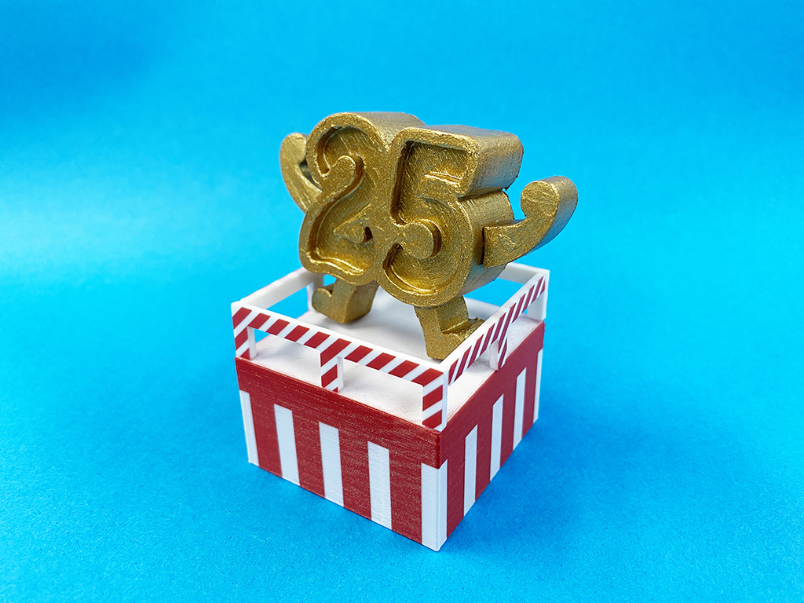
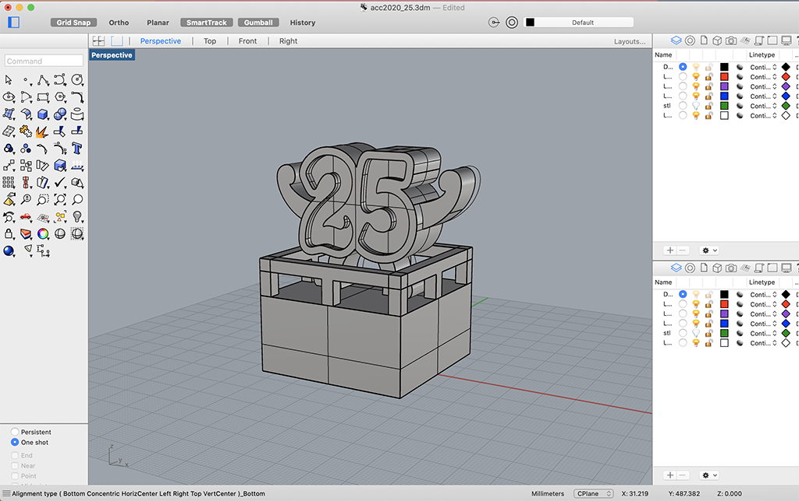
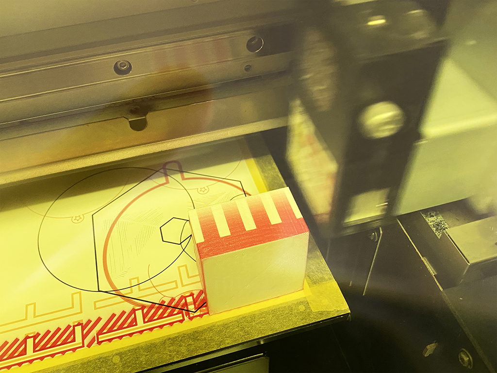
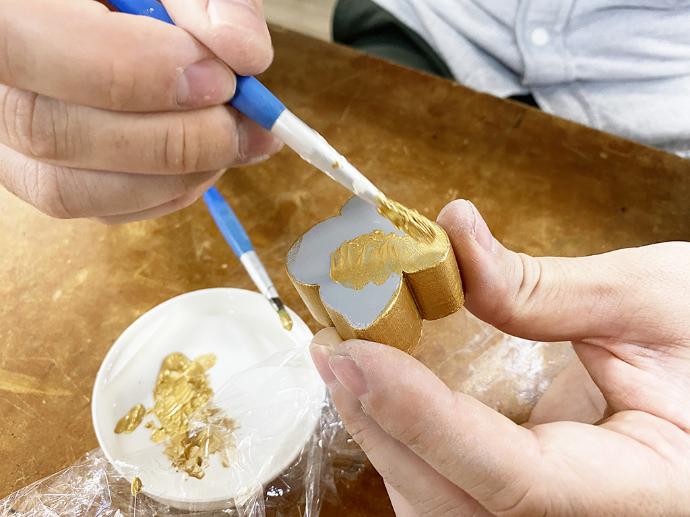

 

## **#25/25 [ 2020/12/25 ]** 
### by Shino ONODERA (FabLab SENDAI - FLAT)
  

 

まもなくお正月なので、とにかくめでたい感じにしてみました！
  

### **材料**

* アクリル板（白色、2mm厚）
* PLA（白）
* ゴールドの絵の具

 

### **技術**

* データ作成：Rhinoceros, Illustrator
* レーザーカット：trotec Speedy100
* UVプリント：RolandDG LEF-12
* 3Dプリント：Makerbot Replicator2
 

### **作り方**
 

### **1.** 
まずはRhinocerosとIllustratorでデータを作成。 

  

### **2.** 
3Dプリントした土台と、レーザーカットしたフレームにUVプリンタで赤いボーダーをプリント。土台は側面全てにUVプリントをし、どの面から見ても紅白の幕がかかっているようにしました。 

  

### **3.** 
上に載せるパーツも3Dプリントし、サーフェイサーで面を整えてからゴールドに塗装。今回は絵の具しかなかったので仕方がないですが、スプレーのほうがムラなく仕上がるので本当はお勧めです。 

  

### **4.** 
全て接着したら完成！ 

    

今年も25個、なんとかやり切りました！正直途中からしんどかったです… 
そして今年でついに全部で50個のサンプルができあがりました。思いの外迫力がありますね。やったかいがあった….！（昨年は「10」をユーザーさんに作っていただきましたが、そのほかは全て2人で順番に作っています。）来年はさすがにネタが出てくるか不安なので、ユーザーさんや他のファブラボメンバーを巻き込んでやれるといいなと思います！ 
それではみなさまどうぞ良いお年を！2021年もどうぞよろしくお願いいたします！！！

  

（Last Updated: 2023.04.11）

