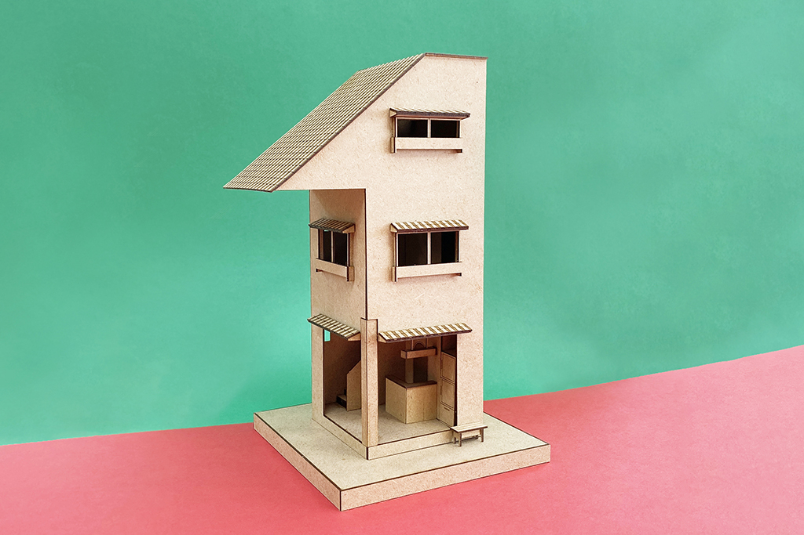
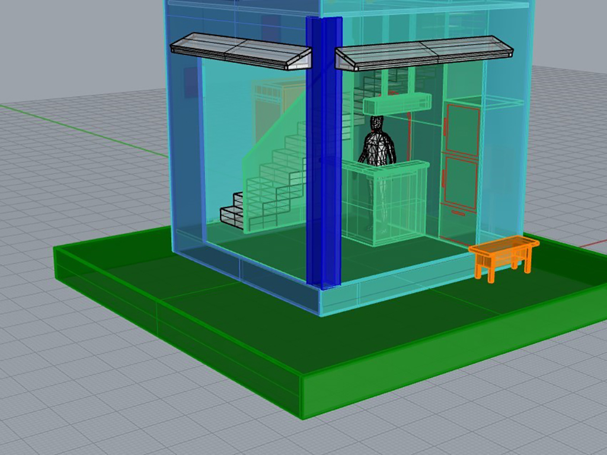
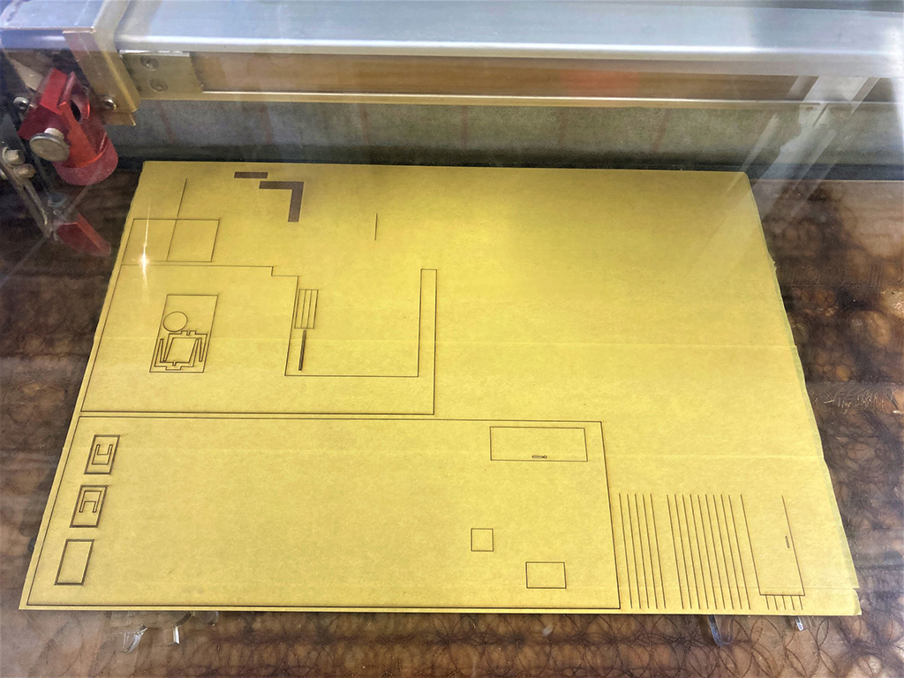
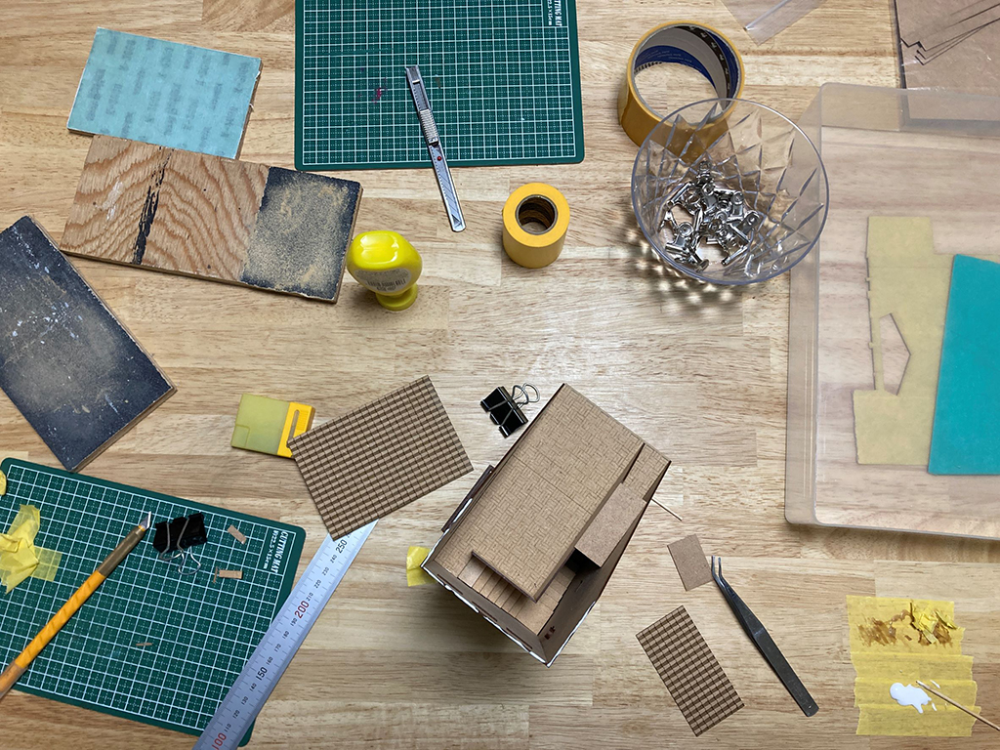
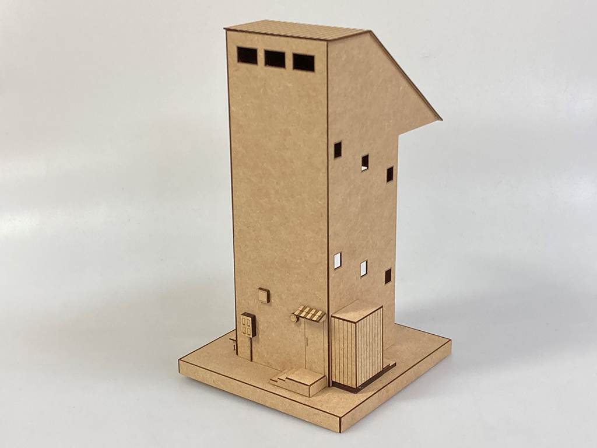

 

## **#01/25 [ 2021/12/01 ]** 
### by Takuma OAMI, Shino ONODERA (FabLab SENDAI - FLAT)
  

 

トップバッターということで、“1”を担当させて頂きました。
色々案出しはしたんですが、結果的に「数字に住んでみる？」というアイデアから数字の形をした建築模型を製作しました。

 

### **材料**

* ミラーアクリル（2.0mm厚）
* 油性ペン
* ボールチェーン

 

### **技術**

* データ作成：Rhiniceros
* レーザーカット：trotec Speedy 100

 

### **作り方**
 

### **1. どんな場所にしたいか妄想する。** 
3DCAD Rhinocerosを立ち上げながら、どんな建物にしたいか、そこで何をやりたいかを妄想します。 
今回は住むトコロというよりは、集まって飲むトコロにしたかったので、1Fはサクッと飲めるバーカウンター、2Fはシッカリ飲む中華テーブル、3Fは酔いつぶれた人の休憩スペースという構成でおおむね合意が取れました。(酒好きがあつまると話が早いです) 
あとは、各スペースの設定を満たすためのアイテムをモデリングしていけば、ただただ楽しいです。 

  

### **2. パーツをレーザーカットする。** 
モデリングしたパーツを、レーザーカッターで切り出します。今回使ったのは1mm厚のMDF、小口が薄いので、組み立てた時にレーザーで焦げた面のやな感じが抑えられて好きです。 

  

### **3. 組み上げる。** 
Rhinocerosの画面を見てパーツ位置を確認しながら、木工用ボンドで接着、組み上げていきます。L字に曲がった階段が、２箇所あり組むのが大変でしたが、マスキングテープの仮止め力とクリップの圧着力にサポートされて完成までこぎつけました。 

  

### **4. 完成〜！！！** 
そして出来上がったものが、↑の模型になります。せっかくなので後ろの写真も載せておきます。
瓦屋根、裏口、換気扇や配電盤などなど小道具をいっぱい付けると”実在してる感”が強くなってきて、
地球のどっかに本当に建ってるんじゃないだろうか？という思いが頭をよぎります。
[3Dデータや瓦のデータはGitHubにアップしてます](https://github.com/fablabSENDAI/acc2021_house01)ので、興味のある方は是非挑戦してみてください！それでは、１日目でした～ 

    

### **作者紹介** 
 

**FabLab SENDAI – FLAT** 

東北は仙台駅前のメイカースペース。思い付きや初期衝動を大切にする運営スタッフ２名(小野寺&大網)が勢いのあるプロトタイプを行なっている。
  

（Last Updated: 2023.04.11）

